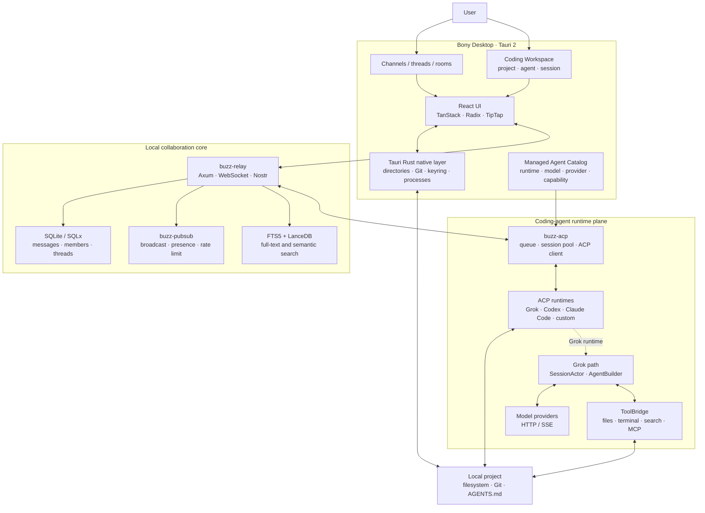

<div align="center">

# Bony

**A local-first desktop platform for AI coding and multi-agent collaboration** — open local projects, enter a Coding Workspace, run coding agents, and coordinate specialists in shared rooms from one client.

Grok is available today over [ACP](https://agentclientprotocol.com/), with one extension path for Codex, Claude Code, and other coding agents. Bony is built with Rust, Tauri, and SQLite for local projects and local execution.

**Language:** [中文](README.md) · **English**

[Quick start](#quick-start) ·
[Features](#features) ·
[Technology stack](#technology-stack) ·
[Local multi-agent collaboration](#local-multi-agent-collaboration) ·
[Models & providers](#models--providers) ·
[Architecture & runtime](#architecture-and-runtime-flow) ·
[Contributors](#contributors) ·
[Upstream relationship](#upstream-relationship) ·
[Development](#development)

[▶ Play the Bony desktop workspace demo](docs/bony-desktop-demo.mp4?raw=1)

</div>

---

## What is Bony

Bony brings the desktop coding workspace and multi-agent room together in one client. Its core workflow is:

1. Select a local project and open Coding Workspace inside a channel.
2. Start a Grok session over ACP and use file, terminal, and search capabilities for coding work.
3. Return to the shared room, where Grok hands search, engine, editing, and documentation work to specialists with `@`.
4. Add Codex, Claude Code, and other coding agents through the same session entry point.

**The repository and product are both named Bony.** `third_party/buzz` contains the embedded and adapted Block/Buzz client and room foundations; the agent / TUI runtime tracks [`xai-org/grok-build`](https://github.com/xai-org/grok-build). Repo: [`phuhao00/bony`](https://github.com/phuhao00/bony).

---

## Features

| Capability | Description |
|------------|-------------|
| Coding Workspace | Open a Codex-like coding surface with projects, sessions, messages, terminal, and search inside a channel |
| Local projects | Native directory picker, recent projects, and removal; ACP sessions use the real project path |
| Session isolation | Switching projects releases the old session and starts a new one to prevent cwd leakage |
| Multi-agent path | Grok works today; UI and session layers expose one extension point for Codex and Claude Code |
| Bony desktop interaction | Smooth workspace/channel transitions with shared theme, title bar, and window behavior |
| Room collaboration | Grok coordinates ZeroClaw / Unity / OpenMontage / DocSmith with threads and progress feedback |
| Local backend | Rust + SQLite + in-process pubsub, one workspace and one root `target/` |

---

## Technology stack

| Layer | Technology | How Bony uses it |
|-------|------------|------------------|
| Desktop shell | **Tauri 2 · Rust · Tokio** | Windows, system tray, native directory selection, process lifecycle, notifications, updates, and OS integration |
| Interface | **React 19 · TypeScript 6 · Vite 8 · Tailwind CSS 4** | Channels, threads, Coding Workspace, agent sessions, and theming; handles rendering, interaction state, and calls into native Tauri capabilities |
| UI and state | **Radix UI · TanStack Query / Router / Virtual · TipTap · Shiki · Motion** | Accessible primitives, server state, routing, long lists, rich text, code highlighting, and transitions |
| Native project integration | **Tauri Commands · Git · atomic-write-file** | Validate and normalize project paths, persist recent projects, read Git state, and pass the real directory to a coding agent |
| Agent protocol | **ACP · JSON-RPC · stdio · `buzz-acp`** | Initialize agents, create sessions, send prompts, cancel turns, configure models, and stream events |
| Coding agents | **Grok · Codex · Claude Code · custom ACP runtimes** | Select runtimes, models, providers, and project sessions through one managed-agent catalog |
| Grok runtime | **`xai-grok-shell` · `SessionActor` · `xai-grok-agent`** | Assemble the agent, run sampling/tool loops, and manage context, memory, compaction, and sub-agents |
| Tools and workspace | **`ToolBridge` · `xai-grok-tools` · `xai-grok-workspace`** | Files, terminal, search, Git, permissions, sandboxing, checkpoints, and MCP tools |
| Room service | **Axum · Tokio · WebSocket · Nostr** | Real-time delivery of channel events, threads, presence, agent mentions, progress, and replies |
| Data layer | **SQLx · SQLite (WAL) · in-process pubsub** | Persist messages, members, and threads; use broadcast / DashMap for local fan-out, rate limiting, and presence |
| Search | **SQLite FTS5 · LanceDB** | Room full-text search and embedded semantic search |
| Security | **System keyring · rustls · NIP-98 · PermissionManager / Sandbox** | Local secrets, TLS, request authentication, and permissions for agent tool execution |

The repository uses one Cargo workspace, one root `Cargo.lock`, and one root `target/`. `buzz-*` is the technical prefix retained by embedded lower-level crates; Bony is the project and product name.

---

## Local multi-agent collaboration

Bony's room capability is built on embedded and adapted [Block/Buzz](third_party/buzz) code: **Grok** is the room coordinator, with **ZeroClaw** (search), **Unity** (game engine), **OpenMontage** (editing), and **DocSmith** (docs) as specialists collaborating in a shared channel via serial `@` handoffs — mid-turn tool status is visible, messages can carry emoji reactions, and threads open on demand for follow-ups.

The local backend uses **SQLite** persistence (WAL mode with a 30-second busy timeout), in-process pub/sub, rate limiting and presence, plus embedded **[LanceDB](https://github.com/lancedb/lancedb)** semantic search. S3-compatible object storage can be configured for attachments.


One-shot startup (whitelisted scripts only; always build with `cargo build -p <crate>`):

```powershell
powershell -File .\scripts\buzz-room\start-room-stack.ps1 -SkipBuild   # relay + in-process pubsub + SQLite
powershell -File .\scripts\buzz-room\start-desktop.ps1                 # Bony desktop client
powershell -File .\scripts\buzz-room\stop-room-stack.ps1               # stop everything
```

Policy and architecture detail: [`docs/buzz-room-collab.md`](docs/buzz-room-collab.md), [`third_party/buzz/README.md`](third_party/buzz/README.md), [`scripts/buzz-room`](scripts/buzz-room).

---

## Quick start

### Dependencies

1. **Rust** (see [`rust-toolchain.toml`](rust-toolchain.toml))
2. **`grok` CLI** (agent subprocess)  
   ```powershell
   npm i -g @xai-official/grok
   grok --version
   ```
3. **Credentials** (either)  
   - Configure BYOK models + env vars in `%USERPROFILE%\.grok\config.toml` (recommended)  
   - Or `grok login` / `XAI_API_KEY`

### Launch the desktop app

```powershell
# Build and run from the repository root, sharing the root target/
cargo build -p buzz-relay -p buzz-desktop
powershell -File .\scripts\buzz-room\start-room-stack.ps1 -SkipBuild
powershell -File .\scripts\buzz-room\start-desktop.ps1
```

### Complete a first Coding Workspace task

1. Enter any joined channel and click the **code icon** on the right side of the header.
2. Select a local project directory. The native Rust layer normalizes the path and adds it to recent projects.
3. Under **Project agents**, choose Grok, Codex, Claude Code, or a registered custom ACP agent.
4. Enter a task. Bony attaches the selected agent mention and the `coding-workspace-v1` project marker.
5. `buzz-acp` creates or reuses the ACP session for that project and passes the real directory as `cwd` in `session/new`.
6. The session view streams messages, plans, tool activity, and model usage. Click **Stop** to cancel the active turn.
7. Return to the room for further delegation or switch projects. A project switch establishes the session boundary for the new `cwd`.

If an agent is not running, the desktop starts its managed runtime first. Runtime, model, and provider settings live in the agent editor; Grok BYOK settings can also be managed through `%USERPROFILE%\.grok\config.toml`.

### Terminal TUI

This repo ships the full `grok` TUI / agent sources:

```powershell
$env:CARGO_TARGET_DIR = "$PWD\target"
cargo run -p xai-grok-pager-bin
```

Official prebuilt install:

```powershell
irm https://x.ai/cli/install.ps1 | iex
```

---

## Models & providers

Model catalog and defaults come from `%USERPROFILE%\.grok\config.toml`. After launch, click the **model name** to switch; the choice is written to `[models] default`.

You can also **edit config.toml** in the picker. Example (Qwen / DashScope):

```toml
[models]
default = "qwen-max"
stream_tool_calls = false

[model.qwen-max]
model = "qwen-max"
base_url = "https://dashscope.aliyuncs.com/compatible-mode/v1"
name = "Qwen Max"
env_key = "DASHSCOPE_API_KEY"
api_backend = "chat_completions"
context_window = 32768
```

Verified providers:

| Provider | Typical `base_url` | Env var |
|----------|--------------------|---------|
| Qwen | `https://dashscope.aliyuncs.com/compatible-mode/v1` | `DASHSCOPE_API_KEY` |
| Kimi / Moonshot | `https://api.moonshot.cn/v1` | `MOONSHOT_API_KEY` |
| Zhipu GLM | `https://open.bigmodel.cn/api/paas/v4` | `ZHIPUAI_API_KEY` |
| OpenAI-compatible | Any `/v1` endpoint | Custom `env_key` |

More protocols:  
[`crates/codegen/xai-grok-pager/docs/user-guide/11-custom-models.md`](crates/codegen/xai-grok-pager/docs/user-guide/11-custom-models.md)

Restart the desktop app after config or env changes. Use `grok models` to verify the catalog.

---

## Architecture and runtime flow

### Component architecture



| Component | Boundary and responsibility |
|-----------|-----------------------------|
| React renderer | Renders channels, Coding Workspace, and agent transcripts; it does not own agent orchestration or secret-management logic |
| Tauri Rust native layer | Handles trusted paths, native dialogs, Git, local configuration, secrets, and managed-process lifecycles |
| `buzz-relay` | Accepts signed room events, persists them, and distributes them through WebSocket and in-process pubsub |
| `buzz-acp` | Converts room events to ACP requests and manages queues and sessions by agent, channel, and project |
| ACP runtime | Executes inside the project `cwd` selected by `session/new`; Grok, Codex, and Claude Code plug into the same managed-session host contract |
| Grok runtime | `SessionActor` runs the sample → tool → resample loop; `AgentBuilder` assembles prompts, skills, and tools |
| Project directory | Agents read, write, and execute directly in the user's selected directory; Bony does not create another project copy |

### One Coding Workspace request

```mermaid
sequenceDiagram
  participant U as User
  participant UI as Coding Workspace
  participant T as Tauri Rust
  participant R as buzz-relay
  participant H as buzz-acp
  participant A as ACP Runtime
  participant P as Local project

  U->>UI: Select a project and agent
  UI->>T: open_coding_workspace_project
  T->>P: Normalize path and read project metadata
  T-->>UI: Project descriptor and recent-project record
  U->>UI: Send a coding task
  UI->>R: Signed event + agent mention + project-path marker
  R-->>H: Deliver through WebSocket / pubsub
  H->>A: Start or reuse runtime
  H->>A: initialize + session/new(cwd)
  H->>A: session/prompt
  A->>P: Files / terminal / search / Git
  A-->>H: Stream messages, plan, tool status, and usage
  H->>R: Progress and reply events
  R-->>UI: Update the session in real time
  UI-->>U: Show result; allow Stop or follow-up
```

The project path travels in the `client / coding-workspace-v1` event marker. `buzz-acp` accepts trusted paths through this marker and binds each path to its ACP session. Switching projects changes the session boundary together with `cwd`, preventing work from leaking into the wrong directory.

### Inside one Grok turn

```text
session/prompt
  → SessionActor::handle_prompt
  → ChatState::build_request
  → SamplerHandle (HTTP/SSE)
  → tool_calls present: permission check → ToolBridge → project side effect → tool_result → resample
  → no tool_calls: checkpoint / memory flush → PromptTurnResult
```

Codex, Claude Code, and custom agents do not need to reuse Grok's internal implementation. Any ACP-compatible agent can reuse Bony's project picker, managed-agent catalog, session UI, message queue, and room-collaboration path.

### Data and state locations

| Data | Location / mechanism | Purpose |
|------|----------------------|---------|
| Local project | Original directory selected by the user | Agent's real `cwd`, files, and Git working tree |
| Recent projects | `coding-workspaces.json` under Tauri app data | Normalized paths in most-recent order, up to 12 entries |
| Room data | `SQLite` (default `buzz.db`, WAL + 30s busy timeout) | Channels, messages, members, threads, reactions, and workflow state |
| Real-time state | `buzz-pubsub` in-process broadcast / DashMap | Fan-out, presence, rate limiting, connection control, and replay guard |
| Search indexes | SQLite FTS5 + LanceDB | Full-text and semantic search |
| Grok configuration and memory | `%USERPROFILE%\.grok\` | Model catalog, session settings, skills, and long-term memory |
| Secrets | Operating-system keyring / environment variables | Nostr identity and provider BYOK credentials |

For deeper coverage of agents, sessions, tools, permissions, memory, compaction, and sub-agents, see [`ARCHITECTURE.md`](ARCHITECTURE.md). The rendered layer and turn diagrams are available in [`docs/architecture-layers.png`](docs/architecture-layers.png) and [`docs/architecture-turn-flow.png`](docs/architecture-turn-flow.png).

---

## Contributors

| Name | Role |
|------|------|
| [phuhao (@phuhao00)](https://github.com/phuhao00) | Creator, product lead, and core maintainer of Bony |
| [OpenAI Codex](https://github.com/apps/openai-codex) | Agentic coding collaborator across design, implementation, testing, and documentation |
| [Cursor Agent](https://github.com/cursoragent) | AI coding collaborator for code exploration, refactoring, and interaction iteration |

GitHub generates the Contributors sidebar from commit-linked accounts. Bony uses `phuhao00`, `openai-codex[bot]`, and `cursoragent`; the page can lag while GitHub refreshes contributor statistics.

---

## Upstream relationship

| Layer | Source |
|-------|--------|
| Agent / TUI / tool stack | Periodically aligned with [`xai-org/grok-build`](https://github.com/xai-org/grok-build) (`Synced from monorepo`) |
| Product layer | Fork-owned: Bony desktop integration, brand, and collaboration docs |
| Pin | Root [`SOURCE_REV`](SOURCE_REV) records the upstream monorepo sync point |

### Sync upstream

```powershell
git remote add upstream https://github.com/xai-org/grok-build.git   # once
git fetch upstream
git rebase upstream/main
# After history rewrite:
git push --force-with-lease origin main
```

## Repo layout (summary)

| Path | Description |
|------|-------------|
| `third_party/buzz/desktop` | Bony desktop implementation, including channels and Coding Workspace (technical package name remains `buzz-desktop`) |
| `third_party/buzz/crates/buzz-acp` | Coding-agent ACP session pool and queue |
| `crates/codegen/xai-grok-shell` | Agent runtime, stdio / headless |
| `crates/codegen/xai-grok-pager*` | Official TUI (`grok`) |
| `crates/codegen/xai-grok-agent` / `*-tools` / `*-workspace` | Agent, tools, workspace |
| `crates/codegen/xai-acp-lib` | ACP stdio helpers (used by the desktop bridge) |
| `docs/` | Bony documentation, screenshots, and architecture diagrams |
| `scripts/buzz-room/` | Startup entry points for Bony's local collaboration stack: relay / Desktop / external agents |
| `third_party/buzz` | Embedded and adapted Block/Buzz foundations (in-tree workspace members) |
| `SOURCE_REV` | Upstream monorepo sync revision |

Full upstream docs remain in each crate and the [user guide](crates/codegen/xai-grok-pager/docs/user-guide/).

---

## Development

```powershell
$env:CARGO_TARGET_DIR = "$PWD\target"
$env:PROTOC = "$PWD\.tools\protoc\bin\protoc.exe"   # if you have protoc placed here
cargo check -p buzz-desktop
cargo test -p buzz-acp
cargo build -p buzz-desktop
```

Ignore local artifacts: `target/`, `.tools/`, `.local-dist/`, `*.log`.

---

## Docs & license

- Coding Workspace: [`third_party/buzz/desktop/src/features/channels/ui/CodingWorkspaceScreen.tsx`](third_party/buzz/desktop/src/features/channels/ui/CodingWorkspaceScreen.tsx)
- User guide: [`crates/codegen/xai-grok-pager/docs/user-guide/`](crates/codegen/xai-grok-pager/docs/user-guide/)
- Auth: [`02-authentication.md`](crates/codegen/xai-grok-pager/docs/user-guide/02-authentication.md)
- Custom models: [`11-custom-models.md`](crates/codegen/xai-grok-pager/docs/user-guide/11-custom-models.md)
- Upstream open-source repo: [`xai-org/grok-build`](https://github.com/xai-org/grok-build)
- License: [`LICENSE`](LICENSE) and per-crate declarations

The agent runtime and `grok` CLI come from [SpaceXAI / Grok Build](https://x.ai/cli) and [`xai-org/grok-build`](https://github.com/xai-org/grok-build); room and client foundations come from [Block/Buzz](third_party/buzz).
