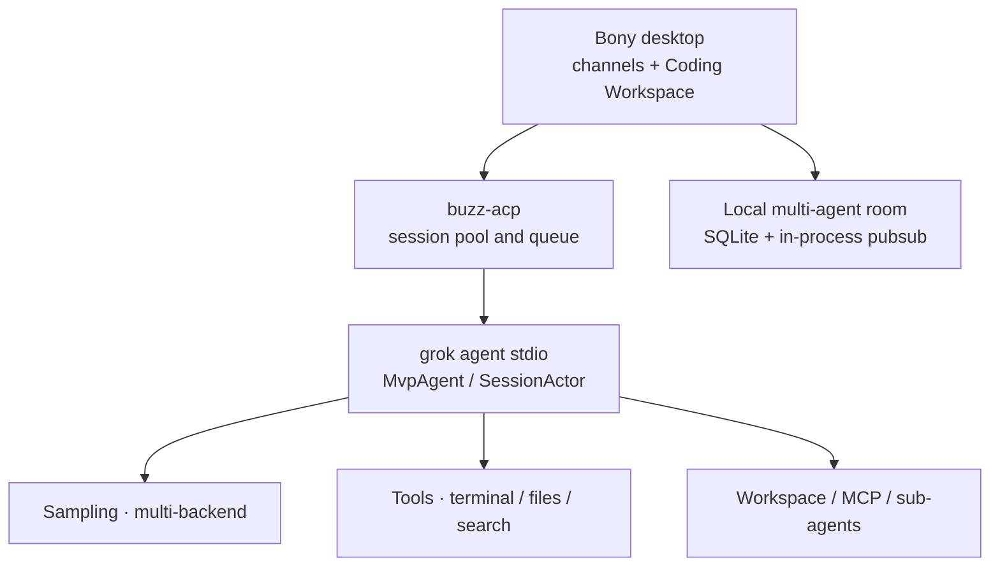

<div align="center">

# Bony

**A local-first desktop platform for AI coding and multi-agent collaboration** — open local projects, enter a Coding Workspace, run coding agents, and coordinate specialists in shared rooms from one client.

Grok is available today over [ACP](https://agentclientprotocol.com/), with one extension path for Codex, Claude Code, and other coding agents. Bony is built with Rust, Tauri, and SQLite for local projects and local execution.

**Language:** [中文](README.md) · **English**

[Quick start](#quick-start) ·
[Features](#features) ·
[Local multi-agent collaboration](#local-multi-agent-collaboration) ·
[Web monitor](#web-monitor) ·
[Models & providers](#models--providers) ·
[Architecture](#architecture) ·
[Contributors](#contributors) ·
[Upstream relationship](#upstream-relationship) ·
[Development](#development)


</div>

---

## What is Bony

Bony brings the desktop coding workspace and multi-agent room together in one client. Its core workflow is:

1. Select a local project and open Coding Workspace inside a channel.
2. Start a Grok session over ACP and use file, terminal, and search capabilities for coding work.
3. Return to the shared room, where Grok hands search, engine, editing, and documentation work to specialists with `@`.
4. Add Codex, Claude Code, and other coding agents through the same session entry point.

**The repository and product are both named Bony.** `third_party/buzz` contains the embedded and adapted Block/Buzz client and room foundations; the agent / TUI runtime tracks [`xai-org/grok-build`](https://github.com/xai-org/grok-build). Repo: [`phuhao00/bony`](https://github.com/phuhao00/bony).

---

## Features

| Capability | Description |
|------------|-------------|
| Coding Workspace | Open a Codex-like coding surface with projects, sessions, messages, terminal, and search inside a channel |
| Local projects | Native directory picker, recent projects, and removal; ACP sessions use the real project path |
| Session isolation | Switching projects releases the old session and starts a new one to prevent cwd leakage |
| Multi-agent path | Grok works today; UI and session layers expose one extension point for Codex and Claude Code |
| Bony desktop interaction | Smooth workspace/channel transitions with shared theme, title bar, and window behavior |
| Room collaboration | Grok coordinates ZeroClaw / Unity / OpenMontage / DocSmith with threads and progress feedback |
| Local backend | Rust + SQLite + in-process pubsub, one workspace and one root `target/` |
| Web monitor | Architecture layers, “how it works”, feature-impact matrix, commit impact timeline |

---

## Local multi-agent collaboration

Bony's room capability is built on embedded and adapted [Block/Buzz](third_party/buzz) code: **Grok** is the room coordinator, with **ZeroClaw** (search), **Unity** (game engine), **OpenMontage** (editing), and **DocSmith** (docs) as specialists collaborating in a shared channel via serial `@` handoffs — mid-turn tool status is visible, messages can carry emoji reactions, and threads open on demand for follow-ups.

The local backend uses **SQLite** persistence (WAL mode with a 30-second busy timeout), in-process pub/sub, rate limiting and presence, plus embedded **[LanceDB](https://github.com/lancedb/lancedb)** semantic search. S3-compatible object storage can be configured for attachments.


One-shot startup (whitelisted scripts only; always build with `cargo build -p <crate>`):

```powershell
powershell -File .\scripts\buzz-room\start-room-stack.ps1 -SkipBuild   # relay + in-process pubsub + SQLite
powershell -File .\scripts\buzz-room\start-desktop.ps1                 # Bony desktop client
powershell -File .\scripts\buzz-room\stop-room-stack.ps1               # stop everything
```

Policy and architecture detail: [`docs/buzz-room-collab.md`](docs/buzz-room-collab.md), [`third_party/buzz/README.md`](third_party/buzz/README.md), [`scripts/buzz-room`](scripts/buzz-room).

---

## Web monitor

Local dashboard for **architecture**, end-to-end “how it works”, and **per-change impact**:

```powershell
cargo run -p bony-monitor -- --bind 127.0.0.1:8787
# open http://127.0.0.1:8787
```

Capabilities:

- **Feature-impact matrix**: chat, model switch, auth, multi-provider, tools, permissions, ACP session, workspace, TUI, monitor, docs, …
- **Multi-axis scoring**: UX / capability / security / stability / compatibility / performance / DX / docs
- **How it works**: layer and turn-flow notes (with architecture diagrams)
- Per-commit **user impact** + **suggested verification checklist**
- Commit messages may include `Impact:` / `改进:` / `Risk:` / `风险:`

Implementation: `crates/codegen/bony-monitor` (Axum).

---

## Quick start

### Dependencies

1. **Rust** (see [`rust-toolchain.toml`](rust-toolchain.toml))
2. **`grok` CLI** (agent subprocess)  
   ```powershell
   npm i -g @xai-official/grok
   grok --version
   ```
3. **Credentials** (either)  
   - Configure BYOK models + env vars in `%USERPROFILE%\.grok\config.toml` (recommended)  
   - Or `grok login` / `XAI_API_KEY`

### Launch the desktop app

```powershell
# Build and run from the repository root, sharing the root target/
cargo build -p buzz-desktop
powershell -File .\scripts\buzz-room\start-desktop.ps1
```

After startup, enter a channel, click the code icon in the header to open Coding Workspace, then choose a local project directory.

### Terminal TUI

This repo ships the full `grok` TUI / agent sources:

```powershell
$env:CARGO_TARGET_DIR = "$PWD\target"
cargo run -p xai-grok-pager-bin
```

Official prebuilt install:

```powershell
irm https://x.ai/cli/install.ps1 | iex
```

---

## Models & providers

Model catalog and defaults come from `%USERPROFILE%\.grok\config.toml`. After launch, click the **model name** to switch; the choice is written to `[models] default`.

You can also **edit config.toml** in the picker. Example (Qwen / DashScope):

```toml
[models]
default = "qwen-max"
stream_tool_calls = false

[model.qwen-max]
model = "qwen-max"
base_url = "https://dashscope.aliyuncs.com/compatible-mode/v1"
name = "Qwen Max"
env_key = "DASHSCOPE_API_KEY"
api_backend = "chat_completions"
context_window = 32768
```

Verified providers:

| Provider | Typical `base_url` | Env var |
|----------|--------------------|---------|
| Qwen | `https://dashscope.aliyuncs.com/compatible-mode/v1` | `DASHSCOPE_API_KEY` |
| Kimi / Moonshot | `https://api.moonshot.cn/v1` | `MOONSHOT_API_KEY` |
| Zhipu GLM | `https://open.bigmodel.cn/api/paas/v4` | `ZHIPUAI_API_KEY` |
| OpenAI-compatible | Any `/v1` endpoint | Custom `env_key` |

More protocols:  
[`crates/codegen/xai-grok-pager/docs/user-guide/11-custom-models.md`](crates/codegen/xai-grok-pager/docs/user-guide/11-custom-models.md)

Restart the desktop app after config or env changes. Use `grok models` to verify the catalog.

---

## Architecture

Overview (renders on GitHub):



Layered view and a single turn:


- Desktop app: [`third_party/buzz/desktop`](third_party/buzz/desktop)
- ACP session layer: [`third_party/buzz/crates/buzz-acp`](third_party/buzz/crates/buzz-acp)
- Write-up: [`ARCHITECTURE.md`](ARCHITECTURE.md)

Bony drives local coding-agent subprocesses over ACP; Rust owns project paths, sessions, and queueing. Rust crates and directories use the `buzz-*` technical prefix.

---

## Contributors

| Name | Role |
|------|------|
| [phuhao (@phuhao00)](https://github.com/phuhao00) | Creator, product lead, and core maintainer of Bony |
| [OpenAI Codex](https://github.com/apps/openai-codex) | Agentic coding collaborator across design, implementation, testing, and documentation |
| [Cursor Agent](https://github.com/cursoragent) | AI coding collaborator for code exploration, refactoring, and interaction iteration |

Codex and Cursor are listed transparently as AI development collaborators. GitHub's Contributors sidebar only counts GitHub accounts associated with commits, so AI tools do not appear there as standalone accounts.

---

## Upstream relationship

| Layer | Source |
|-------|--------|
| Agent / TUI / tool stack | Periodically aligned with [`xai-org/grok-build`](https://github.com/xai-org/grok-build) (`Synced from monorepo`) |
| Product layer | Fork-owned: Bony desktop integration, `bony-monitor`, brand, and collaboration docs |
| Pin | Root [`SOURCE_REV`](SOURCE_REV) records the upstream monorepo sync point |

### Sync upstream

```powershell
git remote add upstream https://github.com/xai-org/grok-build.git   # once
git fetch upstream
git rebase upstream/main
# After history rewrite:
git push --force-with-lease origin main
```

## Repo layout (summary)

| Path | Description |
|------|-------------|
| `third_party/buzz/desktop` | Bony desktop implementation, including channels and Coding Workspace (technical package name remains `buzz-desktop`) |
| `third_party/buzz/crates/buzz-acp` | Coding-agent ACP session pool and queue |
| `crates/codegen/bony-monitor` | Architecture & change-impact Web monitor |
| `crates/codegen/xai-grok-shell` | Agent runtime, stdio / headless |
| `crates/codegen/xai-grok-pager*` | Official TUI (`grok`) |
| `crates/codegen/xai-grok-agent` / `*-tools` / `*-workspace` | Agent, tools, workspace |
| `crates/codegen/xai-acp-lib` | ACP stdio helpers (used by the desktop bridge) |
| `docs/` | Bony documentation, screenshots, and architecture diagrams |
| `scripts/buzz-room/` | Startup entry points for Bony's local collaboration stack: relay / Desktop / external agents |
| `third_party/buzz` | Embedded and adapted Block/Buzz foundations (in-tree workspace members) |
| `SOURCE_REV` | Upstream monorepo sync revision |

Full upstream docs remain in each crate and the [user guide](crates/codegen/xai-grok-pager/docs/user-guide/).

---

## Development

```powershell
$env:CARGO_TARGET_DIR = "$PWD\target"
$env:PROTOC = "$PWD\.tools\protoc\bin\protoc.exe"   # if you have protoc placed here
cargo check -p buzz-desktop -p bony-monitor
cargo test -p buzz-acp
cargo build -p buzz-desktop
```

Ignore local artifacts: `target/`, `.tools/`, `.local-dist/`, `*.log`.

---

## Docs & license

- Coding Workspace: [`third_party/buzz/desktop/src/features/channels/ui/CodingWorkspaceScreen.tsx`](third_party/buzz/desktop/src/features/channels/ui/CodingWorkspaceScreen.tsx)
- User guide: [`crates/codegen/xai-grok-pager/docs/user-guide/`](crates/codegen/xai-grok-pager/docs/user-guide/)
- Auth: [`02-authentication.md`](crates/codegen/xai-grok-pager/docs/user-guide/02-authentication.md)
- Custom models: [`11-custom-models.md`](crates/codegen/xai-grok-pager/docs/user-guide/11-custom-models.md)
- Upstream open-source repo: [`xai-org/grok-build`](https://github.com/xai-org/grok-build)
- License: [`LICENSE`](LICENSE) and per-crate declarations

The agent runtime and `grok` CLI come from [SpaceXAI / Grok Build](https://x.ai/cli) and [`xai-org/grok-build`](https://github.com/xai-org/grok-build); room and client foundations come from [Block/Buzz](third_party/buzz).
