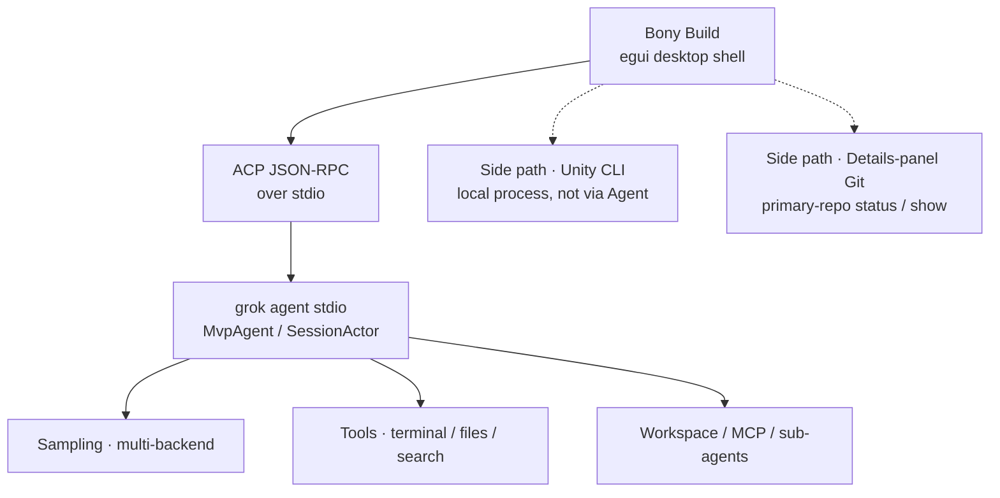

<div align="center">

# Bony Build

**Native desktop AI coding assistant** — chat to edit code, isolate tasks in Git worktrees, details-panel VCS, session plugins (Unity / Bevy).

**Language:** [中文](README.md) · **English**

[Prebuilt binaries](#prebuilt-binaries) ·
[Quick start](#quick-start) ·
[Features](#features) ·
[Details & VCS](#details--vcs) ·
[Plugins & Unity](#plugins--unity) ·
[Web monitor](#web-monitor) ·
[Models & providers](#models--providers) ·
[Architecture](#architecture) ·
[Upstream relationship](#upstream-relationship) ·
[Development](#development)


</div>

---

## What is this

**Bony Build** is a native desktop client (Rust / egui, currently `v0.1.3`). It drives a local `grok agent stdio` process over [ACP](https://agentclientprotocol.com/) and does **conversational coding** in the workspace you choose—explore code, edit files, run the terminal and search tools—not just a chat window.

Good fit if you want to:

- Use **multi-provider BYOK** (Qwen / Kimi / Zhipu / OpenAI-compatible, etc.) for day-to-day edits on your machine
- Keep work **isolated per task with Git worktrees**, with sidebar conversations grouped **by project**
- Inspect the working copy, per-file diffs, and commit history in a **resizable details panel** (Fork-style)
- Drive Unity / Bevy extensions locally; Unity uses a **local CLI loop** (probe, Play, Pipeline) without hanging installs through the Agent
- Inspect architecture layers and per-commit feature impact with a local **Web monitor**

Typical uses: explain repo structure, dig into recent changes, add tests, summarize auth / architecture. Per-task permissions: read-only / ask / allow edits / full control; or require manual approval globally with `--ask-permissions`.

**The product brand and desktop shell are Bony Build.** Agent / TUI runtime tracks open-source [`xai-org/grok-build`](https://github.com/xai-org/grok-build) (see [Upstream relationship](#upstream-relationship)). Repo: [`phuhao00/bony`](https://github.com/phuhao00/bony).

---

## Prebuilt binaries

GitHub Releases ship desktop zips (you still need a local `grok` CLI):

- [**Bony Build v0.1.3**](https://github.com/phuhao00/bony/releases/tag/v0.1.3)
  - `bony-build-v0.1.3-windows-x86_64.zip`
  - `bony-build-v0.1.3-macos-aarch64.zip`
  - `bony-build-v0.1.3-macos-x86_64.zip`

Built by [`.github/workflows/release-desktop.yml`](.github/workflows/release-desktop.yml) on `v*` tags (`release-dist` profile). Local packaging output under `.local-dist/` is listed in [`.gitignore`](.gitignore)—do not commit exe / zip artifacts.

---

## Features

| Capability | Description |
|------------|-------------|
| Chat workspace | Codex-style sidebar + timeline; Markdown, user bubbles / assistant cards, inline tool results |
| New chat | Top-level **New chat** is unscoped; sidebar has a **Recent chats** inbox |
| Grouped by project | Sidebar groups conversations by project; delete / archive; suggested titles |
| Tasks & worktrees | Create / switch tasks; optional isolated worktrees and branches |
| Details · VCS | Resizable right panel: working-copy file list, colored diffs, describe & commit, history → changed files → per-file patch |
| Session plugins | Composer **`+`**: attach files, enable Unity / Bevy, manage plugins; dismissible chips |
| Plugins store | **Plugins** page: tabs, search, installed strip, full-width cards |
| Permission modes | Per task: read-only / ask / allow edits / full control; CLI supports `--ask-permissions` |
| Model switching | Click the model name in the composer; choice is written to `~/.grok/config.toml` as default |
| Multi-provider | Kimi / Qwen / Zhipu / OpenAI-compatible / Anthropic Messages, etc. (BYOK) |
| Unity control | **Plugins** page for install & project binding; in-chat chip + shortcuts / `/unity`; **local CLI, not Agent** |
| Bevy | Optional Rust ECS game-dev integration (enable on the Plugins page) |
| Usage stats | Turn and token usage panel (line / bar charts) |
| CJK UI | System Chinese fonts (e.g. Microsoft YaHei) to avoid tofu glyphs |
| Shortcuts | **Enter** to send, **Shift+Enter** for newline |
| Web monitor | Architecture layers, “how it works”, feature-impact matrix, commit impact timeline |

Primary sidebar nav today: **New chat** · **Chat** · **Plugins**. Sites / PRs / schedules remain placeholders.

---

## Details & VCS

Open the right-hand **Details** panel for session info and Git:

1. **Working copy** — scans the **primary project checkout** (not the agent worktree); lists A/M/D changes  
2. **Describe & commit** — when dirty, an inline message field appears; commit after describing  
3. **Recent history** — click a commit → **changed files** (add/del bars) → click a file for that file’s patch  
4. Drag the **left edge** of the panel to widen it for long diffs  

Non-Git directories do not raise a modal error; the panel simply notes that VCS is unavailable. Status refreshes about every 2 seconds, or use **Refresh**.

---

## Plugins & Unity

### Plugin model

1. Sidebar **Plugins**: enable / disable Unity, Bevy, etc.; open settings or docs  
2. Composer **`+`**: attach files or extensions for this session; dismissible context chips  
3. With Unity enabled, the composer offers quiet shortcuts (save scene, refresh assets, Play, …) and docs

Unity actions use the **local Unity CLI**, not the grok Agent—so `unity pipeline install` does not hang inside a worktree.

### Recommended install

Install CLI → re-detect → confirm a project root with `Assets` → install Pipeline → open the editor and probe → run the loop. Default Windows CLI: `%LOCALAPPDATA%\Unity\bin\unity.exe`.

```powershell
$env:UNITY_CLI_CHANNEL='beta'; irm https://public-cdn.cloud.unity3d.com/hub/prod/cli/install.ps1 | iex
```

More detail: [`crates/codegen/bony-build/README.md`](crates/codegen/bony-build/README.md).

---

## Web monitor

Local dashboard for **architecture**, end-to-end “how it works”, and **per-change impact**:

```powershell
powershell -ExecutionPolicy Bypass -File .\scripts\run-monitor.ps1
# open http://127.0.0.1:8787
```

Capabilities:

- **Feature-impact matrix**: chat, model switch, auth, multi-provider, tools, permissions, ACP session, workspace, TUI, monitor, docs, …
- **Multi-axis scoring**: UX / capability / security / stability / compatibility / performance / DX / docs
- **How it works**: layer and turn-flow notes (with architecture diagrams)
- Per-commit **user impact** + **suggested verification checklist**
- Commit messages may include `Impact:` / `改进:` / `Risk:` / `风险:`

Implementation: `crates/codegen/bony-monitor` (Axum).

---

## Quick start

### Dependencies

1. **Rust** (see [`rust-toolchain.toml`](rust-toolchain.toml))
2. **`grok` CLI** (agent subprocess)  
   ```powershell
   npm i -g @xai-official/grok
   grok --version
   ```
3. **Credentials** (either)  
   - Configure BYOK models + env vars in `%USERPROFILE%\.grok\config.toml` (recommended)  
   - Or `grok login` / `XAI_API_KEY`

### Launch the desktop app

```powershell
# Dev: build and run
powershell -ExecutionPolicy Bypass -File .\scripts\run-desktop.ps1

# Clean restart: kill old process → release build → launch
powershell -ExecutionPolicy Bypass -File .\scripts\run-bony-build.ps1

# Or
$env:CARGO_TARGET_DIR = "$PWD\target"
cargo run -p bony-build
```

Useful flags:

```text
--cwd <path>        Session working directory (default: cwd)
--grok-bin <path>   Path to the grok executable
--ask-permissions   Require manual tool approval (default: auto-approve)
```

On Windows, **os error 4551** (Smart App Control) usually means build from a trusted terminal or disable SAC.

### Terminal TUI

This repo still ships the full `grok` TUI / agent sources:

```powershell
powershell -ExecutionPolicy Bypass -File .\scripts\run-dev.ps1
# or
cargo run -p xai-grok-pager-bin
```

Official prebuilt install:

```powershell
irm https://x.ai/cli/install.ps1 | iex
```

---

## Models & providers

Model catalog and defaults come from `%USERPROFILE%\.grok\config.toml`. After launch, click the **model name** to switch; the choice is written to `[models] default`.

You can also **edit config.toml** in the picker. Example (Qwen / DashScope):

```toml
[models]
default = "qwen-max"
stream_tool_calls = false

[model.qwen-max]
model = "qwen-max"
base_url = "https://dashscope.aliyuncs.com/compatible-mode/v1"
name = "Qwen Max"
env_key = "DASHSCOPE_API_KEY"
api_backend = "chat_completions"
context_window = 32768
```

Verified providers:

| Provider | Typical `base_url` | Env var |
|----------|--------------------|---------|
| Qwen | `https://dashscope.aliyuncs.com/compatible-mode/v1` | `DASHSCOPE_API_KEY` |
| Kimi / Moonshot | `https://api.moonshot.cn/v1` | `MOONSHOT_API_KEY` |
| Zhipu GLM | `https://open.bigmodel.cn/api/paas/v4` | `ZHIPUAI_API_KEY` |
| OpenAI-compatible | Any `/v1` endpoint | Custom `env_key` |

More protocols:  
[`crates/codegen/xai-grok-pager/docs/user-guide/11-custom-models.md`](crates/codegen/xai-grok-pager/docs/user-guide/11-custom-models.md)

Restart the desktop app after config or env changes. Use `grok models` to verify the catalog.

---

## Architecture

Overview (renders on GitHub):



Layered view and a single turn:


- Desktop crate: [`crates/codegen/bony-build`](crates/codegen/bony-build)
- Write-up: [`ARCHITECTURE.md`](ARCHITECTURE.md)

The desktop app does **not** embed the full agent runtime; it drives an installed `grok` subprocess.

---

## Upstream relationship

| Layer | Source |
|-------|--------|
| Agent / TUI / tool stack | Periodically aligned with [`xai-org/grok-build`](https://github.com/xai-org/grok-build) (`Synced from monorepo`) |
| Product shell | Fork-owned: `bony-build`, `bony-monitor`, branded docs, desktop release workflow |
| Pin | Root [`SOURCE_REV`](SOURCE_REV) records the upstream monorepo sync point |

### Sync upstream

```powershell
git remote add upstream https://github.com/xai-org/grok-build.git   # once
git fetch upstream
git rebase upstream/main
# After history rewrite:
git push --force-with-lease origin main
```

Rollback tag (if still present locally): `backup/pre-upstream-sync`.

---

## Repo layout (summary)

| Path | Description |
|------|-------------|
| `crates/codegen/bony-build` | Bony Build desktop client (details VCS, Unity / Bevy / plugin UX) |
| `crates/codegen/bony-monitor` | Architecture & change-impact Web monitor |
| `crates/codegen/xai-grok-shell` | Agent runtime, stdio / headless |
| `crates/codegen/xai-grok-pager*` | Official TUI (`grok`) |
| `crates/codegen/xai-grok-agent` / `*-tools` / `*-workspace` | Agent, tools, workspace |
| `crates/codegen/xai-acp-lib` | ACP stdio helpers (used by the desktop bridge) |
| `scripts/run-desktop.ps1` | Desktop build & run |
| `scripts/run-bony-build.ps1` | Kill old processes + release build + launch |
| `scripts/run-monitor.ps1` | Start Web monitor (default :8787) |
| `scripts/run-dev.ps1` | TUI dev launch |
| `.github/workflows/release-desktop.yml` | Multi-platform desktop zip release |
| `docs/` | Screenshots and architecture diagrams |
| `SOURCE_REV` | Upstream monorepo sync revision |

Full upstream docs remain in each crate and the [user guide](crates/codegen/xai-grok-pager/docs/user-guide/).

---

## Development

```powershell
$env:CARGO_TARGET_DIR = "$PWD\target"
$env:PROTOC = "$PWD\.tools\protoc\bin\protoc.exe"   # if you have protoc placed here
cargo check -p bony-build -p bony-monitor
cargo build -p bony-build --profile release-dist
cargo run -p bony-build -- --cwd $PWD
```

Ignore local artifacts: `target/`, `.tools/`, `.local-dist/`, `*.log`.

To cut a release: push an annotated tag (e.g. `v0.1.3`) to trigger the desktop workflow, or `workflow_dispatch` with an existing tag.

---

## Docs & license

- User guide: [`crates/codegen/xai-grok-pager/docs/user-guide/`](crates/codegen/xai-grok-pager/docs/user-guide/)
- Auth: [`02-authentication.md`](crates/codegen/xai-grok-pager/docs/user-guide/02-authentication.md)
- Custom models: [`11-custom-models.md`](crates/codegen/xai-grok-pager/docs/user-guide/11-custom-models.md)
- Upstream open-source repo: [`xai-org/grok-build`](https://github.com/xai-org/grok-build)

This repo includes agent / TUI sources synced from the SpaceXAI monorepo / `xai-org/grok-build`; the desktop product layer is Bony Build. See root [`LICENSE`](LICENSE) and per-crate declarations.

---

## Acknowledgments

Agent runtime and `grok` CLI capabilities come from [SpaceXAI / Grok Build](https://x.ai/cli) and [`xai-org/grok-build`](https://github.com/xai-org/grok-build). Bony Build adds a multi-provider desktop experience, task / worktree workflows, a details-panel VCS UI, session plugins (Unity / Bevy), and change observability on top.
