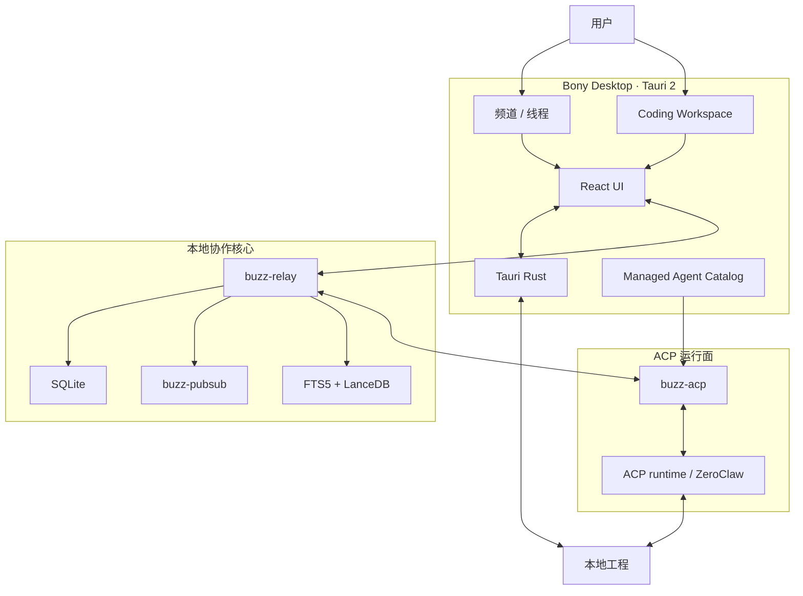

<div align="center">

# Bony

**本地优先的桌面 AI 编程与多 Agent 协作平台** — 在一个客户端里打开本地工程、进入 Coding Workspace、运行 Coding Agent，并在共享房间里协作。

通过 [ACP](https://agentclientprotocol.com/) 接入本机 Coding Agent（Codex、Claude Code 或自定义 runtime）。默认房间座席是 **ZeroClaw**（检索）。产品用 Rust、Tauri 与 SQLite 构建。

**语言:** **中文** · [English](README.en.md)

[快速开始](#快速开始) ·
[功能](#功能) ·
[技术栈](#技术栈) ·
[本地多 Agent 协作](#本地多-agent-协作) ·
[模型与供应商](#模型与供应商) ·
[架构与运行链路](#架构与运行链路) ·
[开发](#开发)

[▶ 播放 Bony 桌面工作区演示视频](https://cdn.jsdelivr.net/gh/phuhao00/bony@main/docs/bony-desktop-demo.mp4)

</div>

---

## Bony 是什么

Bony 把桌面编程工作区与多 Agent 房间放在同一个客户端里：

1. 选择本地工程目录，在频道内打开 Coding Workspace。
2. 通过 ACP 启动已授权的 Coding Agent，在真实工程路径上做文件、终端与搜索。
3. 切回共享房间，用 `@Agent` 串行交接（一条消息最多一个 `@`）。默认检索走 `@ZeroClaw`。
4. 同一 catalog 可继续接入 Codex、Claude Code 或自定义 ACP runtime。

**项目名称与产品名称都是 Bony。** 源码在仓库根：`desktop/`（Tauri 客户端）、`crates/`（relay / ACP / 数据层）。仓库：[`phuhao00/bony`](https://github.com/phuhao00/bony)。

---

## 功能

| 能力 | 说明 |
|------|------|
| Coding Workspace | 频道内编码界面：工程、会话、消息、终端与搜索 |
| 本地工程 | 原生目录选择、最近项目；ACP 会话使用工程真实路径 |
| 会话隔离 | 切换工程时切换 ACP `cwd`，避免工作目录串线 |
| 多 Agent | 默认房间座席 ZeroClaw；Coding Workspace 走 ACP catalog |
| 房间协作 | `@` 串行交接、线程、进度；工具硬拦优先于 prompt |
| 本地后端 | Rust + SQLite + 进程内 pubsub；单一 workspace、单一根 `target/` |

---

## 技术栈

| 层 | 技术 | 用途 |
|----|------|------|
| 桌面壳 | **Tauri 2 · Rust · Tokio** | 窗口、目录选择、进程生命周期、Keyring、OS 集成 |
| 界面 | **React · TypeScript · Vite · Tailwind** | 频道、Coding Workspace、交互状态；不承载编排业务 |
| Agent 协议 | **ACP · `buzz-acp`** | 会话、prompt、取消 turn、流式事件 |
| 房间服务 | **Axum · WebSocket · Nostr** | 频道事件、成员、线程 |
| 数据 | **SQLx · SQLite（WAL）· 进程内 pubsub** | 持久化与本机 fan-out |
| 检索 | **FTS5 · LanceDB** | 全文与语义检索 |

`buzz-*` 是 crate 技术前缀；产品名是 Bony。

---

## 本地多 Agent 协作

房间栈在本仓库根 workspace 内：`crates/buzz-relay` 等。启动时 Desktop 通过 `seed_room_agents` 幂等创建 **Local Room** 与内置 **ZeroClaw**。不再 seed 的旧座席会在 reconcile 时归档并移出频道。

本地后端：**SQLite**（WAL + busy timeout）、进程内 pubsub、嵌入式 **LanceDB**。


```powershell
powershell -File .\scripts\buzz-room\start-room-stack.ps1 -SkipBuild
powershell -File .\scripts\buzz-room\start-desktop.ps1
powershell -File .\scripts\buzz-room\stop-room-stack.ps1
```

策略：[`docs/buzz-room-collab.md`](docs/buzz-room-collab.md)、[`docs/PROJECT_STANDARDS.md`](docs/PROJECT_STANDARDS.md)。

---

## 快速开始

### 依赖

1. **Rust**（[`rust-toolchain.toml`](rust-toolchain.toml)）
2. Windows：VS 2022 C++ 与 CMake（原生依赖）
3. 前端：Node + pnpm 11.4（仅改 UI / 首次装 `desktop` 依赖时）
4. **ZeroClaw**：默认 `~/.bony-build/zeroclaw/target/release/zeroclaw.exe`，否则 PATH 上的 `zeroclaw`

### 启动

从**仓库根**：

```powershell
cargo build -p buzz-relay -p buzz-desktop
powershell -File .\scripts\buzz-room\start-room-stack.ps1 -SkipBuild
powershell -File .\scripts\buzz-room\start-desktop.ps1
```

已有 `target/debug` 产物时启动脚本带 `-SkipBuild`，不要无确认 `cargo clean`。

### Coding Workspace

1. 进入频道，点标题栏右侧代码图标。
2. 选择本地工程；本机层规范化路径并写入最近项目（最多 12 项）。
3. 在 Project agents 中选择已授权 ACP Agent。
4. 发送任务。事件带 Agent mention 与 `coding-workspace-v1` 工程标记。
5. `buzz-acp` 为该工程创建或复用会话，`session/new` 的 `cwd` 为真实目录。
6. 可 **Stop** 取消当前 turn；换工程会换会话边界。

---

## 模型与供应商

Coding Agent 的模型与密钥由所选 ACP runtime 自己的配置管理（环境变量或该工具的配置文件）。改完后请重启桌面端。

---

## 架构与运行链路



一次 Coding Workspace 请求：UI → 签名房间事件（含工程标记）→ `buzz-relay` → `buzz-acp` → ACP `session/new(cwd)` + `session/prompt` → 流式回写频道。

房间硬拦：`BUZZ_ACP_DENY_TOOLS` 在 `session/request_permission` 上 `reject_once`；一条消息最多一个 `@Agent`。

### 数据位置

| 数据 | 位置 |
|------|------|
| 本地工程 | 用户选择的目录 |
| 最近项目 | Tauri app data `coding-workspaces.json` |
| 房间数据 | 仓库根 `buzz.db`（WAL，gitignore） |
| 实时状态 | `buzz-pubsub` 进程内 |
| 密钥 | OS Keyring / 环境变量 |

详见 [`ARCHITECTURE.md`](ARCHITECTURE.md)。

---

## 仓库布局

| 路径 | 说明 |
|------|------|
| `desktop/` | 桌面客户端（crate `buzz-desktop`） |
| `crates/` | relay、acp、db、pubsub、search、economy 等 |
| `desktop/src-tauri/prompts/` | 房间座席文案 |
| `docs/` | 项目规范与房间协作 |
| `scripts/buzz-room/` | 仅三个启动/停止入口 |
| `migrations/` | 数据库迁移 |

---

## 开发

规范：[`docs/PROJECT_STANDARDS.md`](docs/PROJECT_STANDARDS.md) · [`AGENTS.md`](AGENTS.md)

```powershell
cargo check -p buzz-desktop
cargo test -p buzz-acp
cargo build -p buzz-desktop
```

忽略：`target/`、`.local-dist/`、`.local-runtime/`、`*.log`、`buzz.db*`。

---

## 文档与许可

- 规范：[`docs/PROJECT_STANDARDS.md`](docs/PROJECT_STANDARDS.md)
- 房间协作：[`docs/buzz-room-collab.md`](docs/buzz-room-collab.md)
- 架构：[`ARCHITECTURE.md`](ARCHITECTURE.md)
- 许可证：[`LICENSE`](LICENSE)
