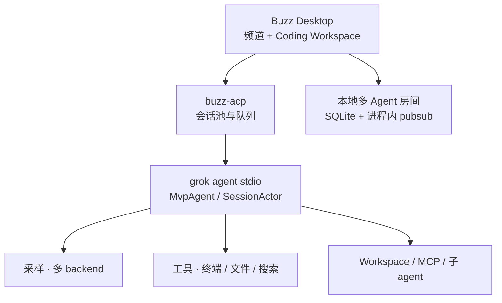

<div align="center">

# Bony Build

**原生桌面 AI 编程助手 + 本地多 Agent 协作房间** — 在同一个 [Buzz Desktop](third_party/buzz/desktop) 中切换频道与 Coding Workspace，打开本地工程并通过 ACP 驱动 Grok；面向 Codex、Claude Code 等 Coding Agent 的后续协同扩展。

**语言:** **中文** · [English](README.en.md)

[快速开始](#快速开始) ·
[功能](#功能) ·
[Buzz 本地协作房间](#buzz-本地协作房间) ·
[Web 监控](#web-监控) ·
[模型与供应商](#模型与供应商) ·
[架构](#架构) ·
[与上游关系](#与上游关系) ·
[开发](#开发)


</div>

---

## 这是什么

本仓库把桌面编程工作区与多 Agent 房间统一进一个 Buzz Desktop：

1. **Coding Workspace**：在频道顶部点击代码图标，打开本地工程目录，通过 [ACP](https://agentclientprotocol.com/) 驱动 `grok agent stdio` 完成探索、编辑、终端与搜索。
2. **本地多 Agent 房间**：Grok 当协调员，ZeroClaw / Unity / OpenMontage / DocSmith 等专员按 `@` 交接分工；后端使用 Rust + SQLite，不依赖 Docker / Postgres / Redis。

适合：

- 本机 **多供应商 BYOK**（Qwen / Kimi / 智谱 / OpenAI 兼容等）日常改码
- 在 Coding Workspace 中管理本地工程、切换会话，并让每个 ACP 会话使用真实工程目录
- 在同一桌面界面中平滑切换频道协作与编码任务，主题跟随 Buzz
- 通过统一 Agent 会话模型逐步接入 Grok、Codex、Claude Code 等编码 Agent
- 用本地 **Web 监控**看架构分层与每次提交对功能的影响
- 需要多个专精 Agent 分工协作时，用 **Buzz 房间**里 `@` 交接，而不是一个 Agent 全包

常见用法：解释仓库结构、排查近期改动、补测试、总结认证 / 架构；或在 Buzz 房间里让 ZeroClaw 检索、Unity 操作引擎、DocSmith 出文档。

**Bony Build 是仓库与产品名称，Buzz Desktop 是唯一桌面壳**；agent / TUI 运行时对齐开源上游 [`xai-org/grok-build`](https://github.com/xai-org/grok-build)（见 [与上游关系](#与上游关系)）。仓库：[`phuhao00/bony`](https://github.com/phuhao00/bony)。

---

## 功能

| 能力 | 说明 |
|------|------|
| Coding Workspace | 在频道内打开类似 Codex 的编码界面，不跳出独立应用 |
| 本地工程 | 原生目录选择器、最近项目、移除记录；ACP 会话使用工程真实路径 |
| 会话隔离 | 切换工程时释放旧会话并创建新会话，避免工作目录串线 |
| 多 Agent 演进 | Grok 当前可用；界面和会话层为 Codex、Claude Code 等保留统一扩展点 |
| Buzz 交互 | Coding Workspace 与频道丝滑切换，主题、标题栏和窗口行为跟随 Buzz |
| 房间协作 | Grok 协调 ZeroClaw / Unity / OpenMontage / DocSmith，支持线程和状态反馈 |
| 本地后端 | Rust + SQLite + 进程内 pubsub，单 workspace、单根 `target/` |
| Web 监控 | 架构分层、「怎么工作」、功能影响矩阵与提交影响时间线 |

---

## Buzz 本地协作房间

本仓库另含 [Block/Buzz](third_party/buzz) 的本地多 Agent 协作房间：**Grok** 担任房间协调员，**ZeroClaw**（检索）/ **Unity**（游戏引擎）/ **OpenMontage**（剪辑）/ **DocSmith**（文档产出）等专员在共享频道里按 `@` 串行交接协作——工具调用中途状态可见，消息可加表情反馈，还能按需开子线程深入追问。

后端已完成**单机化重构**，不再依赖 Docker / Postgres / Redis：持久化用 **SQLite**（WAL 模式 + 30s busy timeout，支持多 Agent 并发写入不报错）；发布订阅、限流、在线状态用**进程内实现**取代 Redis；语义检索接入嵌入式 **[LanceDB](https://github.com/lancedb/lancedb)** 向量库；对象存储仍走 S3 兼容 OSS，且为可选项——不配置也能本机跑起来。


一键启动（仅限白名单脚本，编译一律走 `cargo build -p <crate>`）：

```powershell
powershell -File .\scripts\buzz-room\start-room-stack.ps1 -SkipBuild   # relay + 进程内 pubsub + SQLite
powershell -File .\scripts\buzz-room\start-desktop.ps1                 # Buzz Desktop
powershell -File .\scripts\buzz-room\stop-room-stack.ps1               # 停止
```

策略与架构细节见 [`docs/buzz-room-collab.md`](docs/buzz-room-collab.md)、[`third_party/buzz/README.md`](third_party/buzz/README.md)、[`scripts/buzz-room`](scripts/buzz-room)。

---

## Web 监控

本地仪表盘，查看 **整体架构**、端到端「怎么工作」，以及 **每一次改动带来的影响**：

```powershell
cargo run -p bony-monitor -- --bind 127.0.0.1:8787
# 浏览器打开 http://127.0.0.1:8787
```

能力：

- **功能影响矩阵**：对话、模型切换、登录认证、多供应商、工具执行、权限、会话 ACP、工作区、TUI、监控、文档等
- **多维度评估**：用户体验 / 功能能力 / 安全 / 稳定性 / 兼容性 / 性能 / 开发体验 / 文档
- **怎么工作**：分层与 turn 流程说明（配合架构图）
- 每次提交的**用户影响说明** + **建议验证清单**
- 支持在 commit message 写 `Impact:` / `改进:` / `Risk:` / `风险:`

实现：`crates/codegen/bony-monitor`（Axum）。

---

## 快速开始

### 依赖

1. **Rust**（见 [`rust-toolchain.toml`](rust-toolchain.toml)）
2. **`grok` CLI**（agent 子进程）  
   ```powershell
   npm i -g @xai-official/grok
   grok --version
   ```
3. **凭证**（任选其一）  
   - 在 `%USERPROFILE%\.grok\config.toml` 配置 BYOK 模型 + 对应环境变量（推荐）  
   - 或 `grok login` / `XAI_API_KEY`

### 启动桌面端

```powershell
# 编译与运行都从仓库根目录走 Cargo，共用根 target/
cargo build -p buzz-desktop
powershell -File .\scripts\buzz-room\start-desktop.ps1
```

启动后进入频道，点击标题栏右侧的代码图标打开 Coding Workspace，再选择本地工程目录。

### 也可使用终端 TUI

本仓库仍包含完整 `grok` TUI / agent 源码：

```powershell
$env:CARGO_TARGET_DIR = "$PWD\target"
cargo run -p xai-grok-pager-bin
```

官方预编译安装：

```powershell
irm https://x.ai/cli/install.ps1 | iex
```

---

## 模型与供应商

模型目录与默认值由 `%USERPROFILE%\.grok\config.toml` 决定。桌面端启动后可点 **模型名** 切换；选择结果会同步写入 `[models] default`。

也可在弹窗中 **编辑 config.toml**。示例（通义 Qwen / DashScope）：

```toml
[models]
default = "qwen-max"
stream_tool_calls = false

[model.qwen-max]
model = "qwen-max"
base_url = "https://dashscope.aliyuncs.com/compatible-mode/v1"
name = "Qwen Max"
env_key = "DASHSCOPE_API_KEY"
api_backend = "chat_completions"
context_window = 32768
```

已验证可配：

| 供应商 | 典型 `base_url` | 环境变量 |
|--------|-----------------|----------|
| 通义 Qwen | `https://dashscope.aliyuncs.com/compatible-mode/v1` | `DASHSCOPE_API_KEY` |
| Kimi / Moonshot | `https://api.moonshot.cn/v1` | `MOONSHOT_API_KEY` |
| 智谱 GLM | `https://open.bigmodel.cn/api/paas/v4` | `ZHIPUAI_API_KEY` |
| OpenAI 兼容 | 任意 `/v1` 端点 | 自定义 `env_key` |

更多协议见：  
[`crates/codegen/xai-grok-pager/docs/user-guide/11-custom-models.md`](crates/codegen/xai-grok-pager/docs/user-guide/11-custom-models.md)

配置或环境变量变更后请**重启桌面端**。可用 `grok models` 核对当前目录。

---

## 架构

概览（GitHub 可渲染）：



分层与一次 turn 流程：


- 桌面应用：[`third_party/buzz/desktop`](third_party/buzz/desktop)
- ACP 会话层：[`third_party/buzz/crates/buzz-acp`](third_party/buzz/crates/buzz-acp)
- 文字说明：[`ARCHITECTURE.md`](ARCHITECTURE.md)

Buzz Desktop 通过 ACP 驱动本机 Coding Agent 子进程；工程目录、会话和队列由 Rust 层管理。

---

## 与上游关系

| 层级 | 来源 |
|------|------|
| Agent / TUI / 工具栈 | 定期对齐 [`xai-org/grok-build`](https://github.com/xai-org/grok-build)（`Synced from monorepo`） |
| 产品壳 | 本仓库自有：Buzz Desktop 集成、`bony-monitor`、品牌与协作文档 |
| 源码钉 | 根目录 [`SOURCE_REV`](SOURCE_REV) 记录上游 monorepo 同步点 |

### 同步上游

```powershell
git remote add upstream https://github.com/xai-org/grok-build.git   # 仅首次
git fetch upstream
git rebase upstream/main
# 历史改写后推送：
git push --force-with-lease origin main
```

回滚可用 tag `backup/pre-upstream-sync`（若本地仍保留）。

---

## 仓库布局（摘要）

| 路径 | 说明 |
|------|------|
| `third_party/buzz/desktop` | 唯一桌面客户端，包含频道与 Coding Workspace |
| `third_party/buzz/crates/buzz-acp` | Coding Agent ACP 会话池与队列 |
| `crates/codegen/bony-monitor` | 架构与改动影响 Web 监控 |
| `crates/codegen/xai-grok-shell` | Agent 运行时、stdio / headless |
| `crates/codegen/xai-grok-pager*` | 官方 TUI（`grok`） |
| `crates/codegen/xai-grok-agent` / `*-tools` / `*-workspace` | Agent、工具、工作区 |
| `crates/codegen/xai-acp-lib` | ACP stdio 辅助库（桌面桥接使用） |
| `docs/` | 截图与架构图（含 Buzz 房间协作） |
| `scripts/buzz-room/` | 本地 Buzz 房间：relay / Desktop / 外部 agent |
| `third_party/buzz` | Buzz 源码（in-tree 工作区成员） |
| `SOURCE_REV` | 上游 monorepo 同步修订 |

完整上游说明见各 crate 文档与 [user guide](crates/codegen/xai-grok-pager/docs/user-guide/)。

---

## 开发

**项目强制规范**（终止目标 · 只用 Rust · 除启动外禁止脚本 · 性能 / 协作默认）：[`docs/PROJECT_STANDARDS.md`](docs/PROJECT_STANDARDS.md) · [`AGENTS.md`](AGENTS.md)

```powershell
$env:CARGO_TARGET_DIR = "$PWD\target"
$env:PROTOC = "$PWD\.tools\protoc\bin\protoc.exe"   # 若已放置 protoc
cargo check -p buzz-desktop -p bony-monitor
cargo test -p buzz-acp
cargo build -p buzz-desktop
```

建议忽略本地产物：`target/`、`.tools/`、`.local-dist/`、各类 `*.log`。

## 文档与许可

- 项目规范：[`docs/PROJECT_STANDARDS.md`](docs/PROJECT_STANDARDS.md)
- Coding Workspace：[`third_party/buzz/desktop/src/features/channels/ui/CodingWorkspaceScreen.tsx`](third_party/buzz/desktop/src/features/channels/ui/CodingWorkspaceScreen.tsx)
- 用户指南：[`crates/codegen/xai-grok-pager/docs/user-guide/`](crates/codegen/xai-grok-pager/docs/user-guide/)
- 认证：[`02-authentication.md`](crates/codegen/xai-grok-pager/docs/user-guide/02-authentication.md)
- 自定义模型：[`11-custom-models.md`](crates/codegen/xai-grok-pager/docs/user-guide/11-custom-models.md)
- 上游开源仓：[`xai-org/grok-build`](https://github.com/xai-org/grok-build)

本仓库含从 SpaceXAI monorepo / `xai-org/grok-build` 同步的 agent / TUI 源码；Buzz Desktop 是唯一桌面产品层。许可证见根目录 [`LICENSE`](LICENSE) 及各 crate 声明。

---

## 致谢

Agent 运行时与 `grok` CLI 能力来源于 [SpaceXAI / Grok Build](https://x.ai/cli) 与 [`xai-org/grok-build`](https://github.com/xai-org/grok-build)。Bony Build 在 Buzz Desktop 中提供本地工程 Coding Workspace、多 Agent 房间与改动可观测能力。
