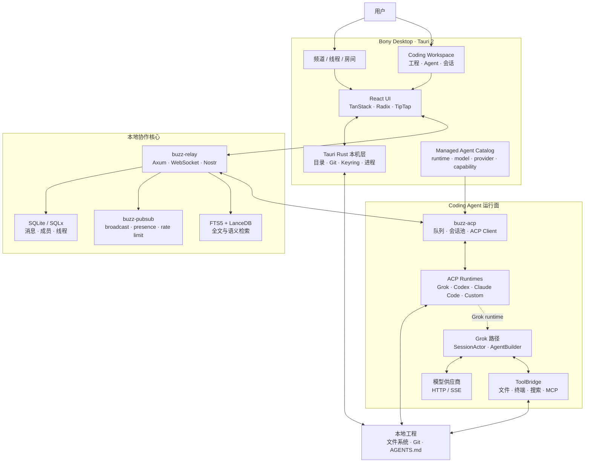
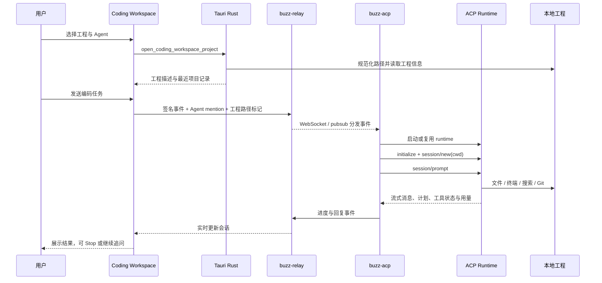

<div align="center">

# Bony

**本地优先的桌面 AI 编程与多 Agent 协作平台** — 在一个客户端里打开本地工程、进入 Coding Workspace、运行 Coding Agent，并在共享房间中协调多个专员协作。

当前通过 [ACP](https://agentclientprotocol.com/) 接入 Grok，并为 Codex、Claude Code 等 Coding Agent 提供统一扩展入口。Bony 使用 Rust、Tauri 与 SQLite 构建，面向本地工程与本机运行环境。

**语言:** **中文** · [English](README.en.md)

[快速开始](#快速开始) ·
[功能](#功能) ·
[技术栈](#技术栈) ·
[本地多 Agent 协作](#本地多-agent-协作) ·
[模型与供应商](#模型与供应商) ·
[架构与运行链路](#架构与运行链路) ·
[贡献者](#贡献者) ·
[与上游关系](#与上游关系) ·
[开发](#开发)

[▶ 播放 Bony 桌面工作区演示视频](docs/bony-desktop-demo.mp4)

</div>

---

## Bony 是什么

Bony 把桌面编程工作区与多 Agent 房间统一在一个客户端中，核心工作流是：

1. 选择本地工程目录，在频道内打开 Coding Workspace。
2. 通过 ACP 启动 Grok 会话，使用文件、终端和搜索能力完成编码任务。
3. 切回共享房间，由 Grok 通过 `@` 把检索、引擎、剪辑和文档任务交给专员。
4. 通过统一会话入口继续接入 Codex、Claude Code 等 Coding Agent。

**项目名称与产品名称都是 Bony。** `third_party/buzz` 存放 Bony 内嵌并改造的 Block/Buzz 客户端与房间基础代码；Agent / TUI 运行时对齐 [`xai-org/grok-build`](https://github.com/xai-org/grok-build)。仓库：[`phuhao00/bony`](https://github.com/phuhao00/bony)。

---

## 功能

| 能力 | 说明 |
|------|------|
| Coding Workspace | 在频道内打开类似 Codex 的编码界面，集成项目、会话、消息、终端与搜索 |
| 本地工程 | 原生目录选择器、最近项目、移除记录；ACP 会话使用工程真实路径 |
| 会话隔离 | 切换工程时释放旧会话并创建新会话，避免工作目录串线 |
| 多 Agent 演进 | Grok 当前可用；界面和会话层为 Codex、Claude Code 等保留统一扩展点 |
| Bony 桌面交互 | Coding Workspace 与频道丝滑切换，共享主题、标题栏和窗口行为 |
| 房间协作 | Grok 协调 ZeroClaw / Unity / OpenMontage / DocSmith，支持线程和状态反馈 |
| 本地后端 | Rust + SQLite + 进程内 pubsub，单 workspace、单根 `target/` |

---

## 技术栈

| 层 | 技术 | 在 Bony 中的用途 |
|----|------|------------------|
| 桌面壳 | **Tauri 2 · Rust · Tokio** | 窗口、系统托盘、原生目录选择、进程生命周期、通知、更新与操作系统集成 |
| 界面 | **React 19 · TypeScript 6 · Vite 8 · Tailwind CSS 4** | 频道、线程、Coding Workspace、Agent 会话与主题；负责界面渲染、交互状态与调用 Tauri 本机能力 |
| UI 与状态 | **Radix UI · TanStack Query / Router / Virtual · TipTap · Shiki · Motion** | 无障碍组件、服务端状态、路由、长列表、富文本、代码高亮与过渡动画 |
| 原生工程集成 | **Tauri Commands · Git · atomic-write-file** | 校验并规范化工程路径、保存最近项目、读取 Git 状态，并把真实目录交给 Coding Agent |
| Agent 协议 | **ACP · JSON-RPC · stdio · `buzz-acp`** | 统一初始化、创建会话、发送 prompt、取消 turn、模型配置和流式事件 |
| Coding Agent | **Grok · Codex · Claude Code · 自定义 ACP Runtime** | 通过同一个 managed-agent catalog 选择运行时、模型、供应商和工程会话 |
| Grok 运行时 | **`xai-grok-shell` · `SessionActor` · `xai-grok-agent`** | 组装 Agent、运行采样/工具循环、管理上下文、记忆、压缩与子 Agent |
| 工具与工作区 | **`ToolBridge` · `xai-grok-tools` · `xai-grok-workspace`** | 文件、终端、搜索、Git、权限、沙箱、checkpoint 与 MCP 工具 |
| 房间服务 | **Axum · Tokio · WebSocket · Nostr** | 频道事件、线程、在线状态、Agent mention、进度与回复的实时传输 |
| 数据层 | **SQLx · SQLite（WAL）· 进程内 pubsub** | 消息、成员、线程等持久化；使用 broadcast / DashMap 做本机 fan-out、限流和 presence |
| 检索 | **SQLite FTS5 · LanceDB** | 房间全文检索与嵌入式语义检索 |
| 安全 | **系统 Keyring · rustls · NIP-98 · PermissionManager / Sandbox** | 本机密钥、TLS、请求认证以及 Agent 工具执行权限 |

仓库使用一个 Cargo workspace、一个根 `Cargo.lock` 和一个根 `target/`。`buzz-*` 是内嵌底层 crate 的技术前缀，Bony 是项目与产品名称。

---

## 本地多 Agent 协作

Bony 的房间能力基于仓库内嵌并改造的 [Block/Buzz](third_party/buzz) 代码：**Grok** 担任房间协调员，**ZeroClaw**（检索）/ **Unity**（游戏引擎）/ **OpenMontage**（剪辑）/ **DocSmith**（文档产出）等专员在共享频道里按 `@` 串行交接协作——工具调用中途状态可见，消息可加表情反馈，还能按需开子线程深入追问。

本地后端使用 **SQLite** 持久化（WAL 模式 + 30s busy timeout），以进程内组件处理发布订阅、限流和在线状态，并用嵌入式 **[LanceDB](https://github.com/lancedb/lancedb)** 提供语义检索；需要附件存储时可配置 S3 兼容对象存储。


一键启动（仅限白名单脚本，编译一律走 `cargo build -p <crate>`）：

```powershell
powershell -File .\scripts\buzz-room\start-room-stack.ps1 -SkipBuild   # relay + 进程内 pubsub + SQLite
powershell -File .\scripts\buzz-room\start-desktop.ps1                 # Bony 桌面客户端
powershell -File .\scripts\buzz-room\stop-room-stack.ps1               # 停止
```

策略与架构细节见 [`docs/buzz-room-collab.md`](docs/buzz-room-collab.md)、[`third_party/buzz/README.md`](third_party/buzz/README.md)、[`scripts/buzz-room`](scripts/buzz-room)。

---

## 快速开始

### 依赖

1. **Rust**（见 [`rust-toolchain.toml`](rust-toolchain.toml)）
2. **`grok` CLI**（agent 子进程）  
   ```powershell
   npm i -g @xai-official/grok
   grok --version
   ```
3. **凭证**（任选其一）  
   - 在 `%USERPROFILE%\.grok\config.toml` 配置 BYOK 模型 + 对应环境变量（推荐）  
   - 或 `grok login` / `XAI_API_KEY`

### 启动桌面端

```powershell
# 编译与运行都从仓库根目录走 Cargo，共用根 target/
cargo build -p buzz-relay -p buzz-desktop
powershell -File .\scripts\buzz-room\start-room-stack.ps1 -SkipBuild
powershell -File .\scripts\buzz-room\start-desktop.ps1
```

### 完成第一个 Coding Workspace 任务

1. 进入任意已加入的频道，点击标题栏右侧的**代码图标**。
2. 选择本地工程目录；Rust 本机层会规范化路径并加入最近项目列表。
3. 在 **Project agents** 中选择 Grok、Codex、Claude Code 或已注册的自定义 ACP Agent。
4. 输入任务。Bony 会自动附加所选 Agent mention 与 `coding-workspace-v1` 工程标记。
5. `buzz-acp` 为该工程创建或复用 ACP 会话，并在 `session/new` 中把真实工程目录设为 `cwd`。
6. 会话区实时展示消息、计划、工具调用和模型用量；运行中可点击 **Stop** 取消当前 turn。
7. 完成后切回房间继续分工，或切换工程；工程切换会建立与新 `cwd` 对应的会话边界。

Agent 未运行时，桌面端会先启动其 managed runtime。运行时、模型和供应商配置位于 Agent 编辑界面；Grok 的 BYOK 目录也可通过 `%USERPROFILE%\.grok\config.toml` 管理。

### 也可使用终端 TUI

本仓库包含完整 `grok` TUI / agent 源码：

```powershell
$env:CARGO_TARGET_DIR = "$PWD\target"
cargo run -p xai-grok-pager-bin
```

官方预编译安装：

```powershell
irm https://x.ai/cli/install.ps1 | iex
```

---

## 模型与供应商

模型目录与默认值由 `%USERPROFILE%\.grok\config.toml` 决定。桌面端启动后可点 **模型名** 切换；选择结果会同步写入 `[models] default`。

也可在弹窗中 **编辑 config.toml**。示例（通义 Qwen / DashScope）：

```toml
[models]
default = "qwen-max"
stream_tool_calls = false

[model.qwen-max]
model = "qwen-max"
base_url = "https://dashscope.aliyuncs.com/compatible-mode/v1"
name = "Qwen Max"
env_key = "DASHSCOPE_API_KEY"
api_backend = "chat_completions"
context_window = 32768
```

已验证可配：

| 供应商 | 典型 `base_url` | 环境变量 |
|--------|-----------------|----------|
| 通义 Qwen | `https://dashscope.aliyuncs.com/compatible-mode/v1` | `DASHSCOPE_API_KEY` |
| Kimi / Moonshot | `https://api.moonshot.cn/v1` | `MOONSHOT_API_KEY` |
| 智谱 GLM | `https://open.bigmodel.cn/api/paas/v4` | `ZHIPUAI_API_KEY` |
| OpenAI 兼容 | 任意 `/v1` 端点 | 自定义 `env_key` |

更多协议见：  
[`crates/codegen/xai-grok-pager/docs/user-guide/11-custom-models.md`](crates/codegen/xai-grok-pager/docs/user-guide/11-custom-models.md)

配置或环境变量变更后请**重启桌面端**。可用 `grok models` 核对当前目录。

---

## 架构与运行链路

### 组件架构



| 组件 | 边界与职责 |
|------|------------|
| React renderer | 渲染频道、Coding Workspace 和 Agent transcript，不持有 Agent 编排与密钥业务 |
| Tauri Rust 本机层 | 处理可信路径、原生对话框、Git、本机配置、密钥和 managed process 生命周期 |
| `buzz-relay` | 接收签名房间事件，持久化并通过 WebSocket / 进程内 pubsub 分发 |
| `buzz-acp` | 把房间事件转成 ACP 请求，按 Agent/频道/工程管理队列与会话 |
| ACP runtime | 在 `session/new` 确定的工程 `cwd` 中执行；Grok、Codex、Claude Code 复用同一 managed-session 宿主协议 |
| Grok runtime | `SessionActor` 运行采样 → 工具 → 再采样循环；`AgentBuilder` 负责提示词、skills 和工具装配 |
| 工程目录 | Agent 直接在用户选择的真实目录中读写和执行，Bony 不创建另一份工程副本 |

### 一次 Coding Workspace 请求



工程路径放在 `client / coding-workspace-v1` 事件标记中；`buzz-acp` 只接受通过该标记传入的受信路径，并将其绑定到 ACP session。切换工程时，会话边界随 `cwd` 一起切换，避免不同项目共享错误的工作目录。

### Grok 内部 turn

```text
session/prompt
  → SessionActor::handle_prompt
  → ChatState::build_request
  → SamplerHandle（HTTP/SSE）
  → 有 tool_calls：权限检查 → ToolBridge → 工程副作用 → 写回 tool_result → 再采样
  → 无 tool_calls：checkpoint / memory flush → PromptTurnResult
```

Codex、Claude Code 和自定义 Agent 不要求复用 Grok 的内部实现；只要实现 ACP，就能复用 Bony 的工程选择、managed-agent catalog、会话界面、消息队列与房间协作路径。

### 数据与状态位置

| 数据 | 位置 / 机制 | 用途 |
|------|-------------|------|
| 本地工程 | 用户选择的原始目录 | Agent 的真实 `cwd`、文件与 Git 工作区 |
| 最近项目 | Tauri app data 下的 `coding-workspaces.json` | 保存规范化路径和最近打开顺序，最多 12 项 |
| 房间数据 | `SQLite`（默认 `buzz.db`，WAL + 30s busy timeout） | 频道、消息、成员、线程、reaction 与工作流状态 |
| 实时状态 | `buzz-pubsub` 进程内 broadcast / DashMap | fan-out、presence、限流、连接控制和 replay guard |
| 检索索引 | SQLite FTS5 + LanceDB | 全文与语义检索 |
| Grok 配置与记忆 | `%USERPROFILE%\.grok\` | 模型目录、会话配置、skills 与长期记忆 |
| 密钥 | 操作系统 Keyring / 环境变量 | Nostr 身份与供应商 BYOK 凭证 |

更深入的 Agent、Session、工具、权限、memory、compaction 与 subagent 说明见 [`ARCHITECTURE.md`](ARCHITECTURE.md)，分层图与 turn 图见 [`docs/architecture-layers.png`](docs/architecture-layers.png) 和 [`docs/architecture-turn-flow.png`](docs/architecture-turn-flow.png)。

---

## 贡献者

| 名称 | 角色 |
|------|------|
| [phuhao（@phuhao00）](https://github.com/phuhao00) | Bony 创建者、产品负责人和核心维护者 |
| [OpenAI Codex](https://github.com/apps/openai-codex) | Agentic 编程协作：设计、实现、测试与文档 |
| [Cursor Agent](https://github.com/cursoragent) | AI 编程协作：代码探索、重构与交互迭代 |

GitHub 的 Contributors 侧栏由提交关联账号自动生成；Bony 对应使用 `phuhao00`、`openai-codex[bot]` 与 `cursoragent`，页面显示可能受 GitHub 统计缓存影响。

---

## 与上游关系

| 层级 | 来源 |
|------|------|
| Agent / TUI / 工具栈 | 定期对齐 [`xai-org/grok-build`](https://github.com/xai-org/grok-build)（`Synced from monorepo`） |
| 产品层 | 本仓库自有：Bony 桌面集成、品牌与协作文档 |
| 源码钉 | 根目录 [`SOURCE_REV`](SOURCE_REV) 记录上游 monorepo 同步点 |

### 同步上游

```powershell
git remote add upstream https://github.com/xai-org/grok-build.git   # 仅首次
git fetch upstream
git rebase upstream/main
# 历史改写后推送：
git push --force-with-lease origin main
```

## 仓库布局（摘要）

| 路径 | 说明 |
|------|------|
| `third_party/buzz/desktop` | Bony 桌面客户端实现，包含频道与 Coding Workspace；技术包名为 `buzz-desktop` |
| `third_party/buzz/crates/buzz-acp` | Coding Agent ACP 会话池与队列 |
| `crates/codegen/xai-grok-shell` | Agent 运行时、stdio / headless |
| `crates/codegen/xai-grok-pager*` | 官方 TUI（`grok`） |
| `crates/codegen/xai-grok-agent` / `*-tools` / `*-workspace` | Agent、工具、工作区 |
| `crates/codegen/xai-acp-lib` | ACP stdio 辅助库（桌面桥接使用） |
| `docs/` | Bony 文档、截图与架构图 |
| `scripts/buzz-room/` | Bony 本地协作栈的启动入口：relay / Desktop / 外部 agent |
| `third_party/buzz` | Bony 内嵌并改造的 Block/Buzz 底层源码（in-tree 工作区成员） |
| `SOURCE_REV` | 上游 monorepo 同步修订 |

完整上游说明见各 crate 文档与 [user guide](crates/codegen/xai-grok-pager/docs/user-guide/)。

---

## 开发

**项目强制规范**（终止目标 · 只用 Rust · 除启动外禁止脚本 · 性能 / 协作默认）：[`docs/PROJECT_STANDARDS.md`](docs/PROJECT_STANDARDS.md) · [`AGENTS.md`](AGENTS.md)

```powershell
$env:CARGO_TARGET_DIR = "$PWD\target"
$env:PROTOC = "$PWD\.tools\protoc\bin\protoc.exe"   # 若已放置 protoc
cargo check -p buzz-desktop
cargo test -p buzz-acp
cargo build -p buzz-desktop
```

建议忽略本地产物：`target/`、`.tools/`、`.local-dist/`、各类 `*.log`。

---

## 文档与许可

- 项目规范：[`docs/PROJECT_STANDARDS.md`](docs/PROJECT_STANDARDS.md)
- Coding Workspace：[`third_party/buzz/desktop/src/features/channels/ui/CodingWorkspaceScreen.tsx`](third_party/buzz/desktop/src/features/channels/ui/CodingWorkspaceScreen.tsx)
- 用户指南：[`crates/codegen/xai-grok-pager/docs/user-guide/`](crates/codegen/xai-grok-pager/docs/user-guide/)
- 认证：[`02-authentication.md`](crates/codegen/xai-grok-pager/docs/user-guide/02-authentication.md)
- 自定义模型：[`11-custom-models.md`](crates/codegen/xai-grok-pager/docs/user-guide/11-custom-models.md)
- 上游开源仓：[`xai-org/grok-build`](https://github.com/xai-org/grok-build)
- 许可证：[`LICENSE`](LICENSE) 及各 crate 声明

Agent 运行时与 `grok` CLI 能力来源于 [SpaceXAI / Grok Build](https://x.ai/cli) 与 [`xai-org/grok-build`](https://github.com/xai-org/grok-build)；房间与客户端基础代码来源于 [Block/Buzz](third_party/buzz)。
