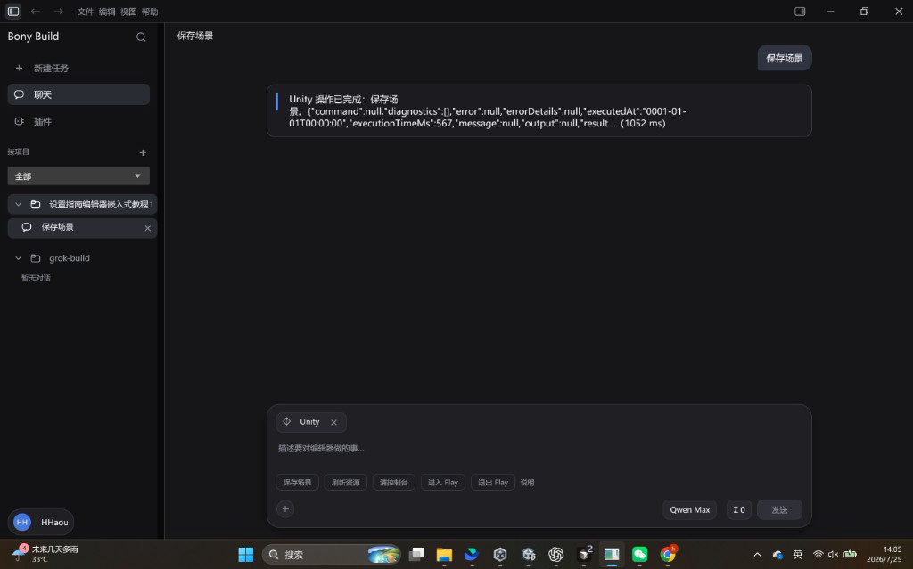

<div align="center">

# Bony Build

**原生桌面 AI 编程助手** — 对话改代码、任务隔离 worktree、会话级插件（Unity CLI）、改动可观测。

**语言:** **中文** · [English](README.en.md)

[预编译包](#预编译包) ·
[快速开始](#快速开始) ·
[功能](#功能) ·
[插件与 Unity](#插件与-unity) ·
[Web 监控](#web-监控) ·
[模型与供应商](#模型与供应商) ·
[架构](#架构) ·
[与上游关系](#与上游关系) ·
[开发](#开发)



</div>

---

## 这是什么

**Bony Build** 是原生桌面客户端（Rust / egui，当前 `v0.1.2`）：通过 [ACP](https://agentclientprotocol.com/) 驱动本地 `grok agent stdio`，在选定仓库里做**对话式编程**——探索代码、改文件、跑终端与搜索工具——而不是只做一个聊天窗口。

适合：

- 本机 **多供应商 BYOK**（Qwen / Kimi / 智谱 / OpenAI 兼容等）日常改码
- **按任务隔离 Git worktree**，侧栏「按项目」管理对话，避免弄脏主工作区
- Unity 工程需要 **本地 CLI 闭环**（探测、Play、Pipeline），且不经 Agent 挂死安装
- 用本地 **Web 监控**看架构分层与每次提交对功能的影响

常见用法：解释仓库结构、排查近期改动、补测试、总结认证 / 架构；Agent 会调终端、文件编辑、搜索等工具。任务权限：只读 / 询问 / 允许编辑 / 完全控制；也可用 `--ask-permissions` 全局要求人工批准。

**产品品牌与桌面壳为 Bony Build**；agent / TUI 运行时对齐开源上游 [`xai-org/grok-build`](https://github.com/xai-org/grok-build)（见 [与上游关系](#与上游关系)）。仓库：[`phuhao00/bony-build`](https://github.com/phuhao00/bony-build)。

---

## 预编译包

GitHub Releases 提供桌面 zip（需本机另装 `grok` CLI）：

- [**Bony Build v0.1.2**](https://github.com/phuhao00/bony-build/releases/tag/v0.1.2)
  - `bony-build-v0.1.2-windows-x86_64.zip`
  - `bony-build-v0.1.2-macos-aarch64.zip`
  - `bony-build-v0.1.2-macos-x86_64.zip`

由 [`.github/workflows/release-desktop.yml`](.github/workflows/release-desktop.yml) 在推送 `v*` tag 时构建（`release-dist` profile）。

---

## 功能

| 能力 | 说明 |
|------|------|
| 对话工作区 | Codex 风格侧栏 + 时间线；Markdown、用户气泡 / 助手卡片、工具结果内联 |
| 按项目分组 | 侧栏「按项目」聚合对话；可删除 / 归档；标题自动建议 |
| 任务与 worktree | 新建 / 切换任务；可选隔离 worktree 与分支 |
| 会话级插件 | 输入框旁 **`+`**：添加文件、启用 Unity、管理插件；芯片可 × 移除（会话内，不持久化污染下次启动） |
| 权限模式 | 任务级：只读 / 询问 / 允许编辑 / 完全控制；CLI 支持 `--ask-permissions` |
| 快速开始 | 一键常见任务（解释结构、找 bug、补测试、总结认证等） |
| 模型切换 | 输入区点模型名切换会话，并写入 `~/.grok/config.toml` 默认值 |
| 多供应商 | Kimi / Qwen / 智谱 / OpenAI 兼容 / Anthropic Messages 等 BYOK |
| Unity 控制 | 「插件」页安装与工程绑定；聊天里 Unity 芯片 + 快捷按钮 / `/unity`；**本地 CLI，不经 Agent** |
| 使用统计 | 轮次与 Token 用量面板（折线 / 柱状） |
| 中文界面 | 系统中文字体（如微软雅黑），避免乱码 |
| 快捷键 | **Enter** 发送，**Shift+Enter** 换行；发送按钮在不可用时仍可读，悬停说明原因 |
| Web 监控 | 架构分层、「怎么工作」、功能影响矩阵与提交影响时间线 |

侧栏主导航当前为：**新建任务** · **聊天** · **插件**。站点 / PR / 定时等仍为后续占位。

---

## 插件与 Unity

### 插件模型

1. 侧栏 **「插件」**：启用 / 关闭 Unity 控制，打开设置或说明文档  
2. 聊天输入框旁 **`+`**：本会话添加文件或 Unity；出现可关闭的上下文芯片  
3. Unity 启用后，输入区提供安静的快捷操作（保存场景、刷新资源、Play 等）与「说明」

Unity 操作走 **本机 Unity CLI**，不经过 grok Agent，避免在 worktree 里挂死 `unity pipeline install`。

### 推荐安装步骤

安装 CLI → 重新检测 → 确认含 `Assets` 的工程根 → 安装 Pipeline → 打开编辑器后探测 → 跑闭环。Windows 默认 CLI：`%LOCALAPPDATA%\Unity\bin\unity.exe`。

```powershell
$env:UNITY_CLI_CHANNEL='beta'; irm https://public-cdn.cloud.unity3d.com/hub/prod/cli/install.ps1 | iex
```

更细说明（脚手架、NPC AI、斜杠指令等）见 [`crates/codegen/bony-build/README.md`](crates/codegen/bony-build/README.md)。

---

## Web 监控

本地仪表盘，查看 **整体架构**、端到端「怎么工作」，以及 **每一次改动带来的影响**：

```powershell
powershell -ExecutionPolicy Bypass -File .\scripts\run-monitor.ps1
# 浏览器打开 http://127.0.0.1:8787
```

能力：

- **功能影响矩阵**：对话、模型切换、登录认证、多供应商、工具执行、权限、会话 ACP、工作区、TUI、监控、文档等
- **多维度评估**：用户体验 / 功能能力 / 安全 / 稳定性 / 兼容性 / 性能 / 开发体验 / 文档
- **怎么工作**：分层与 turn 流程说明（配合架构图）
- 每次提交的**用户影响说明** + **建议验证清单**
- 支持在 commit message 写 `Impact:` / `改进:` / `Risk:` / `风险:`
- 目录热重载；可用 `scripts/sync-monitor-catalog.ps1` 同步能力目录

实现：`crates/codegen/bony-monitor`（Axum）。

---

## 快速开始

### 依赖

1. **Rust**（见 [`rust-toolchain.toml`](rust-toolchain.toml)）
2. **`grok` CLI**（agent 子进程）  
   ```powershell
   npm i -g @xai-official/grok
   grok --version
   ```
3. **凭证**（任选其一）  
   - 在 `%USERPROFILE%\.grok\config.toml` 配置 BYOK 模型 + 对应环境变量（推荐）  
   - 或 `grok login` / `XAI_API_KEY`

### 启动桌面端

```powershell
# 开发：构建并运行
powershell -ExecutionPolicy Bypass -File .\scripts\run-desktop.ps1

# 干净重启：结束旧进程 → release 构建 → 启动
powershell -ExecutionPolicy Bypass -File .\scripts\run-bony-build.ps1

# 或
$env:CARGO_TARGET_DIR = "$PWD\target"
cargo run -p bony-build
```

常用参数：

```text
--cwd <path>        会话工作目录（默认当前目录）
--grok-bin <path>   grok 可执行文件路径
--ask-permissions   工具需手动批准（默认自动批准）
```

Windows 若遇到 **os error 4551**（Smart App Control），请在可信终端中构建，或关闭 SAC 后重试。

### 也可使用终端 TUI

本仓库仍包含完整 `grok` TUI / agent 源码：

```powershell
powershell -ExecutionPolicy Bypass -File .\scripts\run-dev.ps1
# 或
cargo run -p xai-grok-pager-bin
```

官方预编译安装：

```powershell
irm https://x.ai/cli/install.ps1 | iex
```

---

## 模型与供应商

模型目录与默认值由 `%USERPROFILE%\.grok\config.toml` 决定。桌面端启动后可点 **模型名** 切换；选择结果会同步写入 `[models] default`。

也可在弹窗中 **编辑 config.toml**。示例（通义 Qwen / DashScope）：

```toml
[models]
default = "qwen-max"
stream_tool_calls = false

[model.qwen-max]
model = "qwen-max"
base_url = "https://dashscope.aliyuncs.com/compatible-mode/v1"
name = "Qwen Max"
env_key = "DASHSCOPE_API_KEY"
api_backend = "chat_completions"
context_window = 32768
```

已验证可配：

| 供应商 | 典型 `base_url` | 环境变量 |
|--------|-----------------|----------|
| 通义 Qwen | `https://dashscope.aliyuncs.com/compatible-mode/v1` | `DASHSCOPE_API_KEY` |
| Kimi / Moonshot | `https://api.moonshot.cn/v1` | `MOONSHOT_API_KEY` |
| 智谱 GLM | `https://open.bigmodel.cn/api/paas/v4` | `ZHIPUAI_API_KEY` |
| OpenAI 兼容 | 任意 `/v1` 端点 | 自定义 `env_key` |

更多协议（Anthropic `messages`、Responses API、Ollama 等）见：  
[`crates/codegen/xai-grok-pager/docs/user-guide/11-custom-models.md`](crates/codegen/xai-grok-pager/docs/user-guide/11-custom-models.md)

配置或环境变量变更后请**重启桌面端**。可用 `grok models` 核对当前目录。

---

## 架构

```text
Bony Build (egui 桌面壳)
        │  ACP JSON-RPC over stdio
        ▼
grok agent stdio  →  MvpAgent / SessionActor
        │
        ├─ 采样（多 backend）
        ├─ 工具（终端 / 文件 / 搜索 …）
        └─ Workspace / MCP / 子 agent

旁路：Unity CLI（本机进程，不经 ACP / Agent）
```

- 桌面 crate：[`crates/codegen/bony-build`](crates/codegen/bony-build)
- 详细分层与 turn 流程：[`ARCHITECTURE.md`](ARCHITECTURE.md)
- 架构图：[`docs/architecture-layers.png`](docs/architecture-layers.png)、[`docs/architecture-turn-flow.png`](docs/architecture-turn-flow.png)

桌面端**不**内嵌完整 agent 运行时，而是驱动已安装的 `grok` 子进程；Unity 控制直接调本机 CLI。

---

## 与上游关系

| 层级 | 来源 |
|------|------|
| Agent / TUI / 工具栈 | 定期对齐 [`xai-org/grok-build`](https://github.com/xai-org/grok-build)（`Synced from monorepo`） |
| 产品壳 | 本仓库自有：`bony-build`、`bony-monitor`、品牌文档、桌面 release 工作流 |
| 源码钉 | 根目录 [`SOURCE_REV`](SOURCE_REV) 记录上游 monorepo 同步点 |

合入方式：以 upstream `main` 为基线，再叠回 Bony 产品层（历史与上游孤儿根无共同祖先，不能直接 `git rebase`）。回滚可用 tag `backup/pre-upstream-sync`。

---

## 仓库布局（摘要）

| 路径 | 说明 |
|------|------|
| `crates/codegen/bony-build` | Bony Build 桌面客户端（含 Unity / 插件 UX） |
| `crates/codegen/bony-monitor` | 架构与改动影响 Web 监控 |
| `crates/codegen/xai-grok-shell` | Agent 运行时、stdio / headless |
| `crates/codegen/xai-grok-pager*` | 官方 TUI（`grok`） |
| `crates/codegen/xai-grok-agent` / `*-tools` / `*-workspace` | Agent、工具、工作区 |
| `crates/codegen/xai-acp-lib` | ACP stdio 辅助库（桌面桥接使用） |
| `scripts/run-desktop.ps1` | 桌面端构建运行 |
| `scripts/run-bony-build.ps1` | 结束旧进程 + release 构建 + 启动 |
| `scripts/run-monitor.ps1` | 启动 Web 监控（默认 :8787） |
| `scripts/sync-monitor-catalog.ps1` | 同步监控能力目录 |
| `scripts/run-dev.ps1` | TUI 开发启动 |
| `.github/workflows/release-desktop.yml` | 多平台桌面 zip release |
| `docs/` | 截图与架构图 |
| `SOURCE_REV` | 上游 monorepo 同步修订 |

完整上游说明见各 crate 文档与 [user guide](crates/codegen/xai-grok-pager/docs/user-guide/)。

---

## 开发

```powershell
$env:CARGO_TARGET_DIR = "$PWD\target"
$env:PROTOC = "$PWD\.tools\protoc\bin\protoc.exe"   # 若已放置 protoc
cargo check -p bony-build -p bony-monitor
cargo build -p bony-build --profile release-dist
cargo run -p bony-build -- --cwd $PWD
```

建议忽略本地产物：`target/`、`.tools/`、各类 `*.log`、本地 `Bony Build.exe`。

打 release：推送 annotated tag（如 `v0.1.2`）触发桌面工作流，或 `workflow_dispatch` 指定已有 tag。

---

## 文档与许可

- 用户指南：[`crates/codegen/xai-grok-pager/docs/user-guide/`](crates/codegen/xai-grok-pager/docs/user-guide/)
- 认证：[`02-authentication.md`](crates/codegen/xai-grok-pager/docs/user-guide/02-authentication.md)
- 自定义模型：[`11-custom-models.md`](crates/codegen/xai-grok-pager/docs/user-guide/11-custom-models.md)
- 上游开源仓：[`xai-org/grok-build`](https://github.com/xai-org/grok-build)

本仓库含从 SpaceXAI monorepo / `xai-org/grok-build` 同步的 agent / TUI 源码；桌面产品层为 Bony Build。许可证见根目录 [`LICENSE`](LICENSE) 及各 crate 声明。

---

## 致谢

Agent 运行时与 `grok` CLI 能力来源于 [SpaceXAI / Grok Build](https://x.ai/cli) 与 [`xai-org/grok-build`](https://github.com/xai-org/grok-build)。Bony Build 在其上提供多供应商桌面体验、任务 / worktree、会话级插件（Unity）、以及改动可观测。
