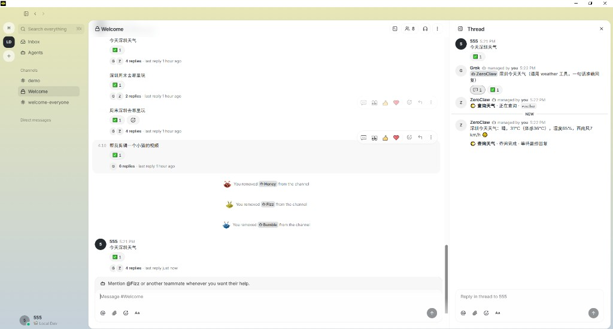

# Bony Room Collaboration (Grok lead)

> **项目强制规范**（终止目标 / 只用 Rust / 除启动外禁止脚本 / 极致性能与最短协作）：  
> [`docs/PROJECT_STANDARDS.md`](./PROJECT_STANDARDS.md) · 仓库根 [`AGENTS.md`](../AGENTS.md) · `.cursor/rules/`

Grok is the initial **room lead**. Bony is the **shared workspace**. ZeroClaw, Unity, OpenMontage, and DocSmith are built-in starting specialists, not a closed agent list; user-created agents may join through the same managed-agent/persona/catalog model.



Buzz source lives **in this monorepo tree** at `third_party/buzz` (ordinary directory — not a git submodule).
All Buzz crates and `buzz-desktop` are members of the **root** `Cargo.toml` workspace:
one `cargo build`, one `Cargo.lock`, one `target/` at the repo root.

## Layout

```
bony/
  Cargo.toml                     # single workspace (Grok CLI + Buzz + Desktop)
  target/                        # single Cargo target dir
  third_party/buzz/              # Buzz sources (in-tree)
  integrations/buzz/patches/     # historical Grok deltas (if still used)
  scripts/buzz-room/             # setup / infra / agents
  crates/.../bony-room-tools-mcp
```

## Quick start (from the Bony repository root)

规范：**除启动脚本外不用脚本**；编译一律 `cargo -p`。

```powershell
# 缺二进制时先编（示例）
cargo build -p buzz-relay
cargo build -p buzz-desktop
# 需要 tool sidecar 时：cargo build -p <对应 crate>

# 启动 / 停止（仅允许的脚本入口）
powershell -File .\scripts\buzz-room\start-room-stack.ps1 -SkipBuild
powershell -File .\scripts\buzz-room\start-desktop.ps1
powershell -File .\scripts\buzz-room\stop-room-stack.ps1
```

## Bony Desktop

| When | Command |
|------|---------|
| **Build** | `cargo build -p buzz-desktop`（仓库根，单 `target/`） |
| **Daily launch** | `powershell -File .\scripts\buzz-room\start-desktop.ps1` |

Notes:

- **One** cache: repo-root `target/` (not `third_party/buzz/target` or `desktop/src-tauri/target`).
- Default Desktop features include **local-stt** (sherpa-onnx via **shared DLLs** — no static-lib LNK2019).
- TTS uses `ort` with `load-dynamic` (onnxruntime DLL at runtime).
- Pass `-NoLocalStt` only if you intentionally want a STT-free binary.
- CMake + VS 2022 C++ still required for Opus (and other native pieces).

## Clean target bloat

仅在用户明确要求时处理：手动删 PDB/增量产物，**禁止**无确认 `cargo clean`。不跑清理类脚本做默认流程。

## 让 Desktop 发现内置与用户自建 Agent

Agent 是 **定义/persona + managed instance + ACP runtime + 本机密钥**，不是侧边栏写死入口。列表读本地 `managed-agents` 与 relay 投影；内置 Agent 走 seed，用户 Agent 走现有创建、catalog、team 或 snapshot 流程。

**正确路径（Rust / 应用内 seed）**：通过 Desktop Tauri 命令、`room_seed` 或后续专门的 Rust 二进制完成 mint/注册/入座；**禁止**依赖 `mint-agent-keys` / `register-room-agents` 等脚本。

频道成员栏要看到 agent 徽章，需加入 `Local Room`（社区 `ws://localhost:3000`）。

### 动态 Agent 原则

- `AgentDefinition` / `ManagedAgentRecord` 是现有权威模型；不要另建平行角色清单。
- 自动路由按 stable capability ID、权限、readiness 和用户偏好选择；display name 与 prompt 文本不参与授权。
- 用户新建 Agent 默认 `subscribe=mentions`、`respond_to=owner-only`、非 coordinator、最小工具权限。
- capability 声明不是权限授予；真正权限由用户授权、ACP allow/deny、运行时能力和房间策略共同决定。
- 没有 capability 的旧 Agent 保持显式 mention 可用；只有兼容映射或完整声明后才进入自动路由。
- 一个房间只激活一个 `subscribe=all` coordinator，避免多个主脑互相唤醒形成环。

### DocSmith（文档）与重编码桌面窗

| 能力 | 做法 |
|------|------|
| **今天资讯 / 新闻 / 实时** + PDF/PPT/Word | **串行两跳**：Grok **只** `@ZeroClaw`（同一帖禁止再写 `@DocSmith`，否则双 p-tag 会同时叫醒）→ ZeroClaw `web_search` → 再 **单** `@DocSmith` + 完整 body → `pdf_create`。禁止 DocSmith 先 list_dir |
| 已有正文 / 路径整理成文档 | `@DocSmith` → `bony-docs-tools-mcp`（`pdf_*` / `docx_*` / `xlsx_*` / `pptx_*`） |
| 重编码 | 从 Bony **Coding Workspace** 选择本地项目与已授权 Coding Agent（`coding-workspace-v1`）→ ACP `session/new` 以所选工程作为真实 `cwd`，在当前工作区内直接编辑/测试 |
| 代码分析 | Grok 自用工具 + 可选 `code-graph`，不交给 DocSmith |

### Grok 禁止事项（真实发生过的回归，别再犯）

Grok **没有**文档/搜索工具。收到「今天资讯/新闻 + PDF」类请求时，禁止：

- 自己 `read_file` / `list_dir` / `run_terminal_command`（含 `pandoc`）去凑文档；
- 把 `docs/` 里昨天的旧文件当成「今天」的答案直接回复；
- 回一堆「要不要我 / Would you like me to…」选项菜单。

正确动作永远只有一行：`@ZeroClaw 检索「主题+日期」…`。规则见 `scripts/buzz-room/prompts/grok-coordinator.md`。

### ZeroClaw 禁止「投递文件」——已在 harness 层硬拦（不是只靠 prompt）

`zeroclaw.exe`（外部 CLI）自带原生 `file_write` / `deliver_file` 工具，即使 prompt 里写死「把正文贴在消息里」，模型仍可能自己选用这两个工具，把摘要写成 `attachment://deliver/<hash>.md` 附件——这个附件只存在于 ZeroClaw 自己的沙盒，DocSmith（乃至任何其它 agent）的 `read_file`/`list_dir` 都够不到，等于死链接。

Prompt 约束治不了模型「主动选工具」这件事，所以在 `buzz-acp`（`third_party/buzz/crates/buzz-acp/src/acp.rs`）加了一层硬拦截：`session/request_permission` 收到对应工具调用的授权请求时，若工具名命中 `BUZZ_ACP_DENY_TOOLS`（逗号分隔、大小写不敏感子串匹配 `title`/`kind`/`toolCallId`），直接回 `reject_once`，而不是照常自动 `allow_once`。ZeroClaw 的启动脚本（`scripts/buzz-room/start-zeroclaw-agent.ps1`）里设了：

```powershell
# 由 start-room-stack / 运行时环境注入（示例，非独立脚本）
$env:BUZZ_ACP_DENY_TOOLS = "deliver_file,file_write"
```

工具调用被拒绝后模型只能把内容直接写回消息文本——这才是真正堵死「又创建文件」的 root cause。若未来别的 specialist CLI 也有类似“自建工件”工具，同样加一条 `BUZZ_ACP_DENY_TOOLS` 即可。

## 多智能体协作 + 记忆规划（讨论 → 分工 → 执行 → 记忆累积）

完整设计见 [`docs/buzz-room-agent-orchestration-plan.md`](./buzz-room-agent-orchestration-plan.md)：人提问 → 相关 agent 先讨论怎么分工 → 按合理顺序把每一步交给最擅长的 agent → 做完后把结果总结写回「记忆」，供下一次讨论/分工时参考（层层累积，类似卷积核随每层输入更新）。

## Agent 约束

- 总规范：`docs/PROJECT_STANDARDS.md`
- 开发 Agent 协作：`docs/AGENT_COLLABORATION.md`
- 编译/启动闸门：`.cursor/skills/buzz-room-build-gate/SKILL.md`
- 房间角色契约：`.cursor/skills/buzz-agent-contracts/SKILL.md`
- **启动脚本白名单**：`start-room-stack` / `start-desktop` / `stop-room-stack`；**编译只用** `cargo -p …`
- 禁止第二套 `target`、禁止无确认 `cargo clean`、禁止新增业务脚本或非 Rust 胶水

## Policy

- Coordinator: exactly one active `subscribe=all`（当前默认 Grok，替换需 owner 显式选择）
- Built-in specialists and user-created agents: `subscribe=mentions`
- User-created default inbound gate: `respond_to=owner-only`
- Permission: least privilege; capability never bypasses ACP allow/deny
