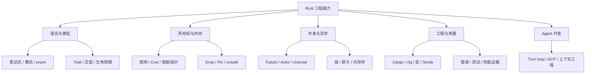
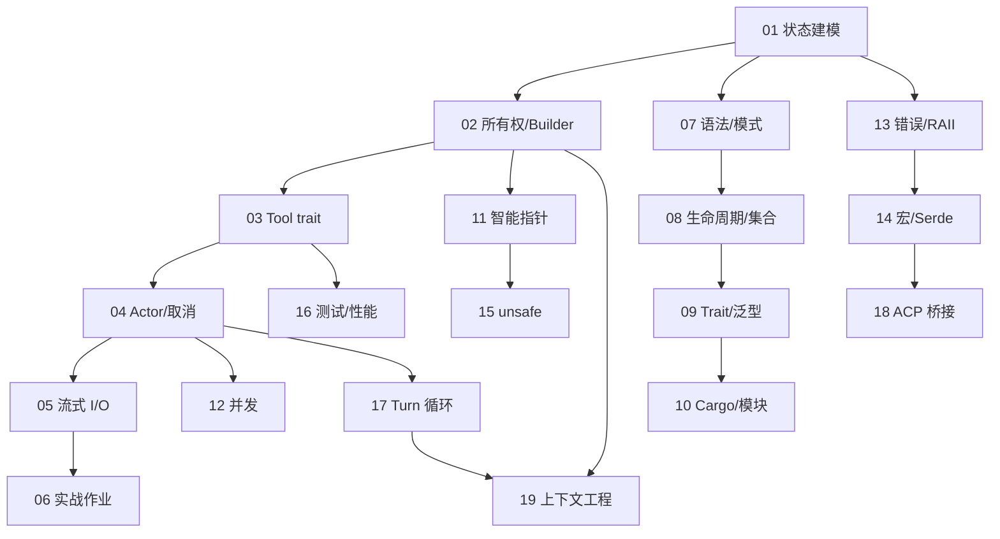

# Rust 完整知识地图与项目覆盖矩阵

本页是课程总索引。A 表示项目主链路，B 表示仓库中真实使用但不是主线，C 表示概念扩展。

## 核心知识点

| 领域 | 必须掌握 | 项目例子 | 章节 |
|---|---|---|---|
| 基础语法 | 绑定、类型、表达式、控制流、模式全家族 | `bounded_kind_label`、`walk_json_strings`、let-else | [07](07-language-foundations.md) |
| 建模 | struct、enum、Option、match、derive、serde tag | `WorkflowOutcome`、`PauseKind`、`JournalMode` | [01](01-task-state-and-sqlite.md) |
| 所有权 | move、borrow、Copy、Clone、Arc、Builder | `AgentBuilder`、`Agent`、`Arc<ToolBridge>` | [02](02-agent-ownership-and-builder.md)、[11](11-smart-pointers-and-memory.md) |
| 生命周期 | elision、`'a`、`'static`、HRTB、Cow、零拷贝解析 | `redact_secrets`、`BorrowedEnvelope<'a>` | [08](08-lifetimes-collections-iterators.md) |
| Trait | bound、关联类型、dyn、impl Trait、Send/Sync、newtype | `Tool` / `ToolDyn`、`SessionId` | [03](03-tool-trait-and-streaming.md)、[09](09-traits-generics-advanced-types.md) |
| 集合/迭代器 | Vec、VecDeque、Map、迭代器链、闭包捕获 | 熔断器窗口、JSONL copy、spawn_blocking | [08](08-lifetimes-collections-iterators.md) |
| Cargo/模块 | workspace、feature/dep:、cfg、build.rs、re-export | 根 Cargo.toml、voice、system-power | [10](10-modules-cargo-and-platform.md) |
| 智能指针 | Box、Arc、Weak、Mutex/RwLock、OnceLock、Pin | fsnotify 注册表、FinalizedToolset、ToolStream | [11](11-smart-pointers-and-memory.md)、[03](03-tool-trait-and-streaming.md) |
| 并发 | actor、mpsc 背压、CancellationToken、CAS、内存序 | sampler actor、pair-relay、熔断器 | [04](04-sampler-actor-and-cancellation.md)、[12](12-sync-concurrency-and-atomics.md) |
| 错误/可靠性 | Result、thiserror、anyhow、事务、Drop 守卫、原子写、重试 | DbError、checkpoint fsync、retry jitter | [13](13-errors-raii-reliability.md) |
| 宏/序列化 | macro_rules、属性宏、serde tag/rename/alias/default | `acp_define_request_response`、`ToolErrorWire` | [14](14-macros-attributes-serde.md) |
| Unsafe/FFI | raw pointer、ABI、repr(C)、unsafe impl、SAFETY | Windows 电源回调、task_vm_info | [15](15-unsafe-ffi-and-platform.md) |
| 质量/性能 | 契约测试、fake、快照、proptest、fuzz、Criterion、RSS、dhat | tool_blocking、fork_copy bench/memory | [16](16-testing-quality-performance.md) |
| Agent 循环 | 分层 loop、结果 enum、压缩/鉴权恢复、取消链 | turn.rs、`SamplerTurnOutcome`、`ToolLoop` | [17](17-turn-loop-anatomy.md) |
| 协议桥接 | JSON-RPC、权限自动化、硬拦截、会话池 | `buzz-acp`、`BUZZ_ACP_DENY_TOOLS` | [18](18-acp-protocol-and-session-pool.md) |
| 上下文工程 | 定义文件装配、模板渲染、compaction、memory | `PromptContext`、`CompactionPolicy` | [19](19-prompt-assembly-and-context-engineering.md) |

## 覆盖说明

- **A（主链路）**：01–06 与 17–19 的代码路径是产品运行时的骨干，读通即可理解「一条消息如何变成 agent 行为」。
- **B（真实但非主线）**： unsafe/FFI（仅 system-power 等少数 crate）、proptest（仅 buzz 子树）、dhat（内存专项测试）。
- **C（概念扩展）**：GAT、const generics、no_std/嵌入式/WASM/编译器内部。课程只讲与本仓库代码的迁移关系，**不伪造生产案例**。

## 章节依赖图

