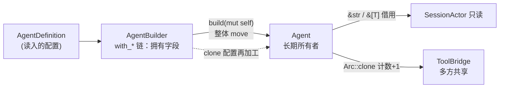

# 02. Agent 的所有权、借用与 Builder

> **本章学到什么**：move 语义、借用（`&T` / `&mut T`）、`Clone` 的代价、`Arc` 共享所有权、消费型 Builder 模式、`impl Into<String>` 这类泛型入参习惯。
>
> **真实入口**：`crates/codegen/xai-grok-agent/src/agent.rs`、`src/builder.rs`。

## 1. 业务背景：造一个 Agent

Bony 的每个编码会话背后都有一个装配好的 `Agent`：系统提示词、工具集、记忆、压缩策略……装配过程有十几个可选开关。Rust 没有「可选命名参数」，惯用解法是 **Builder 模式**：

```text
AgentBuilder::new(...).with_name(...).with_tools(...).build().await? → Agent
```

这条链上每一步都在演示所有权。

## 2. 终点先看：`Agent` 拥有什么

`crates/codegen/xai-grok-agent/src/agent.rs:14-51`（注释略）：

```rust
pub struct Agent {
    /// The definition this agent was built from.
    definition: AgentDefinition,

    /// The context that produced the current system prompt.
    prompt_context: PromptContext,

    /// The rendered system prompt (cached from prompt_context.render()).
    system_prompt: String,

    /// The tool bridge — owns ToolRegistry + ToolState + SessionContext.
    tool_bridge: Arc<ToolBridge>,

    /// Session-level policies.
    reminder_policy: ReminderPolicy,
    compaction_policy: CompactionPolicy,

    /// Backend-hosted tools to include in API requests.
    hosted_tools: Vec<HostedTool>,

    backend_search_enabled: bool,
}
```

所有权分析：

| 字段 | 拥有方式 | 为什么 |
|---|---|---|
| `definition`、`prompt_context`、`system_prompt`、`hosted_tools` | **直接拥有**（struct 内嵌值） | 它们是 Agent 私有数据，随 Agent 生灭 |
| `tool_bridge: Arc<ToolBridge>` | **共享拥有**（引用计数） | 工具注册表还要被会话循环、MCP 注册器等多方同时使用 |

`build()` 执行完，Builder 里攒的所有数据**移动**进了 `Agent`——Builder 被消费，不再可用。这就是「Agent 是长期所有者」。

`agent.rs` 的 doc 注释还点明了一个设计约束：

> NOT portable — tied to a specific session via its ToolBridge, rendered system prompt, and session-level policies. … The Agent is effectively immutable after construction.

**不可跨会话搬运，构造后逻辑上不可变**。需要变更工具状态（注册 MCP 工具等）时，走 `Arc<ToolBridge>` 内部的锁，而不是给 `Agent` 加 `&mut` 方法。

## 3. Builder 的 `with_*`：消费 self 再还回去

`crates/codegen/xai-grok-agent/src/builder.rs:309-320`：

```rust
pub fn with_name(mut self, name: impl Into<String>) -> Self {
    self.name = Some(name.into());
    self
}

pub fn with_description(mut self, desc: impl Into<String>) -> Self {
    self.description = Some(desc.into());
    self
}
```

三个语言点：

1. **`mut self`（按值接收）**：调用 `with_name` 时 Builder 的所有权 **move** 进方法；方法改完字段再把 `self` 返回去。链式调用 `a().b().c()` 实际上是一路移动。好处：类型系统保证**同一个 Builder 不会被两条链路同时改**（并发误用直接编译不过）。
2. **`impl Into<String>`**：接受 `String`、`&str`、`&String` 等一切能转成 `String` 的类型，调用方不需要写 `.to_string()`。这是 API 设计习惯：**入参宽（`impl Into`），出参窄（返回具体类型）**。
3. **`Option<String>` 字段**：Builder 里多数字段是 `Option<T>`——「还没设置」用 `None` 表达，`build()` 时再解析默认值。对比「默认值直接填字段」：`Option` 能区分「用户显式设了 X」和「用户没设」。

`AgentBuilder` 的字段本身也是所有权样例（`builder.rs:42-60` 节选）：

```rust
pub struct AgentBuilder {
    working_directory: PathBuf,                    // 拥有
    prompt_working_directory: Option<String>,      // 拥有（可缺）
    terminal_backend: Arc<dyn TerminalBackend>,    // 共享 trait 对象
    fs_backend: Arc<dyn AsyncFileSystem>,          // 共享 trait 对象
    notification_handle: ToolNotificationHandle,   // 廉价克隆的句柄
    // ...
}
```

`Arc<dyn Trait>`：多个组件共享同一个终端后端/文件系统后端，且跨线程。`dyn` 是动态分发（第 09 章展开）。

## 4. `build(mut self)`：消费与装配现场

`builder.rs:669` 起（节选）：

```rust
pub async fn build(mut self) -> Result<Agent, AgentBuildError> {
    let mut definition = self.resolve_definition();
    let working_dir_str = self.working_directory.to_str().unwrap_or(".").to_string();

    // 1) 技能发现：预加载 skills 注入 prompt_body
    let skill_info = if let Some(preloaded) = self.preloaded_skills.take() {
        preloaded
    } else if definition.discover_skills {
        crate::prompt::skills::list_skills_with_plugins(...).await
    } else {
        vec![]
    };

    // 2) 工具装配：按开关注入 memory / web / lsp / image 工具
    let tool_bridge_builder = ToolBridge::get_builder();
    let mut tool_config = definition.tool_config.clone();
    if definition.inject_default_tools {
        if self.memory_backend.is_some() {
            tool_config.tools.push((&memory::search_tool::MemorySearchImpl).into());
            tool_config.tools.push((&memory::get_tool::MemoryGetImpl).into());
        }
        if self.web_search_config.is_enabled() {
            tool_config.tools.push((&grok_build::WebSearchTool).into());
        }
        // ... lsp / image_gen / video_gen 同理
    }
    // 3) 过滤 allowlist / disallowed_tools → finalize → 渲染 prompt → Agent::new(...)
}
```

值得逐条学的：

- **`self.preloaded_skills.take()`**：从 `Option` 里**移走**值并留下 `None`。`self` 是 `mut` 的但马上要被消费，`take()` 让我们不用 clone 就能把数据搬出来。
- **`definition.tool_config.clone()`**：这里**故意 clone**——definition 是共享读来的配置，装配过程要往里追加工具，不能污染原件。判断 clone 是否合理的问题：*这块数据后面还有人要用吗？* 有，就 clone；没有，就 move。
- **`(&WebSearchTool).into()`**：把工具实现的引用转成统一的工具配置条目（`From` trait，第 09 章展开）。
- **失败早返回**：`inject_default_tools = false` 但工具列表为空时，`build` 直接 `Err(AgentBuildError::InvalidConfig(...))`，错误消息告诉你是哪个 agent、该怎么修——错误信息是写给人看的。

## 5. 借用视角：访问器为什么返回 `&str`

`Agent` 的访问器（同文件）：

```rust
pub fn system_prompt(&self) -> &str { &self.system_prompt }
pub fn tool_bridge(&self) -> &Arc<ToolBridge> { &self.tool_bridge }
pub fn tool_definitions(&self) -> Vec<ToolSpec> { /* 按需构造 */ }
```

原则：**能借就不复制**。返回 `&str` 让调用方读一下 prompt 不用分配新 `String`；确实需要拥有时才 `to_string()`，由调用方决定。注意生命周期规则：返回的 `&str` 挂在 `&self` 上，Agent 活着它才有效。

而 `Arc::clone(&agent.tool_bridge)` 只增加引用计数（一次原子加），不复制 `ToolBridge` 内部任何数据——这是「廉价共享」的含义。

## 6. 一张图：所有权流转



## 7. 动手练习

1. **标注所有权**：打开 `builder.rs` 的 `build()`，给每一处数据流动标注 move / borrow / clone，说出理由。
2. **编译错误实验**：写一段伪代码
   ```rust
   let b = AgentBuilder::new(/* ... */);
   let a1 = b.build().await;
   let a2 = b.build().await; // 会怎样？
   ```
   解释编译器报什么错（`use of moved value`），以及为什么消费型 Builder 天然防止重复 build。
3. **`impl Into` 实验**：把 `with_name` 的签名改成 `name: String`，找出仓库里所有因此编译失败的调用点（`cargo check -p xai-grok-agent`），体会 API 收窄的代价。改回去。
4. **思考题**：为什么 `Agent` 用 `Arc<ToolBridge>` 而不是直接 `tool_bridge: ToolBridge`？如果直接内嵌，MCP 注册器想动态加工具会发生什么？

## 自检

- [ ] 能解释 `with_*(mut self) -> Self` 链上的所有权移动
- [ ] 知道 `Option::take()` 与 `clone()` 各自适用场景
- [ ] 理解 `Arc` 只复制句柄、不复制数据；何时需要它
- [ ] 能说出「访问器返回借用」的收益
- [ ] 跑通 `cargo check -p xai-grok-agent`

> 下一章：[03. 类型化 Tool、泛型约束与流式结果](03-tool-trait-and-streaming.md)
