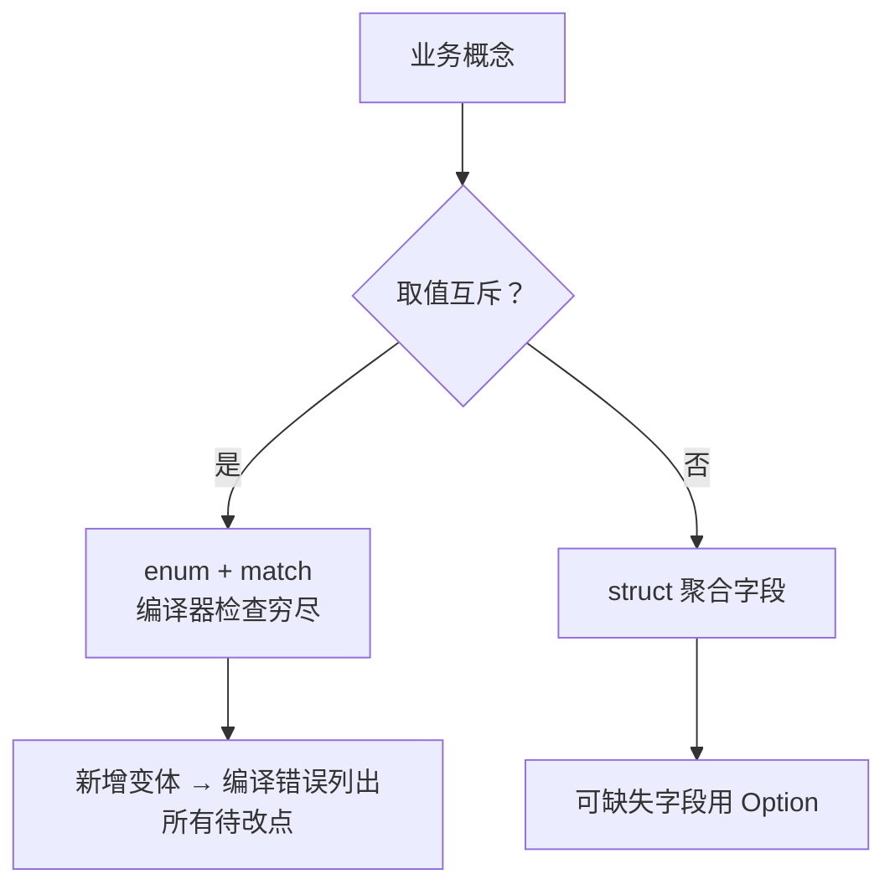

# 07. 基础语法、表达式、模式匹配与业务建模

> **本章学到什么**：`let`/`mut`/shadowing、表达式导向语法、`match` 全家族（解构、范围模式、guard）、`let-else`、`matches!`、`if let` 链、以及「业务概念 → enum/struct」的建模决策树。
>
> 项目例子全部来自真实源码：sanitizer、buzz-relay 事件路由、会话存储。

## 1. 建模决策树



第 01 章已经用 `WorkflowOutcome` 演示过完整流程。本章聚焦**语法武器库**——真实代码里模式匹配的各种形态。

## 2. 表达式导向：一切皆有值

Rust 里 `if`、`match`、代码块都是**表达式**，尾值即返回值：

```rust
// crates/codegen/xai-sqlite-journal/src/lib.rs（for_db_path 内）
let mode = if is_network_fs(dir) {
    Self::Truncate
} else {
    Self::Wal
};
```

没有 `mode = ...` 的赋值语句，分支直接「产出」值。习惯之后你会发现 Rust 代码里可变变量（`mut`）远比其它语言少——**不可变是默认，可变是例外**。

基础速查（已会可跳过）：

```rust
let x = 5;            // 不可变绑定
let mut y = 10;       // 可变
y += 1;
let x = x + 1;        // shadowing：新绑定遮蔽旧名（类型都可以换）

let arr = [1, 2, 3];           // 数组，长度是类型的一部分
let slice: &[i32] = &arr[1..]; // 切片：胖指针（指针+长度）
let s: &str = "utf-8 文本";    // 字符串切片，永远是 UTF-8
let owned: String = s.to_string();
```

## 3. `match` 形态一：递归解构

脱敏器的 JSON 遍历，`crates/codegen/xai-grok-secrets/src/sanitizer.rs:115-122`：

```rust
pub fn walk_json_strings(value: &mut serde_json::Value, f: &mut impl FnMut(&mut String)) {
    match value {
        serde_json::Value::String(s) => f(s),
        serde_json::Value::Array(arr) => arr.iter_mut().for_each(|v| walk_json_strings(v, f)),
        serde_json::Value::Object(map) => map.values_mut().for_each(|v| walk_json_strings(v, f)),
        _ => {}
    }
}
```

- 按变体**解构**出内部数据（`String(s)` 拿到 `&mut String`）。
- `_ => {}` 兜底 Null/Bool/Number——它们是叶子，没有字符串可处理。
- 递归 + 可变借用贯穿整棵树；`&mut impl FnMut` 是「可变回调」的标准签名（第 09 章细讲 Fn 家族）。

## 4. `match` 形态二：范围模式与 or-pattern

生产级路由：把上百种 Nostr 事件 kind 收敛成有限 metrics 标签，防止基数爆炸。`third_party/buzz/crates/buzz-relay/src/handlers/event.rs:36-53`（节选）：

```rust
/// Bound the `kind` label to prevent cardinality explosion from arbitrary Nostr kinds.
pub(crate) fn bounded_kind_label(kind: u32) -> String {
    match kind {
        0..=9 | 1059 | 1063 => kind.to_string(),
        8000..=8003 | 9000..=9022 | 9030..=9036 => kind.to_string(),
        20000..=29999 => kind.to_string(),
        30023 | 30315 | 39000..=39003 => kind.to_string(),
        // ... 更多白名单区间 ...
        _ => "other".to_string(),
    }
}
```

`0..=9` 是**范围模式**，`a | b` 是 **or-pattern**。白名单之外的任何古怪 kind 都落到 `"other"`——监控维度被白名单钉死。注意 `_` 兜底在这里不是偷懒，是**安全设计**。

## 5. `match` 形态三：消费 → 修改 → 重建

带数据的 enum 最常见的操作形状，`crates/codegen/xai-grok-shell/src/session/storage/jsonl/mod.rs:942-957`：

```rust
fn transform_session_id_in_update(
    update: super::SessionUpdate,
    new_id: &acp::SessionId,
) -> super::SessionUpdate {
    match update {
        super::SessionUpdate::Acp(mut notification) => {
            notification.session_id = new_id.clone();
            super::SessionUpdate::Acp(notification)
        }
        super::SessionUpdate::Xai(mut notification) => {
            notification.session_id = new_id.clone();
            super::SessionUpdate::Xai(notification)
        }
    }
}
```

按值接收 `update`（move 进来），解构时标 `mut notification` 取得内部所有权，改完包回原变体。整个函数没有 clone 整个 update——只 clone 了一个 session id。

## 6. `let-else`：提前出局的解构

`third_party/buzz/crates/buzz-relay/src/handlers/event.rs:205-222`（节选）：

```rust
for (conn_id, sub_id) in matches {
    let Some(pubkey) = state.conn_manager.pubkey_for_conn(conn_id) else {
        continue;
    };
    match state.is_member_cached(community_id, channel_id, &pubkey).await {
        Ok(true) => allowed.push((conn_id, sub_id)),
        Ok(false) => {}
        Err(e) => { warn!(%channel_id, "fan-out access filter: membership lookup failed: {e}"); }
    }
}
```

`let Some(pubkey) = ... else { continue }`：解构成功绑定 `pubkey` 继续往下走，失败立即从 `else` 分支**发散**（`continue`/`return`/`break`/panic）。对比嵌套 `if let`：主逻辑不再右移一层。凡是「拿不到就走」的场景优先用 let-else。

## 7. `matches!`：一行布尔判断

只需要判断变体、不需要数据时：

```rust
// crates/codegen/xai-grok-shell/src/session/storage/jsonl/mod.rs:319
if matches!(durability, AppendDurability::Durable) {
    sync_file(&file)?;
}
```

`matches!(expr, pattern)` 展开成 match → bool。比 `if let` 简洁，且支持 guard 与范围（`matches!(kind, 0..=9 | 20)`）。

## 8. `if let` 链（Rust 2024）

本仓库 edition = 2024，可以把多个条件写进一个 `if let`：

```rust
// crates/codegen/xai-grok-shell/src/session/storage/jsonl/mod.rs（sync_session_files 内）
if file_path.exists()
    && let Ok(file) = OpenOptions::new().write(true).open(file_path)
{
    let _ = file.sync_all();
}
```

等价于嵌套 if，但扁平。旧代码里也常见 `if let Some(x) = ... { if let Ok(y) = ... }` 的嵌套形态——新写代码用链式。

## 9. 循环与控制流标签

relay 的连接处理循环用了**标签**（`break 'conn;`）从嵌套循环里整体退出（第 12 章会看到完整代码）。基础形态：

```rust
'outer: for row in rows {
    for cell in row {
        if cell.bad() { break 'outer; }  // 跳出两层
    }
}
```

`loop` 是表达式，可以从内部 `break value;` 返回值（第 05 章的 `for_each_jsonl_line_capped` 正是 `let result = loop { ... break Ok(()); }`）。

## 10. 动手练习

1. **穷尽性实验**：给 `SessionUpdate` 临时加第三个变体（比如 `Test`），`cargo check -p xai-grok-shell`，找出所有报错点。改回去。
2. **写一个 `bounded_kind_label` 的测试**：白名单内（如 `1`、`20500`）返回自身字符串，白名单外（如 `12345678`）返回 `"other"`。
3. **重构练习**：把一段嵌套 `if let Some(...) { if let Ok(...) }` 的草稿代码改写成 let-else / if-let 链。
4. **思考题**：`walk_json_strings` 用 `&mut impl FnMut` 而不是 `fn(&mut String)`——后者可以吗？什么情况下函数指针不够用？（提示：闭包捕获环境。）

## 自检

- [ ] 能区分 `match`/`if let`/`let-else`/`matches!` 各自的最佳场景
- [ ] 会写范围模式与 or-pattern
- [ ] 理解 shadowing 与不可变默认
- [ ] 能说出 edition 2024 的 if-let 链写法
- [ ] 建模时先问「互斥吗」再选 enum/struct

> 下一章：[08. 生命周期、集合、迭代器与闭包](08-lifetimes-collections-iterators.md)
