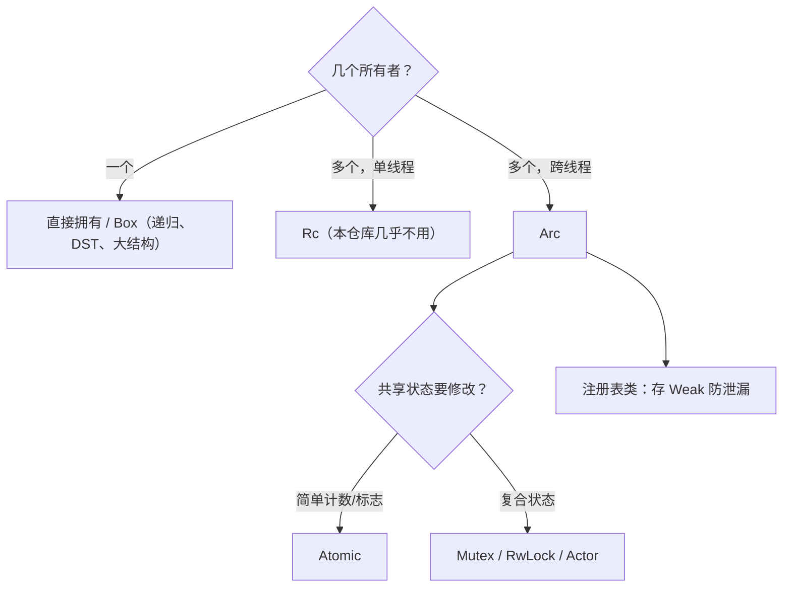

# 11. 智能指针、内部可变性、Drop 与 Pin

> **本章学到什么**：`Box`/`Arc`/`Weak` 的选择、`OnceLock`/`LazyLock` 一次性初始化、内部可变性（`Mutex`/`RwLock`）、`Drop` 的 RAII 语义、`Pin` 的直觉。
>
> **真实入口**：`xai-grok-agent`、`xai-grok-telemetry`、`xai-fsnotify`、`xai-grok-tools`。

## 1. 选型决策树



本仓库跨线程是常态（tokio），所以几乎只见 `Arc`，不见 `Rc`。

## 2. `Arc`：共享但「外部不可变」

第 02 章看过 `Agent` 持有 `Arc<ToolBridge>`。`agent.rs` 的注释把设计意图说透了：

> The Agent is effectively immutable after construction. It holds `Arc<ToolBridge>` — mutations to tool state (MCP registration, completion tracking, retry config) go through ToolBridge's internal locks.

`Arc` 只解决**共享所有权**，不解决修改——`Arc<T>` 给你的是 `&T`，不是 `&mut T`。要修改，要么内部加锁（内部可变性），要么走 actor。`Arc::clone` 只是一次原子计数加一，随手克隆无心理负担。

## 3. `Weak`：注册表不阻止回收

文件监听器的全局注册表要「同一目录复用同一个 watcher」。如果注册表存 `Arc`，watcher 永远不会被释放（注册表成了永久所有者）。解法：存 `Weak`。`crates/codegen/xai-fsnotify/src/source.rs:112-141`（节选）：

```rust
pub fn shared(cwd: PathBuf, config: FsConfig) -> Result<Arc<FsEventSource>, FsNotifyError> {
    let key = canonical_key(&cwd);

    // 快路径：已有存活的 watcher
    {
        let mut map = registry().lock().unwrap_or_else(PoisonError::into_inner);
        map.retain(|_, w| w.strong_count() > 0);
        if let Some(existing) = map.get(&key).and_then(Weak::upgrade) {
            return Ok(existing);
        }
    }

    // 慢路径：创建 watcher 时【不持锁】——初始化可能阻塞数秒，
    // 不能把其它目录的调用串行化在后面
    let source = Arc::new(FsEventSource::start_on(event_loop_handle()?, cwd, config)?);

    let mut map = registry().lock().unwrap_or_else(PoisonError::into_inner);
    // 初始化期间可能已有别人创建：用别人的，让自己的 drop
    if let Some(existing) = map.get(&key).and_then(Weak::upgrade) {
        return Ok(existing);
    }
    map.insert(key.clone(), Arc::downgrade(&source));
    Ok(source)
}
```

四个学习点：

1. **`Weak` 不计入强引用**：所有使用者放手后 watcher 正常回收；`Weak::upgrade()` 返回 `Option<Arc>`，死了就是 `None`。
2. **`retain(|_, w| w.strong_count() > 0)`**：顺手清理已死条目。
3. **双重检查**：创建 watcher 不能持锁（慢），所以创建完再查一次——并发下「别人可能已经建好了」，此时宁可丢弃自己的工作。
4. **锁外做慢事、锁内做快事**：临界区最小化是通用纪律。

## 4. 一次性初始化：`OnceLock` / `LazyLock`

遥测模块的两个真实用法，`crates/codegen/xai-grok-telemetry/src/unified_log.rs`、`src/id.rs`：

```rust
use std::sync::{LazyLock, Mutex, OnceLock};

/// Binary version stamped into every log entry. Set once at startup.
static VERSION: OnceLock<String> = OnceLock::new();

pub fn set_version(ver: &str) {
    let _ = VERSION.set(ver.to_owned());
}

static WRITER: LazyLock<Mutex<Option<LogWriter>>> = LazyLock::new(|| Mutex::new(open_writer()));
```

```rust
// id.rs：机器 ID 很贵（macOS 要调 system_profiler，1-3 秒），缓存之
static AGENT_ID: OnceLock<String> = OnceLock::new();

pub fn agent_id() -> String {
    AGENT_ID.get_or_init(load_or_compute_agent_id).clone()
}
```

- `OnceLock::set` 只成功一次，后来的调用是 no-op（`let _ =` 接受 `Result`）。
- `get_or_init(|| ...)`：首次调用执行初始化闭包，之后直接拿缓存——线程安全，无需手写 `Mutex<bool>`。
- `LazyLock` = 声明时给初始化表达式的 `OnceLock`，首次**访问**才执行。
- 它们替代了老的 `lazy_static!` 宏，都是标准库、无依赖。

## 5. 内部可变性的两把锁

**`RwLock`：多读少写**。工具注册表的容器，`crates/codegen/xai-grok-tools/src/registry/types.rs:449-472`（节选）：

```rust
/// The tools vector is wrapped in `parking_lot::RwLock` to allow concurrent
/// read access (tool dispatch) with rare write access (MCP tool registration).
/// The read guard is held only for microsecond lookups — never across `.await`.
pub struct FinalizedToolset {
    tools: parking_lot::RwLock<Vec<FinalizedTool>>,
    // ...
}
```

工具分发每秒发生很多次（读），MCP 注册偶尔一次（写）——读写锁让读者互不阻塞。注释里的纪律：**守卫只做微秒级查找，绝不跨 `.await` 持有**（跨 await 持锁 = 异步死锁温床）。

**`Mutex`：保护小段复合状态 + 注意释放时机**，`xai-grok-tools/src/notification/handle.rs:100-129`（节选）：

```rust
struct CappedNotificationQueue {
    queue: parking_lot::Mutex<VecDeque<ToolNotification>>,
    capacity: usize,
    closed: AtomicBool,
    ready: tokio::sync::Notify,
}

impl CappedNotificationQueue {
    fn push(&self, notification: ToolNotification) {
        if self.closed.load(Ordering::Relaxed) { return; }
        let mut queue = self.queue.lock();
        if queue.len() >= self.capacity {
            // 满了：非关键事件直接丢；关键事件挤掉最老的非关键事件
            // ...
        }
        queue.push_back(notification);
        drop(queue);            // ← 显式提前释放锁
        self.ready.notify_one(); // 唤醒消费者时不持锁
    }
}
```

`drop(queue)` 在 `notify_one()` **之前**：如果持锁唤醒，被唤醒的消费者立刻又要抢同一把锁，白跑一趟。有界队列 + 降级策略（丢非关键 / 挤掉旧的）是通知管道的常见形状。

## 6. `Drop`：确定性清理

Rust 没有 finally/GC 终结器——值离开作用域时 `Drop` 必然执行（包括 panic unwind）。两个小守卫：

计时守卫，`crates/codegen/xai-grok-agent/src/timing.rs`：

```rust
pub struct TimingGuard {
    name: &'static str,
    start: std::time::Instant,
}

impl Drop for TimingGuard {
    fn drop(&mut self) {
        let elapsed_us = self.start.elapsed().as_micros() as u64;
        tracing::info!(target: TARGET, event = "timing", name = self.name, elapsed_us);
    }
}
```

临时文件守卫，`crates/codegen/xai-fast-worktree/src/git/checkout.rs:226-235`：

```rust
/// Removes a throwaway git index file (and its `.lock` sibling) on drop, so the
/// scratch index never leaks even if a snapshot step fails partway through.
struct ScratchIndexGuard { path: PathBuf }

impl Drop for ScratchIndexGuard {
    fn drop(&mut self) {
        let _ = std::fs::remove_file(&self.path);
        let _ = std::fs::remove_file(format!("{}.lock", self.path.display()));
    }
}
```

注意 `let _ =`：Drop 里不能 panic（会 double-panic abort），清理失败只能忽略。第 13 章会看更复杂的守卫（状态恢复、线程 join、`disarm()` 模式）。

## 7. `Pin`：地址稳定承诺（直觉版）

第 03 章见过 `Pin<Box<dyn Stream + Send>>`。直觉：

- Future/Stream 常常是**自引用**结构（状态机里存着指向自己其它字段的指针）。
- 如果这样的值被**移动**（memcpy 到新地址），内部指针悬垂 → UB。
- `Pin<P>` 是对指针 `P` 的承诺：被指向的值**不会再被移动**，可以安全 poll。

实践中三条够用：

1. 从 `Box`/`Arc` 得到的值天然地址稳定，`Box::pin(future)` 即可 pin 住。
2. `tokio::pin!(fut)` 把栈上 future pin 住（`select!` 里常见）。
3. 自己写 `unsafe impl Unpin` 或手动 pin 投影是高级话题，先不碰。

## 8. 动手练习

1. **Weak 实验**：在 fsnotify 的 `shared()` 里临时把 `Arc::downgrade` 改成直接存 `Arc`，思考 watcher 的生命周期会变成什么样；`rg "strong_count" crates/codegen/xai-fsnotify` 看清理逻辑。
2. **找守卫**：`rg "impl Drop for" crates/ third_party/buzz/crates --count`，挑两个说出它们分别保证什么不变量。
3. **OnceLock 练习**：写一个 `static CONFIG: OnceLock<AppConfig>` 的加载函数，第二次调用不重新读文件，并写测试。
4. **思考题**：`CappedNotificationQueue` 为什么用 `AtomicBool` 存 `closed` 而不用 `Mutex<bool>`？

## 自检

- [ ] 能画出 Box/Arc/Weak/Atomic/锁 的选型树
- [ ] 理解 `Weak` 在注册表场景防泄漏的原理
- [ ] 知道锁守卫不跨 `.await`、notify 前先 drop 锁
- [ ] 理解 Drop 在 panic 路径也执行、且自身不能 panic
- [ ] 对 Pin 有「地址稳定承诺」的直觉

> 下一章：[12. 同步并发、Channel 与原子内存序](12-sync-concurrency-and-atomics.md)
