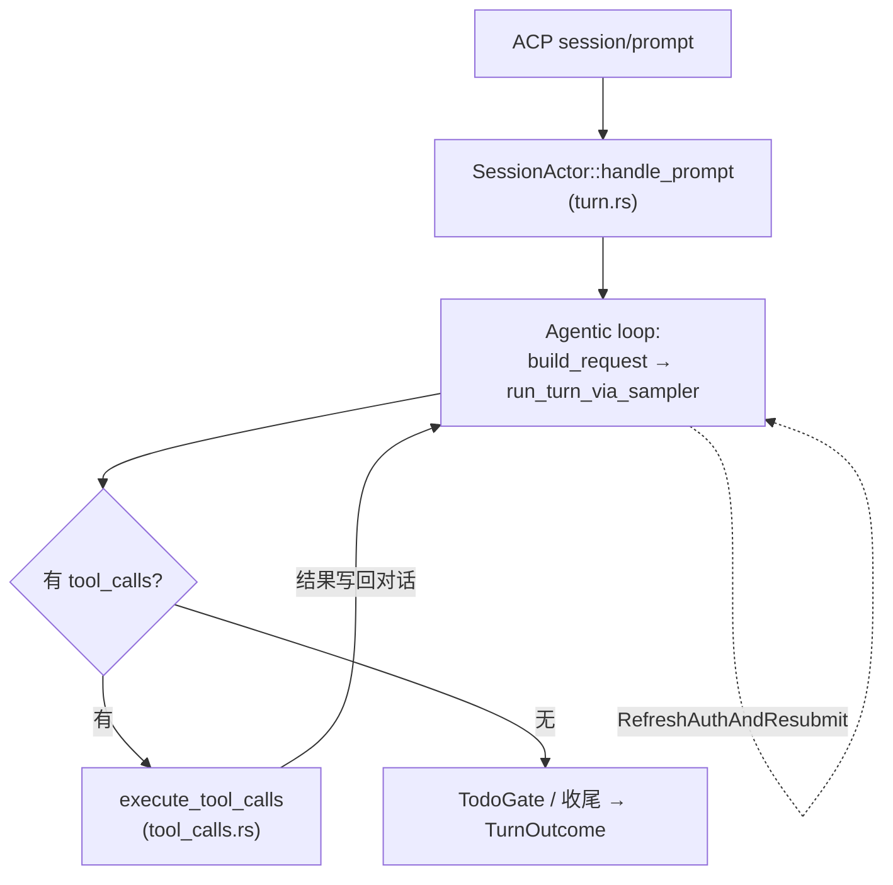

# 17. Turn 循环：一条消息的完整旅程

> **本章开始 Agent 开发进阶**。前三阶段你认识了零件；本章起看整机——Bony/Grok 的 agent 如何把一条用户消息变成一串模型调用与工具执行。
>
> **本章学到什么**：agentic loop 的标准结构、用 enum 表达每层结果并驱动控制流、取消/压缩/刷新的恢复路径、阶段事件（phase events）。
>
> **真实入口**：`crates/codegen/xai-grok-shell/src/session/acp_session_impl/`：`run_loop.rs`（会话主循环）、`turn.rs`（单条消息）、`sampler_turn.rs`（单轮模型调用）、`tool_calls.rs`（工具批执行）、`types.rs`（结果枚举）。

## 1. 四层循环



从外到内四层：

| 层 | 文件 | 循环什么 |
|---|---|---|
| 会话循环 | `run_loop.rs::run_session` | 命令 / 流式事件 / 空闲 memory flush |
| Turn | `turn.rs::handle_prompt` | 一条用户消息内的 agentic loop |
| 采样轮 | `sampler_turn.rs::run_turn_via_sampler` | 一次模型请求（含流式聚合、错误恢复） |
| 工具批 | `tool_calls.rs::execute_tool_calls` | 一批 tool_calls 的权限与执行 |

## 2. 每层用 enum 说话：结果即控制流

这是本章**最值得抄的设计**。`acp_session_impl/types.rs`：

```rust
/// 一次采样轮的结果
pub(crate) enum SamplerTurnOutcome {
    /// 模型回复了，附带延迟统计
    Response(Box<ConversationResponse>, Box<InferenceLatencyStats>),
    /// 上下文太长：压缩后重新提交
    CompactAndResubmit,
    /// 401 已恢复鉴权：重新提交
    RefreshAuthAndResubmit { credential: SentCredential, store: RecoveredStore },
}
```

turn 循环对它的消费（`turn.rs:2204+`，节选）：

```rust
let (response, latency) = match self.run_turn_via_sampler(request.clone()).await {
    Ok(SamplerTurnOutcome::Response(r, latency)) => (r, latency),
    Err(error) => {
        self.tool_context.fail_task_output_usage_closed();
        return Err(error);
    }
    Ok(SamplerTurnOutcome::CompactAndResubmit) => {
        auth_retry_schedule.reset_on_success();
        continue;   // 回到 loop 顶：重新 build_request（chat state 已被压缩更新）
    }
    Ok(SamplerTurnOutcome::RefreshAuthAndResubmit { credential, store }) => {
        // 走鉴权重试预算（AuthRetrySchedule），决定 resubmit 还是放弃
        // ...
    }
};
```

**恢复策略不是异常机制，而是返回值**。`continue` 重新进入循环，此时 `chat_state` 已被压缩器改写——下一轮 `build_request` 自然拿到更短的上下文。

工具层同样如此（`types.rs:97+`）：

```rust
pub(crate) enum ToolLoop {
    Continue,
    NonExistingTool,
    ToolParsingError,
    /// 用户在权限弹窗点了「拒绝」
    PermissionReject { tool_name: String, reason: String },
    /// 用户取消了整个 turn
    Cancelled,
    /// 用户没批准工具，但给了一句补充消息
    FollowupMessage(String),
    /// pre_tool_use hook 拦截：非致命，拒绝原因喂回模型继续
    HookDenied { hook_name: String },
}
```

以及 turn 的最终结果（`types.rs:67+`，节选）：

```rust
pub(crate) enum TurnOutcome {
    Completed {
        snapshot: Box<Option<TurnDeltaSnapshot>>,
        tools_called: Vec<String>,              // 用于 completionRequirement 追踪
        structured_output: Option<Result<serde_json::Value, String>>,
        refusal: Option<String>,
    },
    Cancelled { category: Option<CancellationCategory>, context: Option<serde_json::Value> },
    MaxTurnsReached { limit: usize },
    /// 原地踏步检测（doom loop）后的静默结束：不许被恢复逻辑重新打开
    StationarityEnded { snapshot: Box<Option<TurnDeltaSnapshot>> },
}
```

设计启示：**每一层把「可能发生什么」穷举成 enum，上一层 match 出控制流**。没有隐式异常穿透四层；每种异常路径（拒绝、取消、hook 拦截、达到轮数上限、原地踏步）都显式存在、可测试、可遥测。

## 3. 循环体内：build_request → sample → 分流

`turn.rs:2120+` 的核心段（节选，去掉遥测）：

```rust
loop {
    // 1) 组装本轮工具清单（fork 覆盖、structured-output 追加工具等）
    let mut effective_tools: Vec<ToolSpec> = self.turn_base_tool_specs(&tool_definitions);
    if structured_output_tool && let Some(schema) = json_schema.clone() {
        effective_tools.push(ToolSpec {
            name: STRUCTURED_OUTPUT_TOOL.to_string(),
            description: Some("Return your final answer as JSON matching the required schema. \
                               Call this exactly once, at the end.".to_string()),
            parameters: schema,
        });
    }

    // 2) 让 chat-state actor 组装完整请求（含 memory reminder、图片驱逐、工具结果剪枝）
    let request = self.chat_state_handle
        .build_request(effective_tools, memory_reminder, self.memory.is_enabled(), /* trace */ ...)
        .await
        .expect("chat state actor should be alive");

    // 3) 阶段事件：UI 上显示「等待模型」
    self.emit_event(Event::PhaseChanged { phase: Phase::WaitingForModel });

    // 4) 采样（见上文 match）
    let (response, latency) = match self.run_turn_via_sampler(request).await { /* ... */ };

    // 5) 无 tool_calls → TodoGate 检查 → TurnOutcome::Completed
    //    有 tool_calls → 阶段切到 ToolExecution → execute_tool_calls
    self.emit_event(Event::PhaseChanged { phase: Phase::ToolExecution });
    let execute_tool_calls_result = self.execute_tool_calls(tool_call_responses).await;
    match execute_tool_calls_result {
        Ok(ToolLoop::PermissionReject { tool_name, reason }) => {
            return Ok(TurnOutcome::Cancelled {
                category: Some(CancellationCategory::PermissionRejected),
                context: Some(serde_json::json!({ "tool_name": tool_name, "reason": reason })),
            });
        }
        Ok(ToolLoop::HookDenied { .. }) => {}   // 拒绝原因已喂回，继续循环
        Ok(ToolLoop::Cancelled) => { return Ok(TurnOutcome::Cancelled { /* ... */ }); }
        Ok(ToolLoop::FollowupMessage(msg)) => {
            self.add_followup_message_as_user_turn(&msg).await;
            continue;
        }
        _ => {}
    }

    // 6) 轮数上限（max_turns）：防止无限工具循环
    let next_turn = tool_turn_count + 1;
    if let Some(limit) = self.max_turns && next_turn > limit {
        return Ok(TurnOutcome::MaxTurnsReached { limit });
    }
}
```

值得细品的点：

- **`build_request` 每轮都重新执行**：chat-state actor 会根据最新 token 占用做图片驱逐、工具结果剪枝、memory reminder 注入（第 19 章展开）。循环之所以能「压缩后继续」，正因为请求是每轮现算的，不是一份缓存。
- **Phase 事件**：`WaitingForModel` / `ToolExecution` 让 UI 与 observer 知道 agent 此刻在干什么。可观测性是循环的一部分，不是附加物。
- **`PermissionReject` 终止 turn 并携带原因**：拒绝是用户决策，必须带着上下文（哪个工具、为什么）返回给宿主。
- **`FollowupMessage`**：用户在权限弹窗输入补充说明 → 作为新用户轮注入 → `continue`。**人机交互的插话**被建模成控制流的一种。
- **`max_turns` + doom loop 检测**：两道防线防止 agent 无限打转（后者产出 `StationarityEnded`，见 `doom_loop.rs`）。

## 4. 取消如何穿透四层

- 宿主发 ACP `session/cancel` → `SessionActor` 的取消令牌翻转。
- turn 循环在每轮采样前后检查；采样内部用 `sleep_or_cancel`（第 12 章）等取消安全原语。
- 工具执行层把取消映射为 `ToolLoop::Cancelled` → `TurnOutcome::Cancelled`。
- sampler actor 侧：`CancelOnDrop`（第 04 章）保证上层 future 被 drop 时在途请求也被取消。

**每一层都有自己的取消形态**（令牌、enum 变体、守卫），又串成一条链——这是长生命周期异步系统的基本功。

## 5. 动手练习

1. **读 `run_session`**（`run_loop.rs`）：说出会话循环同时监听哪些事件源（命令、流、定时器），以及空闲时做什么（memory flush）。
2. **枚举审计**：给 `ToolLoop` 加一个变体 `BudgetExceeded`，`cargo check -p xai-grok-shell`，列出所有需要处理的 match 点。改回去。
3. **追踪一次压缩**：找到 `SamplerTurnOutcome::CompactAndResubmit` 的**产生点**（`sampler_turn.rs`），说出什么条件触发（提示：context-length 错误 / usage 阈值，第 19 章的 `CompactionPolicy`）。
4. **思考题**：为什么 `HookDenied` 是非致命的（喂回原因继续），而 `PermissionReject` 直接取消 turn？两者的用户意图差别是什么？

## 自检

- [ ] 能画出四层循环与各自文件
- [ ] 理解「结果 enum 驱动控制流」的分层设计
- [ ] 能说出压缩/鉴权恢复如何以 `continue` 实现
- [ ] 知道取消信号的四种形态如何串链
- [ ] 理解 max_turns / doom loop 两道防线的分工

> 下一章：[18. ACP 协议桥接与会话池](18-acp-protocol-and-session-pool.md)
