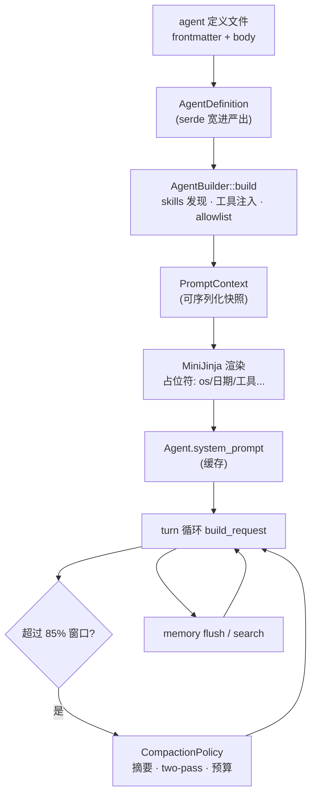

# 19. Prompt 装配与上下文工程

> **本章学到什么**：agent 定义文件（Markdown + frontmatter → serde struct）的系统提示词装配管线、模板渲染的占位符设计、上下文窗口的生命周期管理（compaction）、长期记忆。这是「agent 开发」区别于「聊天接口」的核心工程。
>
> **真实入口**：`crates/codegen/xai-grok-agent/src/config.rs`（定义解析）、`src/prompt/context.rs`（渲染）、`src/compaction.rs`、`crates/codegen/xai-grok-memory/`。

## 1. 业务背景：系统提示词不是常量

一个生产 agent 的系统提示词由很多东西拼成：基础模板（工具约定、格式规范）、用户自定义正文、AGENTS.md、skills 清单、记忆开关、运行环境（OS/日期/工作目录）……而且**主会话与子 agent 的装配规则不同**。Bony 把这整条管线做成了显式的数据结构 + 渲染步骤。

## 2. Agent 定义：Markdown + YAML frontmatter

定义文件长这样（`.grok/agents/*.md` 或 `~/.grok/agents/*.md`）：

```markdown
---
name: code-reviewer
description: Reviews diffs for correctness
promptMode: extend
tools: [read_file, grep]
permissionMode: default
skills: [review-checklist]
agentsMd: true
---
You are a careful reviewer...
```

frontmatter 反序列化成的 struct（`crates/codegen/xai-grok-agent/src/config.rs:740+`，节选）：

```rust
pub struct AgentDefinition {
    pub name: String,
    pub description: String,
    #[serde(default = "default_prompt_mode")]
    pub prompt_mode: PromptMode,
    #[serde(default = "default_grok_build_toolset")]
    pub tool_config: ToolServerConfig,
    /// Runtime capability mode that constrains which tool kinds the agent can use.
    #[serde(default, skip_serializing_if = "Option::is_none")]
    pub capability_mode: Option<xai_tool_types::SubagentCapabilityMode>,
    #[serde(default)]
    pub permission_mode: PermissionMode,
    #[serde(default)]
    pub skills: Vec<String>,
    #[serde(default = "default_true")]
    pub discover_skills: bool,
    #[serde(default = "default_true")]
    pub agents_md: bool,
    /// When true (default), builder layers session-level optional tools on top;
    /// set false for harnesses that need an exact, minimal toolset.
    #[serde(default = "default_true")]
    pub inject_default_tools: bool,
    /// Tool allowlist. Empty = inherit all.
    #[serde(default, deserialize_with = "deserialize_string_or_vec")]
    pub tools: Vec<String>,
    // ...
}
```

serde 工程点复习（都在第 14 章学过，这里是密集实战）：

- **每个字段都有 `default`**：定义文件可以只写关心的字段，其余取默认——作者体验与版本兼容都靠它。
- **`deserialize_string_or_vec`**：`tools: read_file` 和 `tools: [read_file, grep]` 两种写法都接受。对用户手写配置的格式宽容。
- **发现优先级**：项目级（cwd 上溯到 git root）> 用户级 > 内置（`discovery.rs`）——与 Claude/Cursor 的 agent 文件约定同构。

## 3. 装配管线：`PromptContext` 是唯一事实

`AgentBuilder::build`（第 02 章看过所有权视角）产出 `PromptContext`——**渲染系统提示词所需的全部输入**（`prompt/context.rs:85+`，节选）：

```rust
pub struct PromptContext {
    /// Schema version for forward-compatible persistence.
    pub version: u32,
    pub prompt_mode: PromptMode,
    /// Primary (parent) or subagent (child): controls base template choice.
    #[serde(default)]
    pub audience: PromptAudience,
    /// Custom body: appended after base template (Extend) or the entire prompt (Full).
    pub prompt_body: Option<String>,
    /// Which base template to use for Extend mode.
    pub system_prompt: TemplateOverride,
    /// AGENTS.md files discovered during build, in precedence order.
    pub agents_md_files: Vec<AgentConfigFile>,
    /// Pre-rendered persona summaries for system prompt injection.
    pub persona_summaries: Vec<String>,
    pub build_timestamp_utc: String,
    /// When true, the system prompt includes a <memory> section telling the
    /// model it can use memory_search and memory_get.
    pub memory_enabled: bool,
    pub role_instructions: Option<String>,
    // ...
}
```

设计要点：

1. **上下文是数据，不是过程**：`PromptContext` 可序列化（注意 `version` 字段——提示词快照要随会话持久化，格式会演进）、可重新渲染、可审计。
2. **`audience` 决定模板**：主会话与子 agent 用不同基础模板——子 agent 需要紧凑指令、不需要 personas 目录。差异化在装配层解决，不在运行时打补丁。
3. **旁路注入走用户消息**：AGENTS.md/personas 的提醒（`agents_md_user_reminder()`）注入到**用户消息**而不是 system——压缩时可以被摘要、子 agent 可以不带，灵活性大增（架构文档 §13 的设计取舍）。

## 4. 渲染：占位符 + 模板引擎

运行时值通过占位符注入（`context.rs:238-252`）：

```rust
pub fn placeholders(&self) -> serde_json::Value {
    serde_json::json!({
        "memory_enabled": self.memory_enabled,
        "memory_global_path": self.memory_global_path.as_deref().unwrap_or(""),
        "role_instructions": self.role_instructions.as_deref().unwrap_or(""),
        "os_name": self.os_name.as_deref().unwrap_or(""),
        "working_directory": self.working_directory.as_deref().unwrap_or(""),
        "current_date": self.current_date.as_deref().unwrap_or(""),
        "is_non_interactive": self.is_non_interactive,
        // ...
    })
}
```

渲染入口（MiniJinja 模板）：

```rust
/// Both the base template AND the prompt_body are rendered through
/// MiniJinja so that `${{ tools.by_kind.* }}` variables resolve
/// correctly regardless of prompt mode.
pub async fn render(&self, tool_bridge: &ToolBridge) -> Option<String> {
    let renderer = tool_bridge.template_renderer_snapshot().await?;
    // render_with_renderer(renderer) → Extend: 基础模板+正文追加; Full: 仅正文
}
```

- 模板里写 `${{ working_directory }}`、`${{ current_date }}`、条件块 `$...$`——**工具名也是变量**：模板可以引用「当前工具集里有没有某工具」，提示词随工具配置自适应。
- `Option<String>` 渲染结果 + `Agent.system_prompt` 缓存：渲染一次，整个会话复用（第 02 章的「构造后不可变」在这里兑现）。

## 5. 上下文的生命周期：Compaction

对话越长，token 越多；窗口满了要么失败要么**压缩**。策略是显式配置（`crates/codegen/xai-grok-agent/src/compaction.rs`）：

```rust
pub struct CompactionPolicy {
    /// Percentage of context window that triggers auto-compaction.
    /// E.g., 85 means compact when 85% of the context window is used.
    pub auto_compact_threshold_percent: u32,

    /// Model to use for generating the compaction summary.
    /// None = use the session's current model.
    pub compact_model: Option<String>,

    /// Whether to run a memory flush turn before each compaction.
    pub memory_flush_enabled: bool,

    /// Per-compaction wall-clock budget (seconds); a generation exceeding it is
    /// cut and retried — the backstop for reasoning runaways token limits miss.
    pub wall_clock_budget_secs: u64,

    /// Prefire two-pass compaction: speculatively summarize the history prefix
    /// in the background (pass 1); at compaction, summarize NOTE₁ + recent tail.
    pub two_pass_enabled: bool,
}
```

与第 17 章的衔接：压缩触发 → `SamplerTurnOutcome::CompactAndResubmit` → turn 循环 `continue` → 每轮重算的 `build_request` 拿到压缩后的历史。压缩后系统提示词切换为 `Agent::compact_system_prompt()`（专门写给「摘要后会话」的精简模板）。

工程启示：**上下文是有限资源，要像内存一样管理**——有阈值（85%）、有预算（wall-clock）、有策略（two-pass 预压缩）、有降级模型（用便宜模型做摘要）。

## 6. 长期记忆：跨会话的上下文

`xai-grok-memory`：`~/.grok/memory/`（全局）+ workspace hash 目录，`MEMORY.md` + SQLite/embedding 检索（schema 见 `memory/src/schema.rs`：`meta` 表 + `chunks` 表）。

与会话的接口有三处：

1. **工具**：`memory_search` / `memory_get`（第 02 章 builder 注入的就是它们）。
2. **提示词**：`memory_enabled` 时系统提示词含 `<memory>` 段（教模型何时用）。
3. **后台写回**：session 空闲时 flush（第 17 章 `run_session` 的定时器）、压缩前的 memory flush turn。

## 7. 全景图



## 8. 动手练习

1. **读一个真实定义**：在仓库找内置 agent 定义（`xai-grok-agent/src/discovery.rs` 的内置列表或 `.grok/agents` 约定），对照 `AgentDefinition` 字段逐项解释。
2. **占位符练习**：在草稿模板里写 `$...$`，说出 `placeholders()` 需要配什么。
3. **追踪压缩**：从 `CompactionPolicy::auto_compact_threshold_percent` 出发，找到 usage 检查点（`Agent::should_auto_compact`）与 `CompactAndResubmit` 的产生点。
4. **设计题**：如果让你为 Bony 房间 specialist 增加「每个 agent 不同的压缩阈值」，改 `AgentDefinition` + frontmatter + 哪条传递链？列出最小改动面。

## 自检

- [ ] 能说出定义文件 → PromptContext → 渲染的完整管线
- [ ] 理解「上下文是数据」带来的可序列化/可重渲染收益
- [ ] 知道 AGENTS.md/personas 为什么走用户消息旁路
- [ ] 能解释压缩的触发、执行与恢复闭环（连到第 17 章）
- [ ] 理解记忆系统的三个接口（工具/提示词/后台写回）

> 课程完结。回到 [README](README.md) 查看完整路线图；用第 06 章的作业模板检验自己的交付。
