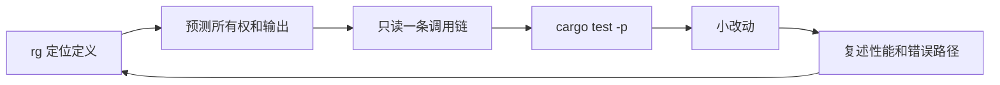

# 用 Bony Build 学 Rust：项目实战课程

这套课程把 Rust 知识放回真实产品调用链中学习：先看用户动作和数据流，再追踪所有权、类型、错误、并发和性能，最后进入 Agent 开发的整机视角。**所有代码例子都来自本仓库真实源码**（标注了文件与行号）。

## 三个阶段


- **第一阶段**：每章围绕一条产品链路（状态持久化、Agent 装配、工具流、采样 Actor、流式复制），在真实代码里撞见语言点。
- **第二阶段**：按知识域系统化补全，例子仍全部来自项目。
- **第三阶段**：把零件装回整机——turn 循环、ACP 桥接、上下文工程，掌握 agent 开发的核心工程。

## 课程目录

### 第一阶段：真实调用链

| 章节 | 主题 | 项目入口 |
|---|---|---|
| [01](01-task-state-and-sqlite.md) | 状态建模（enum/struct/Option/Result）与持久化、SQLite 策略 | `xai-workflow` · `xai-sqlite-journal` |
| [02](02-agent-ownership-and-builder.md) | 所有权、借用、Arc、消费型 Builder | `xai-grok-agent` |
| [03](03-tool-trait-and-streaming.md) | Trait、关联类型、静态/动态分发、流契约 | `xai-tool-runtime` |
| [04](04-sampler-actor-and-cancellation.md) | Actor、channel、JoinSet、取消安全 | `xai-grok-sampler` |
| [05](05-streaming-io-and-performance.md) | 流式 I/O、内存上界、性能证据 | `xai-grok-shell` JSONL copy |
| [06](06-capstone-labs.md) | 分级实战作业（L1–L3） | 现有测试体系 |

### 第二阶段：Rust 知识专题

| 章节 | 主题 | 项目例子 |
|---|---|---|
| [07](07-language-foundations.md) | 语法、表达式、模式匹配全家族 | sanitizer · relay kind 路由 |
| [08](08-lifetimes-collections-iterators.md) | 生命周期、Cow、集合、迭代器、闭包 | `redact_secrets` · `BorrowedEnvelope<'a>` · 熔断器窗口 |
| [09](09-traits-generics-advanced-types.md) | 关联类型、HRTB、impl Trait、newtype | Tool trait · `SessionId` |
| [10](10-modules-cargo-and-platform.md) | Workspace、feature、cfg、build.rs、facade | voice crate · system-power · shell build.rs |
| [11](11-smart-pointers-and-memory.md) | Arc/Weak、OnceLock、锁纪律、Drop、Pin | fsnotify 注册表 · telemetry · TimingGuard |
| [12](12-sync-concurrency-and-atomics.md) | 有界 channel、背压、CAS、内存序 | `buzz-pair-relay` · 熔断器 |
| [13](13-errors-raii-reliability.md) | thiserror/anyhow、事务、守卫、原子写、重试 | `buzz-db` · checkpoint fsync · sampler retry |
| [14](14-macros-attributes-serde.md) | macro_rules、属性宏、Serde 协议设计 | `xai-acp-lib` · `ToolErrorWire` · alias 兼容 |
| [15](15-unsafe-ffi-and-platform.md) | raw pointer、ABI、repr(C)、SAFETY 注释 | system-power Windows 回调 |
| [16](16-testing-quality-performance.md) | 契约测试、快照/属性/Fuzz、Criterion、RSS 预算 | tool_blocking · fork_copy · dhat |

### 第三阶段：Agent 开发进阶

| 章节 | 主题 | 项目入口 |
|---|---|---|
| [17](17-turn-loop-anatomy.md) | Turn 循环全链路：结果 enum 驱动控制流 | `xai-grok-shell` turn/sampler_turn/tool_calls |
| [18](18-acp-protocol-and-session-pool.md) | ACP 协议桥接、会话池、权限硬拦截 | `buzz-acp` |
| [19](19-prompt-assembly-and-context-engineering.md) | Prompt 装配管线、compaction、memory | `xai-grok-agent` prompt · `xai-grok-memory` |

完整知识点矩阵见 [00-complete-knowledge-map.md](00-complete-knowledge-map.md)。

## 每次学习的循环



从仓库根目录开始（命令规范与项目一致）：

```powershell
rustc --version
cargo check -p xai-workflow
cargo test -p xai-tool-runtime --test tool_blocking
cargo test -p xai-grok-sampler
```

## 学习建议

1. **先 01–06 再专题**：调用链给你「为什么需要这个语言点」的动机；专题章节遇到不懂的先跳回对应链路章节。
2. **读代码先读注释**：本仓库注释质量高，尤其 `// SAFETY:`、「为什么这样设计」类注释是隐性课程。
3. **每章练习必做至少一半**：看懂与写出来之间隔着编译器。
4. **遵守项目规范**：所有实验都在单 workspace / 单 target 上做，`cargo -p <crate>`，不开新构建体系（详见根目录 `CLAUDE.md` / `AGENTS.md`）。
