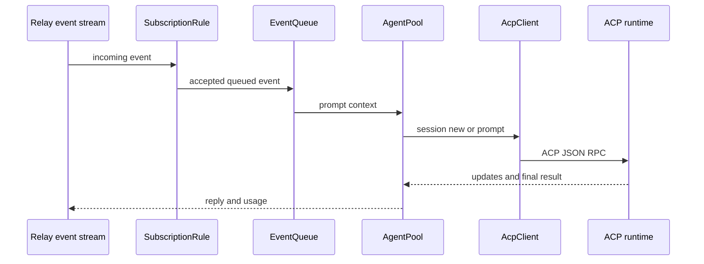

# ACP Harness 与房间 Agent 编排

`buzz-acp` 的 `run()` 是 harness binary 入口。其核心不是通用 LLM，而是将已订阅且允许响应的 Relay event 送入 `EventQueue`，由 `AgentPool` 分配 ACP client/session，并把流式结果、presence、profile directory 和 observer telemetry 回写 Relay。

图示事件过滤、队列、session 池和回复发布的运行链。

## 关键契约

`Config` 定义 subscribe/respond-to、dedup、multiple-event handling、超时和 setup mode；`SubscriptionRule` 不只是 UI 选择，而是进入队列前的 gate。`resolve_agent_owner` 优先验证 `BUZZ_AUTH_TAG` 的 NIP-OA attestation，再退回 `--agent-owner`/环境配置；`OwnerCache` 只缓存 immutable attestation sibling 判断。`PoolLifecycle`、`ControlSignal`、`SessionState` 处理 idle/working/stop，`TurnUsage` 是公开 usage surface。

目录 profile 从 `BUZZ_MANAGED_AGENT_CAPABILITIES` 提取稳定 capability token。能力用于发现/路由，不能代替工具授权。权限请求的 deny 配置要在 ACP request-permission 级别 reject，而不是只写 prompt。

## 延迟 pool lifecycle

`PoolLifecycle` 状态为 `Listening`、`Waking`、`Ready`、`Failed`。`start_wake_if_due` 仅在存在 pending work 时从 Listening 或到期 Failed 发起一次 wake；无积压时不会首启或重试。首次失败后 `retry_delay` 从 5 秒指数增长，封顶 5 分钟。`complete_wake` 只接受 Waking 且 attempt token 匹配的结果，拒绝 duplicate/旧回调；成功转 Ready，失败转 Failed。`take_ready` 消费 pool 后回到 Listening，不能重复借出同一个 ready pool。

## 变更与验证

变更 event 处理需同时检查 filter、queue flush/cancel、pool lifecycle、ACP client、Relay publisher 和 observer/usage。聚焦测试 `tests/pool_lifecycle_state.rs`，包括 stale/duplicate result；运行 `cargo test -p buzz-acp`。Desktop 如何 spawn harness 见[受管 Agent](../desktop/managed-agents.md)，具体 ACP agent 见[ACP Agent](acp-agent.md)。