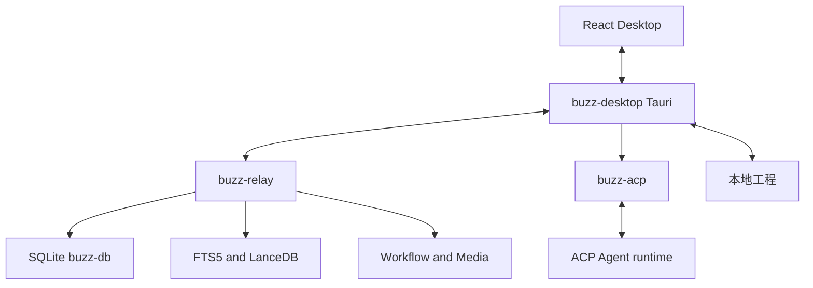

# Bony 运行时架构

Bony 是单一 Cargo workspace。用户通过 `buzz-desktop` 的 React/Tauri 客户端进入频道、Coding Workspace 和 Huddle；协作事件进入 `buzz-relay`，由 SQLite、进程内 pubsub、搜索和工作流服务处理；受管 Agent 由 Desktop 启动的 `buzz-acp` 连接 ACP runtime。根 `Cargo.toml` 是成员与共享依赖的权威入口。

图示 Desktop、Relay、Agent 和本地工程之间的主要运行边界。

## 平面与入口

| 平面 | 权威入口 | 责任 |
|---|---|---|
| 协议与数据 | `crates/buzz-core`、`buzz-db` | Nostr 事件、租户、SQLite 事件与频道状态。见[平台契约](../platform/core-protocol.md)与[持久化](../platform/persistence.md)。|
| Relay | `crates/buzz-relay/src/main.rs` | 配置、DB、认证、router、WS、REST 和后台 worker 的组装。见[Relay 服务](../relay/service-api.md)。|
| Agent | `crates/buzz-acp`、`crates/buzz-agent` | 房间事件到 ACP session，及 ACP JSON-RPC agent 实现。见[ACP harness](../agents/acp-harness.md)。|
| 桌面 | `desktop/src-tauri/src/main.rs` → `buzz_lib::run()` | 本机身份、受管进程、Tauri commands、项目/终端/音频。见[Desktop 架构](../desktop/architecture.md)。|
| 可选服务 | mesh、push、pair relay | 不与默认单实例本地路径混淆；见[Mesh 与 Push](../relay/mesh-push.md)、[配对与 Git](../operations/pairing-git-economy.md)。|

## 端到端不变量

1. Relay 的租户由请求 host 解析成 `CommunityId`，而不是由客户端声明；所有 scoped 持久化以 `community_id` 为边界。
2. Desktop 本地状态（身份、agent store、项目历史）不属于 Relay migration；协作数据才属于 `buzz.db` schema。
3. `buzz-acp` 是房间和 ACP runtime 的桥；Coding Workspace 只选择项目、展示 Git 状态并发送带 agent mention 的频道任务，不直接替代 agent 执行。
4. 新跨层 API 必须贯通 Rust command、`generate_handler!`、`desktop/src/shared/api/tauri.ts`、hook/consumer；只改 module 或只通过 crate 单测都不构成 shipped surface。

## 变更入口

- 协作事件、成员、访问或 SQLite：从[核心协议](../platform/core-protocol.md)和[Relay 服务](../relay/service-api.md)开始。
- agent 不响应、权限或 ACP session：查看[ACP harness](../agents/acp-harness.md)与[受管 Agent](../desktop/managed-agents.md)。
- UI command、启动顺序或 identity：查看[Desktop 架构](../desktop/architecture.md)与[本地状态安全](../desktop/local-state-security.md)。
- 完整命令及测试选择见[开发与验证](../operations/development-testing.md)。