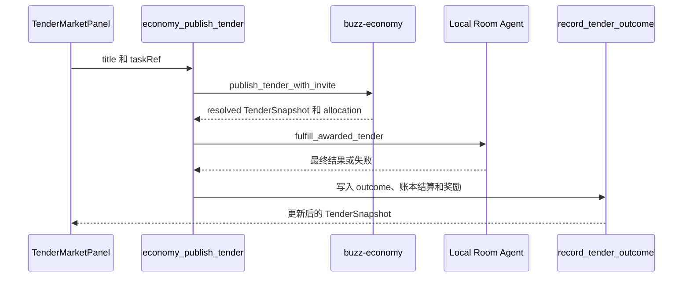

# Agent 经济与开放招标市场

`buzz-economy` 是 Local Room Agent 的唯一经济实现，拥有余额、声望、标签/能力、成就、组织、拍卖和招标的持久化规则。`EconomyPaths` 解析数据位置，`append_chained` 在独占文件锁下追加哈希链；Desktop 与 `buzz-dev-mcp` 都是共享写入者，不能直接修改 ledger、tender 或 contract 文件。默认根为用户目录中的 `.bony-build/room-memory`，可通过 `BONY_ROOM_MEMORY_DIR` 及各经济文件路径变量覆盖。

Desktop 的 `managed_agents::economy` 仅将 managed-agent 记录投影成 `RosterAgent` 并调用该 crate；命令层再将结果暴露给 React。因此它依赖 [Local Room 多 Agent 协作](room-collaboration.md) 提供的稳定 capability 与运行时 roster，而不是维护第二份角色表。Tauri 注册与 renderer import 的完整边界见 [Bony 运行时与桌面架构](architecture/overview.md)。



图示发布、开放市场分配、房间履约及结算的命令链路。

## 开放市场、报价与状态

`TenderRecord` 是链上的权威记录，`TenderSnapshot` 是 Tauri/TypeScript 使用的视图。除 `tender_id`、标题、预算、状态、winner、contract 和 `outcome` 外，快照携带软标签、每个 bid 的 quote/依据/投标时声望、`AllocationDecision` 以及 gold、声望、段位、评级、头衔、成就和新增能力等奖励字段。

- 创建要求非空 `title`、`task_ref` 和正预算；`suggest_tender_fields` 对未提供 capability 或预算的请求给出 `open` 与长度相关的默认预算。标题关键词仅生成展示标签，**不再**硬编码“关键词→指定专员/capability”的路由。
- `open`（空字符串、`open` 或 `*` 都会归一化）邀请每个运行中的 Agent/组织；显式 capability 才过滤候选者。历史数据中没有 allocation 时，`list_tenders` 会从 bid 重建展示用的分配板。
- `compute_agent_quote` 将历史正向 payout（至少两个样本）、预算中位、声望溢价和高流动性折扣合成为 `[25% × budget, budget]` 区间内的报价。`decide_allocation` 按报价价值 0.35、声望 0.35、能力匹配 0.20、流动性 0.10 排序；并以报价和 pubkey 打破同分。开放市场的能力匹配固定为 `1.0`。
- 招标状态为 `open`、`resolved`、`cancelled`。默认列表隐藏 cancelled 项。`cancel_tender` 是软删除且重复调用幂等；`clear_tenders` 的 `stuck` 清理 open 与没有 outcome 的 resolved 项，`history` 清理所有 resolved 项，`all` 清理 open/resolved 项。

## 履约与奖励生命周期

只有 `status == "resolved"`、winner 与非空标题存在、且没有非空 `outcome` 的项可进入 `fulfill_awarded_tender`。这使 sweep 或重试不会重复执行已结算工作。履约顺序是：winner 先在 Local Room 处理任务；无法产生可用结果时，winner 最多两次按预算一半上限雇佣开放市场支持 Agent，携带先前材料重试；两次都失败后，才以 winner 的 LLM 作最后后备。ACP progress 文本、任务 marker、结果 marker 和错误样式文本都不能被当作最终答案；成功结果会以 winner 身份回贴 `【招标结果】`，再持久化 outcome。

`record_tender_outcome` 调用统一的 `settle` / `compute_settlement_reward`，不能在 command 或 UI 层硬编码 payout。质量由 `grade_outcome` 判定：数字/简明事实或较长交付为 `excellent`，普通可用文本为 `pass`，极短文本为 `thin`，空/错误/声明失败为 `fail`。能力匹配时，excellent/pass 支付 100% budget 并分别加 12/8 声望，thin 支付 70% 并加 3，fail 支付 0 并扣 5；跨能力成功提高声望，失败扣 18。仅 excellent/pass 授予能力对应的表现头衔；获得的 tag 经账本 API 合并，避免重复。

## UI、清理与完整修改面

`TenderMarketPanel` 挂载时 best-effort `sweepEconomyTenders`，标题输入后预览开放市场预算和标签；发布只传标题及 `ui-<timestamp>` task reference。它显示报价/分配理由、结果与奖励，并可单项取消或批量清理卡住项/历史项。`useEconomyAdminMutation` 中的 mutation 必须在 `onSettled` 后失效 `economyTendersQueryKey`；绕过它会留下过期 market snapshot。

新增或修改经济 public API 时按完整链路检查：

1. 在 `buzz-economy/src/*.rs` 定义权威行为与 serde 类型，并在 `lib.rs` `pub use` 需要的 public symbol。
2. 在 `desktop/src-tauri/src/managed_agents/economy.rs` 维持 `EconomyPaths`、错误转换、roster 投影或 adapter。
3. 在 `commands/economy.rs` 添加 `#[tauri::command]`；必要的房间生命周期放在 `commands/economy_fulfill.rs`；并在 `commands/mod.rs` 声明、`src-tauri/src/lib.rs` 的 `generate_handler!` 注册。
4. 在 `desktop/src/shared/api/tauri.ts` 同步 wire type 与 `invokeTauri` wrapper；在 `features/agents/hooks.ts` 建 mutation/query 和 invalidation，最后由 `MarketScreen`、`TenderMarketPanel` 或 Profile consumer 使用。

第 3–4 步是 shipped-surface 正确性：crate 能编译或单元测试通过，不代表 renderer 能从真实 import 路径调用命令。新增取消/批量清理命令的现有范例就是 `economy_cancel_tender` / `economy_clear_tenders` → wrappers → `useEconomyAdminMutation` → 面板按钮。

## 聚焦验证与测试矩阵

实现同文件测试是首选入口：`tender::tests` 覆盖开放市场邀请、allocation 回建、结算和取消/清理；`quote::tests` 的 `quote_stays_inside_budget_band`、`history_anchors_quote`、`lower_quote_scores_higher_all_else_equal`、`decide_picks_best_score` 锁定报价与排序；`reward::tests` 的 `grades_empty_and_error_as_fail` 与 `schedule_scales_gold_and_rep` 锁定质量和奖励表。默认检查：

```powershell
cargo test -p buzz-economy --lib --quiet
```

改动状态机至少覆盖：必填字段/默认 open；open→resolved、open→cancelled；同一取消的幂等性；`stuck`/`history`/`all` 各自的清理范围；空 outcome 与已有 outcome；无 winner、非 resolved 或空标题时不履约；progress/失败文本不能成功结算；支持雇佣次数上限；独立 `EconomyPaths` 隔离以及多写者链验证。改动 Tauri、履约或 TypeScript surface 时，额外运行：

```powershell
cargo check -p buzz-desktop
```

仅当修改 UI—command—room 消息集成时，再条件性启动 Local Room 与 Desktop，发布低风险任务，确认 allocation、频道结果回贴、结果卡和奖励字段一致。该验证依赖 relay、Desktop 和可用 Agent runtime，不是普通 crate 修改的默认步骤。

## 何时阅读本页

- 账本、报价、奖励、能力成长、组织或市场分配不正确。
- 招标 resolved 后没有结果、重试重复执行，或进度消息被错误结算。
- 要新增经济类型、Tauri command、市场字段、清理规则或奖励层。
- 要理解市场为何依赖 managed-agent capabilities，以及为何履约策略受 Local Room / ACP 消息约束。
