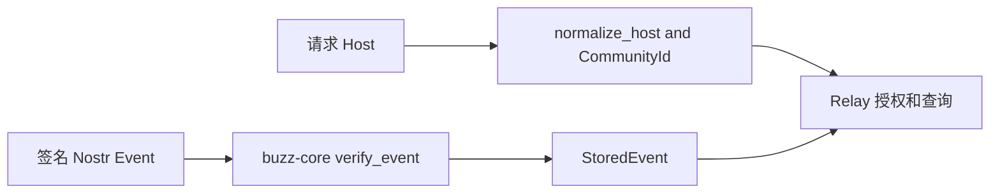

# 核心协议与租户模型

`crates/buzz-core/src/lib.rs` 禁止 unsafe，并明确是所有 Buzz crate 依赖的 zero-I/O foundation。它不连接数据库或网络；将可共享、可测试的协议语义放在 `StoredEvent`、`CommunityId` 和领域模块中。

## 拥有的公共契约

| 模块/符号 | 用途 | 下游 |
|---|---|---|
| `StoredEvent`、`verify_event` | 已验证 Nostr 事件及签名/ID 校验 | Relay、DB、SDK、测试客户端 |
| `tenant::{CommunityId, TenantContext, normalize_host}` | host 到社区的规范化租户身份 | Relay tenant resolver、DB 查询 |
| `kind`、`channel`、`filter` | 自定义 kind 注册、频道/成员枚举、NIP-01 filter 匹配 | Relay handler/订阅、SDK |
| `engram`、`observer`、`agent_turn_metric` | agent memory、观察帧与 turn telemetry 数据格式 | ACP、Desktop、CLI |
| `pairing` | NIP-AB crypto/message primitives | pair relay、pairing CLI |
| `git_perms` | ref pattern、保护规则和策略计算 | Relay Git 服务 |

`CommunityId` 是服务器解析后的 key；它必须随 scoped path/查询传播。不要把 UI 选择、URL 文本或 event tag 当作授权替代品。

## 关系与扩展

`buzz-sdk` 构造 typed Nostr event builders，但不拥有密钥或网络；`buzz-ws-client` 提供通用 WS transport；`buzz-relay` 决定事件是否接收、存储与 fan-out。新增 kind 时先在 `buzz-core::kind` 建立稳定常量和分类，再同步 SDK builder、relay handler/存储策略及消费者。

图示事件完整性与租户归属在 Relay 前置路径中的不同职责。

## 验证与边界

`test_helpers` 只在 test 或 `test-utils` feature 下提供签名事件构造。协议变更应优先运行涉及的 crate 测试，再运行[Relay E2E/一致性验证](../operations/development-testing.md)。本页不定义 SQLite、HTTP router 或 Agent runtime：分别见[持久化](persistence.md)、[Relay 服务](../relay/service-api.md)、[ACP harness](../agents/acp-harness.md)。