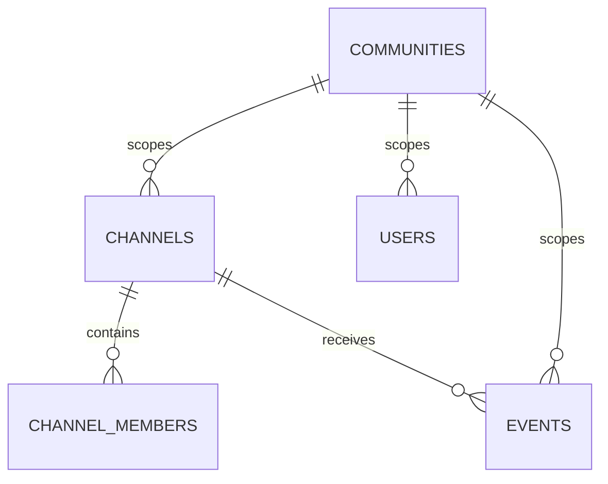

# Relay SQLite 持久化与迁移

`buzz-db` 是 Relay 协作数据的访问层；根 `migrations/0001_initial_schema.sql` 是从零部署的 consolidated SQLite schema。它不是 Desktop app-data、agent JSON 或 identity key 的 schema；那些状态见[Desktop 本地状态安全](../desktop/local-state-security.md)。

## 数据与并发不变量

`sqlite_connect_options` 统一开启 `foreign_keys(true)`、WAL 和 30 秒 busy timeout。WAL 允许 reader 与单 writer 并发；两个 writer 仍被 SQLite 串行化，timeout 防止多 Agent 同时写时立刻 `SQLITE_BUSY`。所有附加 pool 也必须复用该函数，而非悄悄使用默认连接选项。

- AUTH kind `22242` 永不存储，因为携带 bearer token。
- ephemeral kind `20000–29999` 永不存储；实时 fan-out 属于 `buzz-pubsub`。
- 该部署模型是单实例，没有读副本、月度分区或跨 pod advisory lock。

## 租户 shape

`communities` 是 operator-global registry；其余 scoped row 的 `community_id` 是不可变边界。`channels` 主键为 `(community_id, id)`，并由 `trg_channels_community_id_immutable` 阻止 re-tenant。`events` 以 `(community_id, created_at, id)` 存储，允许同一签名 event 出现在不同社区，但不在同一社区重复。成员、用户、事件索引和外键均以前导 community key 维持隔离。

图示 migration 中社区、频道、成员和事件的核心租户关系。

## 模块所有权

`Db`、`DbConfig`、`EventQuery` 在 `buzz-db`；其余模块按 channel、event、DM、reaction、feed、user、workflow、push、moderation、relay member、Git repo 和 usage 组织。`insert_mentions` 在 event insertion 后写 `event_mentions`，故障记录日志但不阻塞主事件落库。FTS5 external-content 表由 `buzz-search` 拥有，而不是 migration 的 events 表。

## 变更与验证

修改 schema 必须同时检查：迁移的复合 PK/FK/index 是否仍以 `community_id` 开头、`buzz-db` query 是否绑定该值、Relay caller 是否从 host-derived tenant 获得值。不要把 Desktop secret/history 加进本 migration。最小验证：`cargo test -p buzz-db`；涉及真实行为时再运行[测试客户端 E2E](../operations/development-testing.md)。