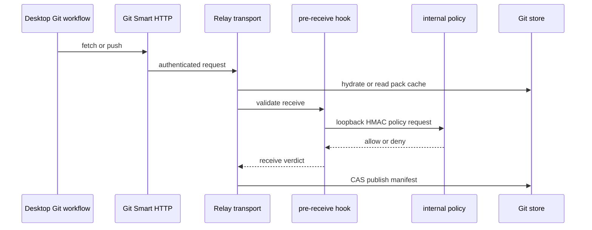

# Relay Git 服务与授权链

`crates/buzz-relay/src/router.rs` 把 Smart HTTP Git router、内部 `/internal/git/policy` router 和可选 Git Web GUI 组装进生产路由。`crates/buzz-relay/src/api/git/mod.rs` 是领域边界：`transport` 处理 clone/fetch/push，`hook` 和 `policy` 处理 pre-receive 授权，`binding`、`manifest`、`hydrate`、`cas_publish`、`pack_cache`、`store` 管理仓库物化与一致性。

图示 Git push 从外部 transport 到内部 policy 决定和 CAS 发布的安全链。

## 关键不变量

- public transport 与内部 policy 不是同一信任区；policy route 仅 loopback，并以 HMAC 与 TTL fail closed。
- hook 是接受前的授权点；不能用客户端提交的显示名或未验证 ref 信息替代权限策略。
- CAS publish、manifest/hydrate 和 pack cache 共同保证并发推送/读取不会把不一致对象当作最新仓库。
- `buzz-core::git_perms` 定义 ref pattern 与保护规则；Relay 才把它们应用到请求和仓库状态。

Desktop `commands/project_git_workflow.rs` 证明 native merge 以仓库 owner 或其 managed-agent 密钥运行、校验 repo address 并发布签名状态 event。客户端 credential/sign path 见[配对、Git 与经济](../operations/pairing-git-economy.md)，但 helper 不能绕过 server policy。

## 推送提交点与故障语义

`GitAuth::from_request_parts` 从 `Host` 得到 `TenantContext`，用该租户构造预期 Git 根 URL，再执行 NIP-98 与 relay membership gate。Git transport 明确复用 NIP-98 的方法校验，但对无 body transport 不要求 payload hash，并做 event-id 去重；这不是所有 NIP-98 HTTP API 的泛化规则。

`cas_publish` 先读取 parent manifest/`ParentState.if_match`，捕获 pack，create-only 写内容寻址 pack 与 manifest（manifest 记录 `parent_digest`），最后以 pointer 的 `IfMatch` 或 `IfNoneMatchStar` 作唯一提交点。`CasError::Conflict` 不在服务端重试，返回已赢得 pointer 状态给客户端；只有 CAS 成功后才派生 kind `30618`，因此冲突、损坏或超限都不能被观察为推送成功。`ManifestReadFailed`/`ManifestInvalid` 表示 parent 不可信；`PackCapture`/`ResourceLimit` 是 CAS 前输入失败；后端存储错误可发生于对象写或 pointer 提交，均不得发布成功 event。

## 验证

改动 transport、hook 或 store 时同时检查 router registration、loopback middleware、HMAC/TTL 错误、CAS conflict、manifest hydrate、pack cache invalidation 和 Git GUI 的访问边界。运行 `cargo test -p buzz-relay`，再以 `buzz-test-client` 的 Git E2E 覆盖 clone/fetch/push/拒绝路径。