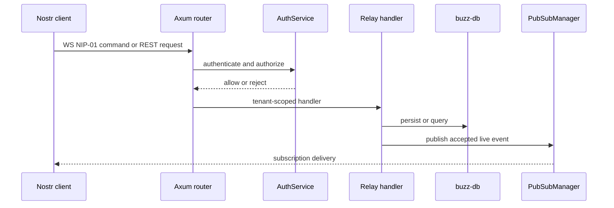

# Buzz Relay 服务与实时 API

`crates/buzz-relay/src/main.rs` 是主服务入口。它先安装 rustls ring provider，初始化 JSON 日志及可选 OTLP，读取 `Config::from_env()`，创建 `Db`，按 `BUZZ_AUTO_MIGRATE` 决定迁移，再装配 `AuthService`、`PubSubManager`、`SearchService`、`AuditService`、`WorkflowEngine` 和 `AppState`，最后由 `router::{build_router, build_health_router}` 暴露业务与 health 服务。

图示 Relay 对实时请求执行认证、租户作用域、持久化与 fan-out 的顺序。

## 运行边界

`AppState` 是 router 的共享组合根；`connection`、`handlers`、`protocol`、`subscription` 实现 NIP-01 生命周期与 filter fan-out。`tenant` 将 host 绑定到 row-zero community；`admission`、Auth 和 handler 共同负责接收决定。`audio` 服务 Huddle WebSocket，`push_runtime` 处理耐久 NIP-PL 匹配/投递，`workflow_sink` 是 `buzz_workflow::ActionSink` 的 relay 适配器，`tunnel` 维护 tunnel session directory。

`buzz-pubsub` 是单进程实时状态，broadcast buffer 容量为 4096；topic 不是授权边界，订阅交付仍须遵守 Relay filter/access 判定。默认本地部署无需 Redis；可选 mesh 通过 `mesh_boot` 接入。

## 启动与失败

membership enforcement 开启时，缺少有效 owner pubkey 或稳定 relay 私钥会在数据库副作用前 fail fast。启动会按 `relay_url` 规范化 host 并幂等 ensure deployment community，再进行 membership backfill/bootstrap。不要通过配置解析或客户端 host 绕过 tenant resolver。

## 变更与验证

新增 REST/WS surface：实现 handler → router 注册 → `AppState` 依赖 → tenant/auth gate → 失败响应/metrics → E2E client。重点测试由 crate 内测试设施和 `buzz-test-client` 黑盒套件承载。默认：`cargo test -p buzz-relay`；协议兼容：`cargo test -p buzz-test-client`。Git 是单独公开 API，见[Relay Git 服务](git-service.md)；workflow/media 见[工作流与媒体](workflows-media.md)。