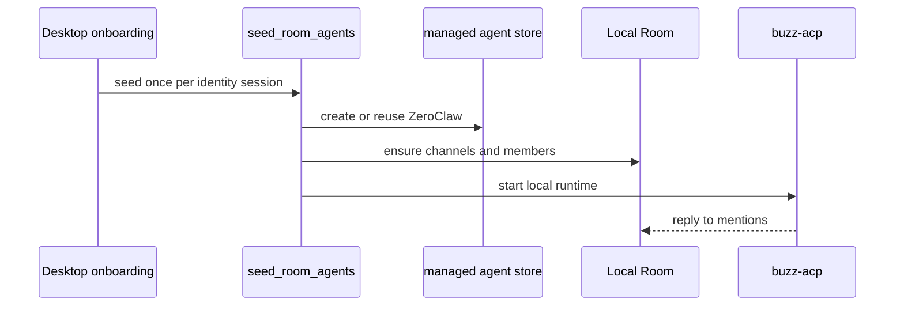

# Local Room 与 ZeroClaw 协作

`desktop/src-tauri/src/commands/room_seed.rs::seed_room_agents` 是座席的权威。它以名称幂等创建/复用 Local Room 和当前唯一内置 seat **ZeroClaw**；任何脚本、README 或旧注释中关于 Grok、两名或五名默认 seat 的表述都不是当前可执行事实。

ZeroClaw 的 runtime 从项目约定位置或 PATH 解析，使用 `acp` 参数、本地 backend、`research.web` capability 与 `mentions` 订阅；配置 `BUZZ_ACP_AUTO_POST_REPLY`、progress post 和 no-memory，并对 `deliver_file,file_write` 施加硬 deny。能力仅用于目录/路由，不等同于工具授权。

图示启动时 seed 与运行时 ACP 回复之间的职责边界。

seed 会停止、移除成员并从 local store 清理遗留 Grok、Unity、OpenMontage、DocSmith。它还确保 human owner 和 ZeroClaw 进入 Local Room、welcome-everyone、general。修改 seat 时同步审查 `RoomAgentSpec`、runtime/MCP、capability、订阅、deny list、既有 record reconcile 和测试；默认 `cargo test -p buzz-desktop`。受管进程/私钥详情见[受管 Agent](desktop/managed-agents.md)。