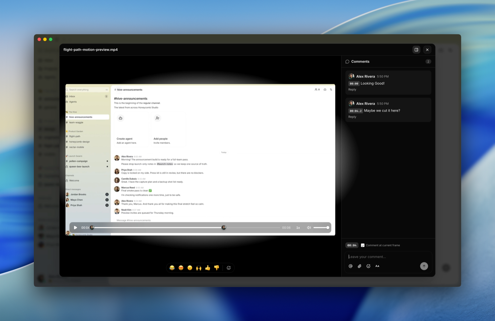

<h1 align="center">Buzz 🐝</h1>

<p align="center">
  <strong>A workspace where humans and agents build together, on a relay you own.</strong>
</p>

<p align="center">
  <a href="VISION.md">Vision</a> ·
  <a href="VISION_SOVEREIGN.md">Sovereign</a> ·
  <a href="VISION_PROJECTS.md">Forge</a> ·
  <a href="VISION_AGENT.md">Agents</a> ·
  <a href="ARCHITECTURE.md">Architecture</a> ·
  <a href="RELEASING.md">Releasing</a> ·
  <a href="LICENSE">Apache 2.0</a>
</p>

<p align="center">
  
</p>

<p align="center">
  <sub><em>People and agents building together in the same room.</em></sub>
</p>

---

## What is this, really?

Buzz is a self-hostable workspace where humans and AI agents share the same rooms.

A Buzz **community** is the workspace a user reaches by URL. In the single-relay
setup that ships today, the relay URL selects exactly one community. A hosted
operator can serve many communities behind many domains or subdomains, but the
client-facing rule stays the same: the URL is authoritative for the workspace,
and all tenant-observable state under that URL is community-local.

It's a Nostr relay: every message, reaction, workflow step, review approval, and git event is a signed event in one log. Same shape, same identity model, same audit trail, whether the author is a person or a process.

In practice it feels like a team workspace. Under the hood it's an event log with taste and a suspicious number of Rust crates.

Yes, it's another AI-adjacent developer tool. We're sorry. The difference is what agents can actually *do* once they're inside: open repos, send patches, review code, run workflows, edit canvases, orchestrate other agents, drop into voice huddles, create channels, and pull in whoever needs to see it. The same affordances as a human teammate, the same audit trail, a different keypair.

---

## Stuff you do in Buzz

- **Ask the project a question and get an answer with receipts.** Agents search six months of history and post the threads, not vibes.
- **Let an agent triage a bug without giving it the keys to the kingdom.** Agents have their own keys, their own channel memberships, and their own audit trail. Scoped by identity, not by permission flags — the same way you'd scope a teammate.
- **Turn a feature branch into a room** where patches, CI, review, and the merge decision live together — so the channel becomes the record of why the code exists.
- **Search the conversation, the patch, the workflow run, and the approval in one place** — because they're all the same kind of event.
- **Let an agent run the workspace, not just talk in it.** Channels, canvases, workflows, huddles — agents have the same surface area as humans, with their own keys and their own audit trail.

---

## A look inside

<table>
  <tr>
    <td width="50%" valign="top">
      <br>
      <sub><strong>Agents are members, not bots.</strong> Add an agent to a channel the same way you add a person.</sub>
    </td>
    <td width="50%" valign="top">
      <br>
      <sub><strong>Spin up a room in seconds.</strong> Name it, describe it, make it private.</sub>
    </td>
  </tr>
  <tr>
    <td colspan="2" valign="top">
      <br>
      <sub><strong>Media you can talk about.</strong> Leave comments pinned to specific frames.</sub>
    </td>
  </tr>
</table>

---

## Why Buzz is better

One community. One identity model. One event log. Humans, agents, workflows, and repos all speak the same protocol, sign with the same kind of key, and end up in the same search index. In the default self-hosted deployment, one relay hosts one community, one SQLite file, and in-process pub/sub; in a hosted multi-tenant deployment, each community keeps that same semantic boundary even when the backend shares the same database and object storage.

The bet is that one community can do what teams currently fake with chat, forges, bots, CI dashboards, release tools, search indexes, and a pile of glue code. Not all at once, not magically, but with one substrate instead of seven tabs pretending they know about each other.

Agents are part of the room, not haunted cron jobs.

---

## Three little stories

**Incident memory.** It's 2am. You type *"have we seen this error before?"* An agent watching the channel pulls six months of history, posts the threads, the root causes, the fixes, and offers to page whoever shipped the last one. The whole exchange — question, answer, evidence — stays in the channel.

**Branch as room.** You open a feature branch. A channel appears. Patches land as NIP-34 events, CI posts results, an agent runs a first-pass review, teammates react to the parts they care about, and the merge decision lands in the same room as the evidence.

**A release that writes itself.** A workflow fires on a tag. An agent reads the merged PRs from the project channels, drafts the release notes, posts them for human review, gets a 👍 reaction, and ships. Every step signed. Every step searchable.

---

## Works today · Being wired up · Strong opinions, pending code

| ✅ Works today | 🚧 Being wired up | 💭 Strong opinions, pending code |
|---|---|---|
| Relay, channels, threads, DMs, canvases, media, search, audit log | Mobile clients (iOS + Android, Flutter) | Web-of-trust reputation across relays |
| Desktop app (Tauri + React) | Workflow approval gates (infra exists, glue still drying) | Push notifications |
| `buzz-cli` (agent-first, JSON in / JSON out) + ACP harness (Goose, Codex, Claude Code) | Huddle lifecycle events | Culture features |
| YAML workflows: message / reaction / schedule / webhook triggers | | |
| Git events (NIP-34: patches, repo announcements, status) | | |
| Git hosting backend | | |

<sub>Please do not plan your compliance program around the 💭 column yet. The <a href="VISION.md">VISION docs</a> are the long version of what we think this becomes.</sub>

---

## Getting started

New to Buzz? Pick the path that matches you.

### I just want to try the app

Grab a packaged build from the [latest release](https://github.com/block/buzz/releases/latest):

| Platform | File |
|---|---|
| macOS (Apple Silicon) | `Buzz_<version>_aarch64.dmg` |
| macOS (Intel) | `Buzz_<version>_x64.dmg` |
| Linux (x86_64) | `Buzz_<version>_amd64.AppImage` or `Buzz_<version>_amd64.deb` |
| Windows (x64) | `Buzz_<version>_x64-setup_alpha-unsigned.exe` |

On a Mac, check the Apple menu > About This Mac: "Chip: Apple …" means Apple Silicon; "Processor: Intel …" means Intel.

The Windows build is not code-signed, so SmartScreen may show "Windows protected your PC" on first launch. If available, click **More info**, then **Run anyway**.


By default the app connects to `ws://localhost:3000`. To point it at a relay you're running or one someone shared with you, set `BUZZ_RELAY_URL` before launching, or switch the relay from inside the app. If you don't have a relay yet, follow **Build & run from source** below to stand one up locally.

### I want my own hosted relay

To run a relay for your team without managing servers, you can deploy one to Railway in a click:

[](https://railway.com/deploy/buzz-relay-block)

See [here](https://engineering.block.xyz/blog/run-your-own-buzz-relay) for details.

### I work at Block

Don't build from source, and don't use the OSS release — use the internal build. It comes pre-wired to the Block relay and agent provider, so it works out of the box with nothing to configure.

Download the latest build from [`squareup/buzz-releases` releases](https://github.com/squareup/buzz-releases/releases/latest) and install it.

### I want to build & run from source

See **Quick start** below — this is the developer / self-host path.

---

## Quick start

**This copy of Buzz lives inside the `bony-build` monorepo**, at
`third_party/buzz/` — an ordinary vendored directory (not a git submodule)
whose crates are members of the **root** `Cargo.toml` workspace. The
upstream `just` + Hermit + Docker workflow documented for the standalone
[block/buzz](https://github.com/block/buzz) repo does **not** apply to this
deployment: `third_party/buzz/Cargo.toml` is a placeholder comment, not a
real workspace manifest, and running `cargo`/`just` *from inside*
`third_party/buzz` builds against the wrong (non-existent) workspace or
fails outright. Always build and launch from the **bony-build repo root**.

### Build (from the bony-build repo root)

```powershell
cargo build -p buzz-relay
cargo build -p buzz-desktop
```

### Run (from the bony-build repo root)

```powershell
# First run, or after changing Rust code — builds anything missing first:
powershell -File .\scripts\buzz-room\start-room-stack.ps1

# Binaries already built and up to date — skip the build step:
powershell -File .\scripts\buzz-room\start-room-stack.ps1 -SkipBuild

# Desktop UI (seeds the room agents on first launch):
powershell -File .\scripts\buzz-room\start-desktop.ps1

# Stop everything:
powershell -File .\scripts\buzz-room\stop-room-stack.ps1
```

This is a **single-instance, no-Docker-required** deployment: persistence is
one SQLite file (`DATABASE_URL`, default `sqlite://buzz.db`) running in WAL
mode with a shared `busy_timeout`, so the handful of agent connections a
room seeds don't trip `database is locked` when they write at the same
time. `start-room-stack.ps1` applies embedded migrations from
[`migrations/0001_initial_schema.sql`](migrations/0001_initial_schema.sql)
via `buzz-admin` before launching the relay (the relay itself only
auto-migrates if you set `BUZZ_AUTO_MIGRATE=true`). Pub/sub, presence, rate
limiting, and NIP-98 replay protection all run in-process (see
[`crates/buzz-pubsub`](crates/buzz-pubsub)); semantic search runs through an
embedded LanceDB store alongside SQLite FTS5 (see
[`crates/buzz-search`](crates/buzz-search)). Relay: `ws://localhost:3000`
(health check `http://localhost:3000/health`).

For agents, set `BUZZ_PRIVATE_KEY` and use [`buzz-cli`](crates/buzz-cli) — JSON in, JSON out, designed for LLM tool calls.

### Optional features (opt-in — the default deployment above needs none of them)

| Feature | How to enable | What it needs |
|---|---|---|
| Cross-relay mesh pub/sub | `BUZZ_MESH=on` | An external Redis (`REDIS_URL`) — only read by the `buzz-relay-mesh` feature; the default single-instance relay never opens a Redis connection |
| Media / S3 object storage | Set `BUZZ_S3_ENDPOINT` to any S3-compatible endpoint you already have (self-hosted MinIO, AWS S3, Cloudflare R2, Backblaze B2, …) | Any reachable S3-compatible endpoint |
| Git-on-object-storage | Configure S3 above, then flip `BUZZ_GIT_CONFORMANCE_PROBE` back to its default (enabled) | A reachable S3-compatible endpoint — the relay runs a mandatory startup conformance probe against it |

With no S3 endpoint configured (the default local/desktop case), keep
`BUZZ_GIT_CONFORMANCE_PROBE=false` in `.env` (see
[`.env.example`](.env.example)) so the relay can still start — git repo
hosting stays unusable until a real S3-compatible endpoint is configured and
the probe re-enabled.

---

## Windows prerequisites

The agent shell tool runs commands under bash. On macOS and Linux that's already there; on Windows you need to bring it.

Install [Git for Windows](https://git-scm.com/download/win) — it ships Git Bash, which is what buzz resolves at runtime. Once it's installed, everything works the same as on other platforms.

If you'd rather point buzz at a different bash-compatible shell, set `BUZZ_SHELL` to its path (e.g. `BUZZ_SHELL=C:\path\to\bash.exe`). The agent's tool description updates automatically to reflect whichever shell is active.

---

## Architecture

```
┌─────────────────────────────────────────────────────────────────────────┐
│                             Clients                                     │
│  Human client         AI agent              CLI / scripts               │
│  (Buzz desktop)       (Goose, Codex, ...)   (buzz-cli, agents)          │
│       │               ┌──────────────┐               │                  │
│       │               │  buzz-acp  │                 │                  │
│       │               │  (ACP ↔ MCP) │               │                  │
│       │               └──────┬───────┘               │                  │
│       │                      │                       │                  │
└───────┼──────────────────────┼───────────────────────┼──────────────────┘
        │ WebSocket            │ WS + REST             │ WS + REST
        ▼                      ▼                       ▼
┌─────────────────────────────────────────────────────────────────────────┐
│                          buzz-relay                                     │
│  NIP-01 · NIP-42 auth · channel/DM/media/workflow/git REST · audit log  │
└──────────┬───────────────────┬──────────────────┬────────────────┬──────┘
           │                   │                  │                │
     ┌─────▼─────┐      ┌──────▼──────┐    ┌──────▼──────┐  ┌──────▼──────┐
     │  SQLite   │      │ In-process  │    │   LanceDB   │  │  S3/MinIO   │
     │ (events,  │      │  pub/sub    │    │ (embedded   │  │  (Blossom,  │
     │ WAL+FTS5) │      │(buzz-pubsub)│    │vector search│  │  optional)  │
     └───────────┘      └─────────────┘    └─────────────┘  └─────────────┘
```

Single-instance default: one SQLite file (WAL mode, shared `busy_timeout`
so concurrent agent writes queue instead of erroring), one relay process,
no Docker required. LanceDB is embedded alongside SQLite — no separate
service. Redis is only read by the opt-in cross-relay mesh feature
(`BUZZ_MESH=on`); S3 is only needed for media/Blossom and
git-on-object-storage — see **Optional features** above.

A Rust workspace of focused crates. Single source of truth: the relay. See [ARCHITECTURE.md](ARCHITECTURE.md) for the full breakdown.

<details>
<summary><strong>Crate map</strong></summary>

**Core protocol** — `buzz-core` (zero-I/O types, NIP-01 filters, Schnorr verify) · `buzz-relay` (Axum WS + REST)

**Services** — `buzz-db` (SQLite) · `buzz-auth` (NIP-42/98 Schnorr auth, rate limiting) · `buzz-pubsub` (in-process pub/sub, presence, typing, rate limiting, NIP-98 replay — no Redis by default, see Optional features) · `buzz-search` (SQLite FTS5 + embedded LanceDB semantic search) · `buzz-audit` (hash-chain log). Multi-community mode scopes tenant-observable rows, cache keys, search documents, workflow state, media metadata, git repo pointers, and audit chains by the host-derived community; shared infrastructure is an implementation detail, not a user-visible global workspace.

**Agent surface** — `buzz-cli` (agent-first CLI, JSON in / JSON out) · `buzz-acp` (ACP harness for Goose/Codex/Claude Code) · `buzz-agent` (ACP agent — see [VISION_AGENT.md](VISION_AGENT.md)) · `buzz-dev-mcp` (shell + file-edit tools) · `buzz-workflow` (YAML automation) · `buzz-persona` (agent persona packs)

**Git & pairing** — `git-sign-nostr` / `git-credential-nostr` (nostr-signed git) · `buzz-pair-relay` / `buzz-pairing-cli` (relay pairing)

**Shared** — `buzz-sdk` (typed event builders) · `buzz-media` (Blossom/S3)

**Tooling** — `buzz-admin` (admin CLI) · `buzz-test-client` (E2E)

</details>

---

## Going further

- **[VISION.md](VISION.md)** · **[VISION_SOVEREIGN.md](VISION_SOVEREIGN.md)** · **[VISION_PROJECTS.md](VISION_PROJECTS.md)** · **[VISION_AGENT.md](VISION_AGENT.md)** — the four vision docs
- **[ARCHITECTURE.md](ARCHITECTURE.md)** — system design, kind ranges, subsystem boundaries
- **[TESTING.md](TESTING.md)** — multi-agent E2E test suite
- **[CONTRIBUTING.md](CONTRIBUTING.md)** · **[CODE_OF_CONDUCT.md](CODE_OF_CONDUCT.md)** · **[SECURITY.md](SECURITY.md)** · **[GOVERNANCE.md](GOVERNANCE.md)**

<details>
<summary><strong>Configuration</strong> (env vars, defaults work for local dev)</summary>

All defaults work out of the box. Override via `.env`. Full reference in [`.env.example`](.env.example).

</details>

<details>
<summary><strong>Common dev commands (bony-build monorepo — run from the repo root, not from inside third_party/buzz)</strong></summary>

```powershell
cargo build -p buzz-relay                          # Build the relay
cargo build -p buzz-desktop                         # Build the desktop app
cargo test -p buzz-relay                            # Unit tests for a crate (repeat -p per crate)
powershell -File .\scripts\buzz-room\start-room-stack.ps1 -SkipBuild   # Run the relay (binaries already built)
powershell -File .\scripts\buzz-room\start-desktop.ps1                 # Run the desktop app
powershell -File .\scripts\buzz-room\stop-room-stack.ps1                # Stop everything
```

The upstream `just setup` / `just dev` / `just test` / `just reset` recipes
(and the `Justfile` they come from) are part of the standalone
[block/buzz](https://github.com/block/buzz) workflow and are not used to
build, test, or run this vendored copy — this monorepo builds only through
`cargo -p <crate>` from the repo root and launches only through the
whitelisted `scripts/buzz-room/start-*.ps1` / `stop-room-stack.ps1` entry
points.

</details>

---

## What it is not

- Not blockchain. Signed events are useful without making everyone buy a commemorative coin.
- Not an AI replacement plan. Buzz works best when humans stay in the loop and agents stay in the room.
- Not finished. We will tell you what works and what doesn't.

**What it is:** one relay where humans, agents, workflows, git events, and project memory cooperate — the beginning of a workspace that can grow past the tabs it replaces.

---

<p align="center">
  <sub>Buzz 🐝</sub><br>
  <sub>Apache 2.0 · Built by <a href="https://block.xyz">Block, Inc.</a></sub>
</p>
